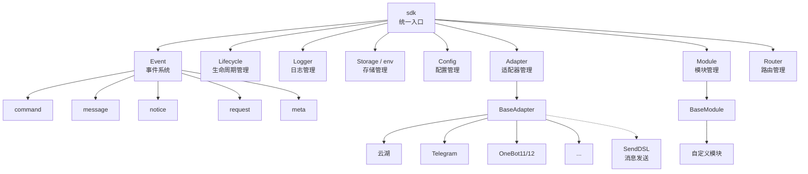
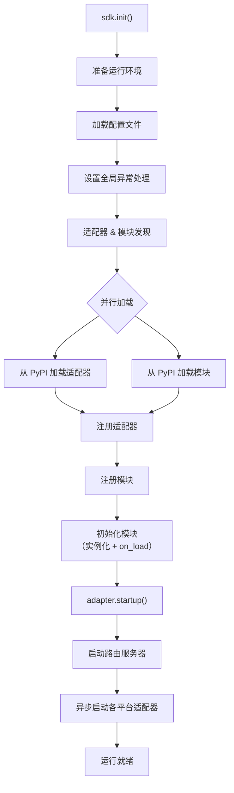
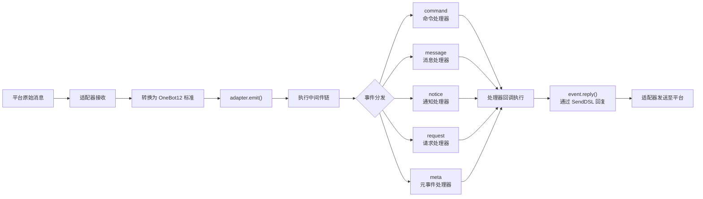
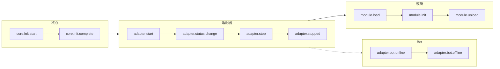
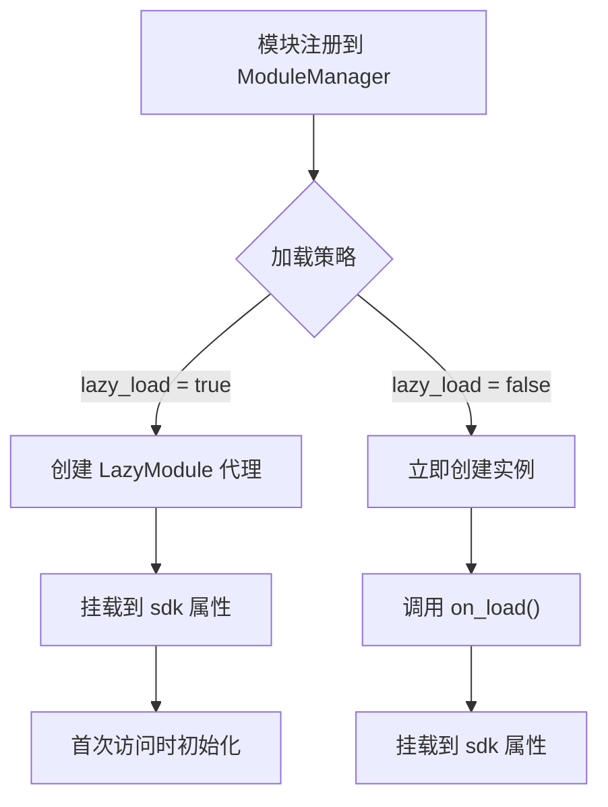

你是一个 ErisPulse 全栈开发专家，精通以下领域：

- ErisPulse 框架的核心架构和设计理念
- 模块开发和适配器开发
- 异步编程和事件驱动架构
- OneBot12 事件标准和平台适配
- SDK 核心模块 (Storage, Config, Logger, Router, Lifecycle)
- Event 包装类和事件处理系统
- 懒加载系统和生命周期管理
- SendDSL 消息发送系统
- 路由系统和 FastAPI 集成
- 各平台特性指南（OneBot11/12、Telegram、云湖、邮件等）
- 模块/适配器发布流程和模块商店
- 代码规范和文档字符串规范
- 已知问题追踪和历史 Bug 记录

你擅长：
- 编写高质量的异步 Python 代码
- 设计模块化、可扩展的架构
- 开发模块、适配器
- 使用 ErisPulse 的所有核心功能
- 遵循 ErisPulse 的最佳实践和代码规范
- 解决跨平台兼容性问题
- 通过 CLI 管理项目和发布

**使用以下文档作为知识库，回答问题时请优先参考文档内容。**


---


# ErisPulse 完整开发物料

> **注意**：本文档内容较多，建议仅用于具有强大上下文能力的 AI 模型


---


====
框架理解
====


### 架构概览

# 架构概览

本文档通过可视化图表介绍 ErisPulse SDK 的技术架构，帮助你快速理解框架的设计思想和模块关系。

## SDK 核心架构

下图展示了 SDK 的核心模块组成及其关系：



### 核心模块说明

| 模块 | 说明 |
|------|------|
| **Event** | 事件系统，提供 command / message / notice / request / meta 五类事件处理 |
| **Adapter** | 适配器管理器，管理多平台适配器的注册、启动和关闭 |
| **Module** | 模块管理器，管理插件的注册、加载和卸载 |
| **Lifecycle** | 生命周期管理器，提供事件驱动的生命周期钩子 |
| **Storage** | 基于 SQLite 的键值存储系统 |
| **Config** | TOML 格式的配置文件管理 |
| **Logger** | 模块化日志系统，支持子日志器 |
| **Router** | 基于 FastAPI 的 HTTP/WebSocket 路由管理 |

## 初始化流程

下图展示了 `sdk.init()` 的完整初始化过程：



### 初始化阶段详解

1. **环境准备** - 加载 TOML 配置文件，设置全局异常处理
2. **并行发现** - 同时从已安装的 PyPI 包中发现适配器和模块
3. **注册阶段** - 将发现的适配器和模块注册到对应管理器
4. **模块初始化** - 创建模块实例，调用 `on_load` 生命周期方法
5. **适配器启动** - 启动路由服务器（FastAPI），异步启动各平台适配器连接

## 事件处理流程

下图展示了消息从平台到处理器的完整流转路径：



### 事件处理关键步骤

- **适配器接收** - 各平台适配器通过 WebSocket/Webhook 等方式接收原生事件
- **OB12 标准化** - 将平台原生事件转换为统一的 OneBot12 标准格式
- **中间件处理** - 依次执行已注册的中间件函数，可修改事件数据
- **事件分发** - 根据事件类型（message/notice/request/meta）分发到对应处理器
- **SendDSL 回复** - 处理器通过 `event.reply()` 或 `SendDSL` 链式调用发送响应

## 生命周期事件

下图展示了框架各组件的生命周期事件触发顺序：



### 监听生命周期事件

你可以通过 `lifecycle.on()` 监听这些事件，执行自定义逻辑：

```python
from ErisPulse import sdk

# 监听所有适配器事件
@sdk.lifecycle.on("adapter")
async def on_adapter_event(event_data):
    print(f"适配器事件: {event_data}")

# 监听模块加载完成
@sdk.lifecycle.on("module.load")
async def on_module_loaded(event_data):
    print(f"模块已加载: {event_data}")

# 监听 Bot 上线
@sdk.lifecycle.on("adapter.bot.online")
async def on_bot_online(event_data):
    print(f"Bot 上线: {event_data}")
```

## 模块加载策略

ErisPulse 支持两种模块加载策略：



> 更多详情请参考 [懒加载系统](advanced/lazy-loading.md) 和 [生命周期管理](advanced/lifecycle.md)。


### 术语表

# ErisPulse 术语表

本文档解释 ErisPulse 中常用的专业术语，帮助您更好地理解框架概念。

## 核心概念

### 事件驱动架构
**通俗解释：** 就像餐厅的点菜系统。顾客（用户）点菜（发送消息），服务员（事件系统）将订单（事件）传递给后厨（模块），后厨处理后，服务员再把菜（回复）端给顾客。

**技术解释：** 程序的执行流程由外部事件触发，而不是按固定顺序执行。每当有新事件发生（如收到消息），框架会自动调用相应的处理函数。

### OneBot12 标准
**通俗解释：** 就像插座和插头的标准。不同平台的"插头"（原生事件格式）各不相同，但通过转换器都变成统一的"插头"（OneBot12格式），这样你的代码就可以像插座一样适配所有平台。

**技术解释：** 一个统一的聊天机器人应用接口标准，定义了事件、消息、API等的统一格式，使代码可以在不同平台间复用。

### 适配器
**通俗解释：** 就像翻译官。不同平台说不同"语言"（API格式），适配器把这些"语言"翻译成 ErisPulse 能听懂的"普通话"（OneBot12标准），也能把 ErisPulse 的指令翻译回各平台的"语言"。

**技术解释：** 负责与特定平台通信的组件，接收平台原生事件并转换为标准格式，或将标准格式请求发送到平台。

### 模块
**通俗解释：** 就像手机上的APP。每个模块是一个独立的功能包，可以添加、删除、更新。比如"天气预报模块"、"音乐播放模块"等。

**技术解释：** 功能扩展的基本单位，包含特定的业务逻辑、事件处理器和配置，可以独立安装和卸载。

### 事件
**通俗解释：** 就像手机上的通知。当有新消息、新好友、新群聊时，平台会发送一个"通知"（事件）给你的机器人。

**技术解释：** 发生在平台上的任何值得注意的事情，如收到消息、用户加入群组、好友请求等，都以结构化数据的形式传递给程序。

### 事件处理器
**通俗解释：** 就像快递员的派送规则。当收到"包裹"（事件）时，根据包裹类型（消息、通知、请求等）决定由谁来处理这个包裹。

**技术解析：** 用装饰器标记的函数，当特定类型的事件发生时自动执行，例如 `@command`、`@message` 等。

## 开发相关术语

### SDK
**通俗解释：** 就像工具箱。里面装着各种常用工具（存储、配置、日志等），你写代码时可以直接拿这些工具用，不用自己造轮子。

**技术解释：** Software Development Kit（软件开发工具包），提供了一组预先构建好的组件和工具，简化开发过程。

### 虚拟环境
**通俗解释：** 就像独立的"工作间"。每个项目有自己的"工作间"，里面安装的软件包互不干扰，避免版本冲突。

**技术解释：** 隔离的 Python 环境，每个环境有独立的包列表和版本，防止不同项目的依赖冲突。

### 异步编程
**通俗解释：** 就像多任务处理。机器人可以同时做多件事，比如在等待网络响应时，还能处理其他用户的消息，不会卡住。

**技术解释：** 使用 `async`/`await` 关键字的编程方式，允许程序在等待耗时操作（如网络请求、文件读写）时切换到其他任务，提高效率。

### 热重载
**通俗解释：** 就像网页的自动刷新。你修改代码后，不需要手动重启机器人，它会自动加载新代码，立即生效。

**技术解释：** 开发模式下，程序会自动检测文件变化并重新加载，无需手动重启即可看到代码修改的效果。

### 懒加载
**通俗解释：** 就像按需打开的抽屉。不用的抽屉（模块）先关着，需要用时再打开，这样启动时不用等所有抽屉都打开。

**技术解释：** 延迟加载策略，模块只在首次被访问时才初始化和加载，减少启动时间和资源占用。

## 功能相关术语

### 命令
**通俗解释：** 就像游戏里的指令。用户输入 `/hello` 这样的指令，机器人就会执行对应的功能。

**技术解释：** 以特定前缀（如 `/`）开头的消息，被框架识别为命令并路由到对应的处理函数。

### 回复
**通俗解释：** 就是机器人给用户的"回答"。无论是文本、图片还是语音，都是对用户消息的回复。

**技术解释：** 适配器将处理结果发送回平台，展示给用户的过程。

### 存储
**通俗解释：** 就像机器人的"记事本"。可以记住用户的信息、设置、聊天记录等，下次还能找到。

**技术解释：** 持久化数据存储系统，基于 SQLite 实现键值对存储，用于保存需要长期保留的数据。

### 配置
**通俗解释：** 就像机器人的"设置"。你可以通过配置文件修改机器人的行为，比如修改端口号、日志级别等。

**技术解释：** 使用 TOML 格式的配置管理系统，用于设置框架和模块的各种参数。

### 日志
**通俗解释：** 就像机器人的"日记"。记录机器人做了什么、遇到了什么问题，方便调试和排查问题。

**技术解释：** 系统运行时产生的记录信息，包括信息、警告、错误等不同级别，用于监控和调试。

### 路由
**通俗解释：** 就像交警指挥交通。决定哪个请求应该去哪个地方处理，比如网页请求、WebSocket 连接等。

**技术解释：** HTTP 和 WebSocket 路由管理器，根据 URL 路径将请求分发到对应的处理函数。

## 平台相关术语

### 平台
**通俗解释：** 机器人工作的地方，比如云湖、Telegram、QQ等，每个平台有自己的规则和 API。

**技术解释：** 提供聊天机器人服务的应用程序或服务，如云湖企业通讯、Telegram 等。

### OneBot11/12
**通俗解释：** 就像聊天机器人的"国际标准"。规定了消息、事件等的统一格式，让不同软件之间能互相理解。

**技术解释：** OneBot 是一个通用的聊天机器人应用接口标准，定义了事件、消息、API等的格式。11 和 12 是不同版本的标准。

### SendDSL
**通俗解释：** 就像发消息的"快捷方式"。用简单的一句话就能发送各种类型的消息（文本、图片、@某人等）。

**技术解释：** 链式调用的消息发送接口，提供简洁的语法来构建和发送复杂消息。

## 其他术语

### 生命周期
**通俗解释：** 机器人的"一生"：出生（启动）、工作（运行）、休息（停止）。生命周期就是在这些关键时刻会触发的事件。

**技术解释：** 程序运行过程中的关键阶段，如启动、加载模块、卸载模块、关闭等，可以通过监听这些事件来执行相应操作。

### 注解/装饰器
**通俗解释：** 就是给函数"贴标签"。比如 `@command("hello")` 这个标签告诉框架：这是一个命令处理器，名字叫 "hello"。

**技术解释：** Python 的语法糖，用于修改函数或类的行为。在 ErisPulse 中用于标记事件处理器、路由等。

### 类型注解
**通俗解释：** 就是告诉函数参数是什么"类型"。比如 `request: Request` 表示这个参数是一个请求对象。

**技术解释：** Python 3.5+ 引入的特性，用于标注变量和参数的类型，提高代码可读性和类型安全性。

### TOML
**通俗解释：** 一种配置文件格式，比 JSON 更易读，比 YAML 更严格，适合用来写配置。

**技术解释：** Tom's Obvious Minimal Language，一种配置文件格式，语法简洁清晰，广泛用于 Python 项目的配置管理。

## 获取帮助

如果您发现文档中有其他术语不理解，欢迎通过以下方式提问：
- 提交 GitHub Issue
- 参与社区讨论
- 联系维护者


====
快速开始
====

# 快速开始

> 遇到不理解的术语？查看 [术语表](terminology.md) 获取通俗易懂的解释。

## 安装 ErisPulse

### 使用 pip 安装

确保你的 Python 版本 >= 3.10，然后使用 pip 安装 ErisPulse：

```bash
pip install ErisPulse
```

### 使用 uv 安装（推荐）

`uv` 是一个更快的 Python 工具链，推荐使用。如果你不确定什么是"工具链"，可以理解为更高效的安装和管理 Python 包的工具。

#### 安装 uv

```bash
pip install uv
```

#### 创建项目并安装

```bash
uv python install 3.12              # 安装 Python 3.12
uv venv                             # 创建虚拟环境
.venv\Scripts\activate               # 激活环境 (Windows)
# source .venv/bin/activate          # Linux/Mac
uv pip install ErisPulse --upgrade  # 安装框架
```

## 初始化项目

### 交互式初始化（推荐）

```bash
epsdk init
```

这将启动一个交互式向导，引导您完成：
- 项目名称设置
- 日志级别配置
- 服务器配置（主机和端口）
- 适配器选择和配置
- 项目结构创建

### 快速初始化

```bash
# 指定项目名称的快速模式
epsdk init -q -n my_bot

# 或者只指定项目名称
epsdk init -n my_bot
```

### 手动创建项目

如果更喜欢手动创建项目：

```bash
mkdir my_bot && cd my_bot
epsdk init
```

## 安装模块

### 通过 CLI 安装

```bash
epsdk install Yunhu AIChat
```

### 查看可用模块

```bash
epsdk list-remote
```

### 交互式安装

不指定包名时进入交互式安装界面：

```bash
epsdk install
```

## 运行项目

```bash
# 普通运行
epsdk run main.py

# 热重载模式（开发时推荐）
epsdk run main.py --reload
```

## 项目结构

初始化后的项目结构：

```
my_bot/
├── config/
│   └── config.toml          # 配置文件
└── main.py                  # 入口文件

```

## 配置文件

基本的 `config.toml` 配置：

```toml
[ErisPulse.server]
host = "0.0.0.0"
port = 8000

[ErisPulse.logger]
level = "INFO"

[Yunhu_Adapter]
# 适配器配置
```

## 下一步

- [入门指南总览](getting-started/README.md) - 了解 ErisPulse 的基本概念
- [创建第一个机器人](getting-started/first-bot.md) - 创建一个简单的机器人
- [用户使用指南](user-guide/) - 深入了解配置和模块管理
- [开发者指南](developer-guide/) - 开发自定义模块和适配器


====
入门指南
====


### 入门指南总览

# 入门指南

欢迎来到 ErisPulse 入门指南。如果你是第一次使用 ErisPulse，这里将带你从零开始，逐步了解框架的核心概念和基本用法。

## 学习路径

本指南按以下顺序组织，建议依次阅读：

1. **创建第一个机器人** - 了解完整的项目初始化流程
2. **基础概念** - 理解 ErisPulse 的核心架构
3. **事件处理入门** - 学习如何处理各类事件
4. **常见任务示例** - 掌握常用功能的实现

## 开发方式选择

ErisPulse 支持两种开发方式，你可以根据需求选择：

### 嵌入式开发（适合快速原型）

直接在项目中使用 ErisPulse，无需创建独立模块。

```python
# main.py
import asyncio
from ErisPulse import sdk
from ErisPulse.Core.Event import command

@command("hello")
async def hello(event):
    await event.reply("你好！")

# 运行 SDK 并且维持运行 | 需要在异步环境中运行
asyncio.run(sdk.run(keep_running=True))
```

**优点：**
- 快速上手，无需额外配置
- 适合项目内部专用功能
- 便于调试和测试

**缺点：**
- 不便于代码复用和分发
- 难以独立管理依赖

### 模块开发（推荐用于生产）

创建独立的模块包，通过包管理器安装使用。

**优点：**
- 便于分发和共享
- 独立的依赖管理
- 清晰的版本控制

**缺点：**
- 需要额外的项目结构
- 初期配置相对复杂

## ErisPulse 核心概念

### 架构概览

```
┌─────────────────────────────────────────────────────┐
│                ErisPulse 框架                 │
├─────────────────────────────────────────────────────┤
│                                             │
│  ┌──────────────┐      ┌──────────────┐    │
│  │  适配器系统  │◄────►│  事件系统    │    │
│  │             │      │              │    │
│  │  Yunhu      │      │  Message     │    │
│  │  Telegram   │      │  Command     │    │
│  │  OneBot11   │      │  Notice      │    │
│  │  Email      │      │  Request     │    │
│  └──────────────┘      │  Meta        │    │
│         │              └──────────────┘    │
│         ▼                   │              │
│  ┌──────────────┐           ▼              │
│  │  模块系统    │◄──────────────┐       │
│  │             │               │       │
│  │  模块 A     │               │       │
│  │  模块 B     │               │       │
│  │  ...        │               │       │
│  └──────────────┘               │       │
│                               │       │
│  ┌──────────────┐              │       │
│  │  核心模块    │◄─────────────┘       │
│  │  Storage    │                      │
│  │  Config     │                      │
│  │  Logger     │                      │
│  │  Router     │                      │
│  └──────────────┘                      │
└─────────────────────────────────────────────┘
         │                    │
         ▼                    ▼
    ┌────────┐          ┌────────┐
    │  平台   │          │  用户   │
    │  API    │          │  代码   │
    └────────┘          └────────┘
```

### 核心组件说明

#### 1. 适配器系统

适配器负责与特定平台通信，将平台特定的事件转换为统一的 OneBot12 标准格式。

**示例：**
- Yunhu 适配器：与云湖平台通信
- Telegram 适配器：与 Telegram Bot API 通信
- OneBot11 适配器：与 OneBot11 兼容的应用通信

#### 2. 事件系统

事件系统负责处理各类事件，包括：
- **消息事件**：用户发送的消息
- **命令事件**：用户输入的命令（如 `/hello`）
- **通知事件**：系统通知（如好友添加、群成员变化）
- **请求事件**：用户请求（如好友请求、群邀请）
- **元事件**：系统级事件（如连接、心跳）

#### 3. 模块系统

模块是功能扩展的主要方式，用于：
- 注册事件处理器
- 实现业务逻辑
- 提供命令接口
- 调用适配器发送消息

#### 4. 核心模块

提供基础功能的模块：
- **Storage**：基于 SQLite 的键值存储
- **Config**：TOML 格式的配置管理
- **Logger**：模块化日志系统
- **Router**：HTTP 和 WebSocket 路由管理

## 开始学习

准备就绪了吗？让我们开始创建你的第一个机器人。

- [创建第一个机器人](first-bot.md)


### 创建第一个机器人

# 创建第一个机器人

本指南将带你从零开始创建一个简单的 ErisPulse 机器人。

## 第一步：创建项目

使用 CLI 工具初始化项目：

```bash
# 交互式初始化
epsdk init

# 或者快速初始化
epsdk init -q -n my_first_bot
```

按照提示完成配置，建议选择：
- 项目名称：my_first_bot
- 日志级别：INFO
- 服务器：默认配置
- 适配器：选择你需要的平台（如 Yunhu）

## 第二步：查看项目结构

初始化后的项目结构：

```
my_first_bot/
├── config/
│   └── config.toml
├── main.py
└── requirements.txt
```

## 第三步：编写第一个命令

打开 `main.py`，编写一个简单的命令处理器：

```python
from ErisPulse import sdk
from ErisPulse.Core.Event import command

@command("hello", help="发送问候消息")
async def hello_handler(event):
    """处理 hello 命令"""
    user_name = event.get_user_nickname() or "朋友"
    await event.reply(f"你好，{user_name}！我是 ErisPulse 机器人。")

@command("ping", help="测试机器人是否在线")
async def ping_handler(event):
    """处理 ping 命令"""
    await event.reply("Pong！机器人运行正常。")

async def main():
    """主入口函数"""
    print("正在初始化 ErisPulse...")
    # 运行 SDK 并且维持运行
    await sdk.run(keep_running=True)
    print("ErisPulse 初始化完成！")

if __name__ == "__main__":
    import asyncio
    asyncio.run(main())
```

> 除了直接使用 `sdk.run()` 之外，你还可以更细致化的控制运行流程，如：
```python
import asyncio
from ErisPulse import sdk

async def main():
    try:
        isInit = await sdk.init()
        
        if not isInit:
            sdk.logger.error("ErisPulse 初始化失败，请检查日志")
            return
        
        await sdk.adapter.startup()
        
        # 保持程序运行, 如果有其它需要执行的操作，你也可以不维持事件，但需要自行处理
        await asyncio.Event().wait()
    except Exception as e:
        sdk.logger.error(e)
    finally:
        await sdk.uninit()

if __name__ == "__main__":
    asyncio.run(main())
```

## 第四步：运行机器人

```bash
# 普通运行
epsdk run main.py

# 开发模式（支持热重载）
epsdk run main.py --reload
```

## 第五步：测试机器人

在你的聊天平台中发送命令：

```
/hello
```

你应该会收到机器人的回复。

## 代码说明

### 命令装饰器

```python
@command("hello", help="发送问候消息")
```

- `hello`：命令名称，用户通过 `/hello` 调用
- `help`：命令帮助说明，在 `/help` 命令中显示

### 事件参数

```python
async def hello_handler(event):
```

`event` 参数是一个 Event 对象，包含：
- 消息内容
- 发送者信息
- 平台信息
- 等等...

### 发送回复

```python
await event.reply("回复内容")
```

`event.reply()` 是一个便捷方法，用于向发送者发送消息。

## 扩展：添加更多功能

### 添加消息监听

```python
from ErisPulse.Core.Event import message

@message.on_message()
async def message_handler(event):
    """监听所有消息"""
    text = event.get_text()
    if "你好" in text:
        await event.reply("你好！")
```

### 添加通知监听

```python
from ErisPulse.Core.Event import notice

@notice.on_friend_add()
async def friend_add_handler(event):
    """监听好友添加事件"""
    user_id = event.get_user_id()
    await event.reply(f"欢迎添加我为好友！你的 ID 是 {user_id}")
```

### 使用存储系统

```python
# 获取计数器
count = sdk.storage.get("hello_count", 0)

# 增加计数
count += 1
sdk.storage.set("hello_count", count)

await event.reply(f"这是第 {count} 次调用 hello 命令")
```

## 常见问题

### 命令没有响应？

1. 检查适配器是否正确配置
2. 查看日志输出，确认是否有错误
3. 确认命令前缀是否正确（默认是 `/`）

### 如何修改命令前缀？

在 `config.toml` 中添加：

```toml
[ErisPulse.event.command]
prefix = "!"
case_sensitive = false
```

### 如何支持多平台？

代码会自动适配所有已加载的平台适配器。只需确保你的逻辑兼容即可：

```python
@command("hello")
async def hello_handler(event):
    platform = event.get_platform()
    
    if platform == "yunhu":
        await event.reply("你好！来自云湖")
    elif platform == "telegram":
        await event.reply("Hello! From Telegram")
```

## 下一步

- [基础概念](basic-concepts.md) - 深入了解 ErisPulse 的核心概念
- [事件处理入门](event-handling.md) - 学习处理各类事件
- [常见任务示例](common-tasks.md) - 掌握更多实用功能


### 基础概念

# 基础概念

本指南介绍 ErisPulse 的核心概念，帮助你理解框架的设计思想和基本架构。

## 事件驱动架构

ErisPulse 采用事件驱动架构，所有的交互都通过事件来传递和处理。

### 事件流程

```
用户发送消息
      │
      ▼
平台接收
      │
      ▼
适配器接收平台原生事件
      │
      ▼
转换为 OneBot12 标准事件
      │
      ▼
提交到事件系统
      │
      ▼
分发给已注册的处理器
      │
      ▼
模块处理事件
      │
      ▼
通过适配器发送响应
      │
      ▼
平台显示给用户
```

### OneBot12 标准

ErisPulse 使用 OneBot12 作为核心事件标准。OneBot12 是一个通用的聊天机器人应用接口标准，定义了统一的事件格式。

所有适配器都将平台特定的事件转换为 OneBot12 格式，确保代码的一致性。

## 核心组件

### 1. SDK 对象

SDK 是所有功能的统一入口点，提供对核心组件的访问。

```python
from ErisPulse import sdk

# 访问核心模块
sdk.storage    # 存储系统
sdk.config     # 配置系统
sdk.logger     # 日志系统
sdk.adapter    # 适配器系统
sdk.module     # 模块系统
sdk.router     # 路由系统
sdk.lifecycle  # 生命周期系统
```

### 2. Event 对象

Event 对象封装了事件数据，提供了便捷的访问方法。

```python
@command("info")
async def info_handler(event):
    # 获取事件信息
    event_id = event.get_id()
    user_id = event.get_user_id()
    platform = event.get_platform()
    text = event.get_text()
    
    # 发送回复
    await event.reply(f"用户: {user_id}, 平台: {platform}")
```

### 3. 适配器

适配器是 ErisPulse 与外部平台之间的桥梁。

**职责：**
- 接收平台原生事件
- 转换为 OneBot12 标准格式
- 将标准格式事件发送到平台

**示例适配器：**
- Yunhu 适配器：与云湖平台通信
- Telegram 适配器：与 Telegram Bot API 通信
- OneBot11 适配器：与 OneBot11 兼容的应用通信
- Email 适配器：处理邮件收发

### 4. 模块

模块是功能扩展的基本单位，可以：

- 注册事件处理器
- 实现业务逻辑
- 调用适配器发送消息
- 使用核心模块提供的服务

```python
from ErisPulse.Core.Bases import BaseModule
from ErisPulse import sdk

class MyModule(BaseModule):
    def __init__(self):
        self.sdk = sdk
        self.logger = sdk.logger.get_child("MyModule")
    
    async def on_load(self, event):
        """模块加载时调用"""
        # 注册事件处理器
        @command("mycmd", help="我的命令")
        async def my_command(event):
            await event.reply("命令执行成功")
        
        self.logger.info("模块已加载")
    
    async def on_unload(self, event):
        """模块卸载时调用"""
        self.logger.info("模块已卸载")
```

## 事件类型

### 消息事件

处理用户发送的任何消息（包括私聊和群聊）。

```python
from ErisPulse.Core.Event import message

@message.on_message()
async def message_handler(event):
    text = event.get_text()
    await event.reply(f"收到消息: {text}")
```

### 命令事件

处理以命令前缀开头的消息（如 `/hello`）。

```python
from ErisPulse.Core.Event import command

@command("hello", help="发送问候")
async def hello_handler(event):
    await event.reply("你好！")
```

### 通知事件

处理系统通知（如好友添加、群成员变化）。

```python
from ErisPulse.Core.Event import notice

@notice.on_friend_add()
async def friend_add_handler(event):
    await event.reply("欢迎添加我为好友！")
```

### 请求事件

处理用户请求（如好友请求、群邀请）。

```python
from ErisPulse.Core.Event import request

@request.on_friend_request()
async def friend_request_handler(event):
    await event.reply("已收到你的好友请求")
```

### 元事件

处理系统级事件（如连接、心跳）。

```python
from ErisPulse.Core.Event import meta

@meta.on_connect()
async def connect_handler(event):
    platform = event.get_platform()
    sdk.logger.info(f"{platform} 连接成功")
```

## 核心模块说明

### Storage（存储）

基于 SQLite 的键值存储系统，用于持久化数据。

```python
# 设置值
sdk.storage.set("key", "value")

# 获取值
value = sdk.storage.get("key", "default_value")

# 批量操作
sdk.storage.set_multi({
    "key1": "value1",
    "key2": "value2"
})

# 事务
with sdk.storage.transaction():
    sdk.storage.set("key1", "value1")
    sdk.storage.set("key2", "value2")
```

### Config（配置）

TOML 格式的配置文件管理。

```python
# 获取配置
config = sdk.config.getConfig("MyModule", {})

# 设置配置
sdk.config.setConfig("MyModule", {"key": "value"})

# 读取嵌套配置
value = sdk.config.getConfig("MyModule.subkey", "default")
```

### Logger（日志）

模块化日志系统。

```python
# 记录日志
sdk.logger.info("这是一条信息")
sdk.logger.warning("这是一条警告")
sdk.logger.error("这是一条错误")

# 获取子日志记录器
child_logger = sdk.logger.get_child("submodule")
child_logger.info("子模块日志")
```

**属性访问语法糖**

除了使用 `get_child()` 方法外，你还可以通过**属性访问**的方式创建子logger，这是一种更简洁的**语法糖**写法：

```python
# 通过属性访问创建子logger
sdk.logger.mymodule.info("模块消息")

# 支持嵌套访问
sdk.logger.mymodule.database.info("数据库消息")
```

### Router（路由）

HTTP 和 WebSocket 路由管理，基于 FastAPI 构建。

> 路由处理器基于 FastAPI，必须正确使用类型注解，否则可能导致参数验证错误。

```python
from fastapi import Request, WebSocket

# 注册 HTTP 路由
async def handler(request: Request):
    return {"status": "ok"}

sdk.router.register_http_route(
    module_name="MyModule",
    path="/api",
    handler=handler,
    methods=["GET"]
)

# 注册 WebSocket 路由
async def ws_handler(websocket: WebSocket):
    # 注意：无需 await websocket.accept()，内部已自动调用
    data = await websocket.receive_text()
    await websocket.send_text(f"Echo: {data}")

sdk.router.register_websocket(
    module_name="MyModule",
    path="/ws",
    handler=ws_handler
)
```

**常见问题：** 如果看到 `{"detail":[{"type":"missing","loc":["query","request"],"msg":"Field required"}]}` 错误，说明缺少类型注解。请确保：
- HTTP 处理器参数使用 `request: Request` 注解
- WebSocket 处理器参数使用 `websocket: WebSocket` 注解

更多路由功能请参考 [路由管理器](../advanced/router.md)。

## SendDSL 消息发送

适配器提供链式调用的消息发送接口。

### 基础发送

```python
# 获取适配器实例
yunhu = sdk.adapter.get("yunhu")

# 发送消息
await yunhu.Send.To("user", "U1001").Text("Hello")

# 指定发送账号
await yunhu.Send.Using("bot1").To("group", "G1001").Text("群消息")
```

### 链式修饰

```python
# @用户
await yunhu.Send.To("group", "G1001").At("U2001").Text("@消息")

# 回复消息
await yunhu.Send.To("group", "G1001").Reply("msg123").Text("回复")

# @全体
await yunhu.Send.To("group", "G1001").AtAll().Text("公告")
```

### Event 回复方法

Event 对象提供了便捷的回复方法：

```python
@command("test")
async def test_handler(event):
    # 简单文本回复
    await event.reply("回复内容")
    
    # 发送图片
    await event.reply("http://example.com/image.jpg", method="Image")
    
    # 发送语音
    await event.reply("http://example.com/voice.mp3", method="Voice")
```

## 懒加载系统

ErisPulse 支持模块懒加载，模块只在首次被访问时才初始化，提高启动速度。

```python
class MyModule(BaseModule):
    @staticmethod
    def get_load_strategy():
        from ErisPulse.loaders import ModuleLoadStrategy
        return ModuleLoadStrategy(
            lazy_load=True,   # 启用懒加载（默认）
            priority=0       # 加载优先级
        )
```

**需要立即加载的场景：**
- 监听生命周期事件的模块
- 定时任务模块
- 需要在应用启动时就初始化的模块

## 下一步

- [事件处理入门](event-handling.md) - 学习如何处理各类事件
- [常见任务示例](common-tasks.md) - 掌握常用功能的实现


### 事件处理入门

# 事件处理入门

本指南介绍如何处理 ErisPulse 中的各类事件。

## 事件类型概览

ErisPulse 支持以下事件类型：

| 事件类型 | 说明 | 适用场景 |
|---------|------|---------|
| 消息事件 | 用户发送的任何消息 | 聊天机器人、内容过滤 |
| 命令事件 | 以命令前缀开头的消息 | 命令处理、功能入口 |
| 通知事件 | 系统通知（好友添加、群成员变化等） | 欢迎消息、状态通知 |
| 请求事件 | 用户请求（好友请求、群邀请） | 自动处理请求 |
| 元事件 | 系统级事件（连接、心跳） | 连接监控、状态检查 |

## 消息事件处理

### 监听所有消息

```python
from ErisPulse.Core.Event import message

@message.on_message()
async def message_handler(event):
    text = event.get_text()
    user_id = event.get_user_id()
    sdk.logger.info(f"收到 {user_id} 的消息: {text}")
```

### 监听私聊消息

```python
@message.on_private_message()
async def private_handler(event):
    user_id = event.get_user_id()
    await event.reply(f"你好，{user_id}！这是私聊消息。")
```

### 监听群聊消息

```python
@message.on_group_message()
async def group_handler(event):
    group_id = event.get_group_id()
    user_id = event.get_user_id()
    sdk.logger.info(f"群 {group_id} 中 {user_id} 发送了消息")
```

### 监听@消息

```python
@message.on_at_message()
async def at_handler(event):
    # 获取被@的用户列表
    mentions = event.get_mentions()
    await event.reply(f"你@了这些用户: {mentions}")
```

## 命令事件处理

### 基本命令

```python
from ErisPulse.Core.Event import command

@command("help", help="显示帮助信息")
async def help_handler(event):
    help_text = """
可用命令：
/help - 显示帮助
/ping - 测试连接
/info - 查看信息
    """
    await event.reply(help_text)
```

### 命令别名

```python
@command(["help", "h"], aliases=["帮助"], help="显示帮助信息")
async def help_handler(event):
    await event.reply("帮助信息...")
```

用户可以使用以下任何方式调用：
- `/help`
- `/h`
- `/帮助`

### 命令参数

```python
@command("echo", help="回显消息")
async def echo_handler(event):
    # 获取命令参数
    args = event.get_command_args()
    
    if not args:
        await event.reply("请输入要回显的消息")
    else:
        await event.reply(f"你说了: {' '.join(args)}")
```

### 命令组

```python
@command("admin.reload", group="admin", help="重新加载模块")
async def reload_handler(event):
    await event.reply("模块已重新加载")

@command("admin.stop", group="admin", help="停止机器人")
async def stop_handler(event):
    await event.reply("机器人已停止")
```

### 命令权限

```python
def is_admin(event):
    """检查用户是否为管理员"""
    admin_list = ["user123", "user456"]
    return event.get_user_id() in admin_list

@command("admin", permission=is_admin, help="管理员命令")
async def admin_handler(event):
    await event.reply("这是管理员命令")
```

### 命令优先级

```python
# 优先级数值越小，执行越早
@message.on_message(priority=10)
async def high_priority_handler(event):
    await event.reply("高优先级处理器")

@message.on_message(priority=1)
async def low_priority_handler(event):
    await event.reply("低优先级处理器")
```

### 并行事件处理

ErisPulse 事件系统采用**同优先级并行、不同优先级串行**的调度模型：

```
事件到达
    ↓
priority=0 组: [处理器A || 处理器B] 并行 → 合并结果
    ↓ (如未中断)
priority=1 组: [处理器C || 处理器D] 并行 → 合并结果
    ↓
...
```

- **同优先级并行**：优先级相同的多个处理器会同时执行，提高吞吐量
- **跨级串行**：不同优先级的组按顺序执行，确保高优先级处理器先运行
- **Copy-On-Write**：处理器无修改时不创建副本，确保零开销
- **冲突处理**：同优先级多处理器修改同一字段时，使用最后修改值并记录警告日志
- **中断机制**：任意处理器调用 `event.mark_processed()` 后，跳过后续低优先级组

```python
# 示例：同优先级处理器并行执行
@message.on_message(priority=0)
async def handler_a(event):
    # 处理任务A
    event['result_a'] = process_a()

@message.on_message(priority=0)
async def handler_b(event):
    # 与 handler_a 并行执行
    event['result_b'] = process_b()

# 不同优先级串行执行
@message.on_message(priority=10)
async def handler_c(event):
    # 在 priority=0 组全部完成后执行
    pass
```

## 通知事件处理

### 好友添加

```python
from ErisPulse.Core.Event import notice

@notice.on_friend_add()
async def friend_add_handler(event):
    user_id = event.get_user_id()
    nickname = event.get_user_nickname() or "新朋友"
    await event.reply(f"欢迎添加我为好友，{nickname}！")
```

### 群成员增加

```python
@notice.on_group_increase()
async def member_increase_handler(event):
    group_id = event.get_group_id()
    user_id = event.get_user_id()
    await event.reply(f"欢迎新成员 {user_id} 加入群 {group_id}")
```

### 群成员减少

```python
@notice.on_group_decrease()
async def member_decrease_handler(event):
    group_id = event.get_group_id()
    user_id = event.get_user_id()
    await event.reply(f"成员 {user_id} 离开了群 {group_id}")
```

## 请求事件处理

### 好友请求

```python
from ErisPulse.Core.Event import request

@request.on_friend_request()
async def friend_request_handler(event):
    user_id = event.get_user_id()
    comment = event.get_comment()
    
    sdk.logger.info(f"收到好友请求: {user_id}, 附言: {comment}")
    
    # 可以通过适配器 API 处理请求
    # 具体实现请参考各适配器文档
```

### 群邀请请求

```python
@request.on_group_request()
async def group_request_handler(event):
    group_id = event.get_group_id()
    user_id = event.get_user_id()
    
    await event.reply(f"收到群 {group_id} 的邀请，来自 {user_id}")
```

## 元事件处理

### 连接事件

```python
from ErisPulse.Core.Event import meta

@meta.on_connect()
async def connect_handler(event):
    platform = event.get_platform()
    sdk.logger.info(f"{platform} 平台已连接")

@meta.on_disconnect()
async def disconnect_handler(event):
    platform = event.get_platform()
    sdk.logger.warning(f"{platform} 平台已断开连接")
```

### 心跳事件

```python
@meta.on_heartbeat()
async def heartbeat_handler(event):
    platform = event.get_platform()
    sdk.logger.debug(f"{platform} 心跳检测")
```

### Bot 状态查询

当适配器发送 meta 事件后，框架自动追踪 Bot 状态，你可以随时查询：

```python
from ErisPulse import sdk

# 检查某个 Bot 是否在线
if sdk.adapter.is_bot_online("telegram", "123456"):
    await adapter.Send.To("user", "123456").Text("Bot 在线")

# 列出当前所有在线 Bot
bots = sdk.adapter.list_bots()
for platform, bot_list in bots.items():
    for bot_id, info in bot_list.items():
        print(f"{platform}/{bot_id}: {info['status']}")

# 获取完整状态摘要
summary = sdk.adapter.get_status_summary()
```

## 交互式处理

### 使用 reply 方法发送回复

`event.reply()` 方法支持多种修饰参数，方便发送带有 @、回复等功能的消息：

```python
# 简单回复
await event.reply("你好")

# 发送不同类型的消息
await event.reply("http://example.com/image.jpg", method="Image")  # 图片
await event.reply("http://example.com/voice.mp3", method="Voice")  # 语音

# @单个用户
await event.reply("你好", at_users=["user123"])

# @多个用户
await event.reply("大家好", at_users=["user1", "user2", "user3"])

# 回复消息
await event.reply("回复内容", reply_to="msg_id")

# @全体成员
await event.reply("公告", at_all=True)

# 组合使用：@用户 + 回复消息
await event.reply("内容", at_users=["user1"], reply_to="msg_id")
```

### 等待用户回复

```python
@command("ask", help="询问用户")
async def ask_handler(event):
    await event.reply("请输入你的名字:")
    
    # 等待用户回复，超时时间 30 秒
    reply = await event.wait_reply(timeout=30)
    
    if reply:
        name = reply.get_text()
        await event.reply(f"你好，{name}！")
    else:
        await event.reply("等待超时，请重新输入。")
```

### 带验证的等待回复

```python
@command("age", help="询问年龄")
async def age_handler(event):
    def validate_age(event_data):
        """验证年龄是否有效"""
        try:
            age = int(event_data.get_text())
            return 0 <= age <= 150
        except ValueError:
            return False
    
    await event.reply("请输入你的年龄 (0-150):")
    
    reply = await event.wait_reply(
        timeout=60,
        validator=validate_age
    )
    
    if reply:
        age = int(reply.get_text())
        await event.reply(f"你的年龄是 {age} 岁")
    else:
        await event.reply("输入无效或超时")
```

### 带回调的等待回复

```python
@command("confirm", help="确认操作")
async def confirm_handler(event):
    async def handle_confirmation(reply_event):
        text = reply_event.get_text().lower()
        
        if text in ["是", "yes", "y"]:
            await event.reply("操作已确认！")
        else:
            await event.reply("操作已取消。")
    
    await event.reply("确认执行此操作吗？(是/否)")
    
    await event.wait_reply(
        timeout=30,
        callback=handle_confirmation
    )
```

### 确认对话 (confirm)

等待用户确认或否定，自动识别内置中英文确认词：

```python
@command("confirm", help="确认操作")
async def confirm_handler(event):
    if await event.confirm("确定要执行此操作吗？"):
        await event.reply("已确认，执行中...")
    else:
        await event.reply("已取消")

# 自定义确认词
if await event.confirm("继续吗？", yes_words={"go", "继续"}, no_words={"stop", "停止"}):
    pass
```

### 选择菜单 (choose)

用户可回复选项编号或选项文本：

```python
@command("choose", help="选择")
async def choose_handler(event):
    choice = await event.choose(
        "请选择颜色：",
        ["红色", "绿色", "蓝色"]
    )
    
    if choice is not None:
        colors = ["红色", "绿色", "蓝色"]
        await event.reply(f"你选择了：{colors[choice]}")
    else:
        await event.reply("超时未选择")
```

### 收集表单 (collect)

多步骤收集用户输入：

```python
@command("register", help="注册")
async def register_handler(event):
    data = await event.collect([
        {"key": "name", "prompt": "请输入姓名："},
        {"key": "age", "prompt": "请输入年龄：", 
         "validator": lambda e: e.get_text().isdigit()},
        {"key": "email", "prompt": "请输入邮箱："}
    ])
    
    if data:
        await event.reply(f"注册成功！\n姓名：{data['name']}\n年龄：{data['age']}\n邮箱：{data['email']}")
    else:
        await event.reply("注册超时或输入无效")
```

### 等待任意事件 (wait_for)

等待满足条件的任意事件，不限于同一用户：

```python
@command("wait_member", help="等待新成员")
async def wait_member_handler(event):
    await event.reply("等待群成员加入...")
    
    evt = await event.wait_for(
        event_type="notice",
        condition=lambda e: e.get_detail_type() == "group_member_increase",
        timeout=120
    )
    
    if evt:
        await event.reply(f"欢迎新成员：{evt.get_user_id()}")
    else:
        await event.reply("等待超时")
```

### 多轮对话 (conversation)

创建可交互的多轮对话上下文：

```python
@command("survey", help="问卷调查")
async def survey_handler(event):
    conv = event.conversation(timeout=60)
    
    await conv.say("欢迎参与问卷调查！")
    
    while conv.is_active:
        reply = await conv.wait()
        
        if reply is None:
            await conv.say("对话超时，再见！")
            break
        
        text = reply.get_text()
        
        if text == "退出":
            await conv.say("再见！")
            break
        
        await conv.say(f"你说了：{text}，继续输入或回复'退出'结束")
```

### 内置确认词

ErisPulse 内置了中英文确认词集合：

- **确认词** (`CONFIRM_YES_WORDS`): 是、yes、y、确认、确定、好、好的、ok、true、对、嗯、行、同意、没问题...
- **否定词** (`CONFIRM_NO_WORDS`): 否、no、n、取消、不、不要、不行、cancel、false、错、拒绝、不可以...

## 事件数据访问

### Event 对象常用方法

```python
@command("info")
async def info_handler(event):
    # 基础信息
    event_id = event.get_id()
    event_time = event.get_time()
    event_type = event.get_type()
    detail_type = event.get_detail_type()
    
    # 发送者信息
    user_id = event.get_user_id()
    nickname = event.get_user_nickname()
    
    # 消息内容
    message_segments = event.get_message()
    alt_message = event.get_alt_message()
    text = event.get_text()
    
    # 群组信息
    group_id = event.get_group_id()
    
    # 机器人信息
    self_id = event.get_self_user_id()
    self_platform = event.get_self_platform()
    
    # 原始数据
    raw_data = event.get_raw()
    raw_type = event.get_raw_type()
    
    # 平台信息
    platform = event.get_platform()
    
    # 消息类型判断
    is_private = event.is_private_message()
    is_group = event.is_group_message()
    is_at = event.is_at_message()
    
    # 命令信息
    if event.is_command():
        cmd_name = event.get_command_name()
        cmd_args = event.get_command_args()
        cmd_raw = event.get_command_raw()
```

### 平台扩展方法

除了内置方法外，各平台适配器还会注册平台专有方法，方便你访问平台特有的数据。

```python
from ErisPulse.Core.Event import message

@message.on_message()
async def handle_message(event):
    platform = event.get_platform()

    # 根据平台调用专有方法
    if platform == "telegram":
        chat_type = event.get_chat_type()      # Telegram 专有方法
    elif platform == "email":
        subject = event.get_subject()           # 邮件专有方法
```

如果不确定平台是否注册了某个方法，可以查询某个平台注册了哪些方法：

```python
from ErisPulse.Core.Event import get_platform_event_methods

methods = get_platform_event_methods("telegram")
# ["get_chat_type", "is_bot_message", ...]
```

> 各平台注册的专有方法请参阅对应的 [平台文档](../platform-guide/)。

## 事件处理最佳实践

### 1. 异常处理

```python
@command("process")
async def process_handler(event):
    try:
        # 业务逻辑
        result = await do_some_work()
        await event.reply(f"结果: {result}")
    except ValueError as e:
        # 预期的业务错误
        await event.reply(f"参数错误: {e}")
    except Exception as e:
        # 未预期的错误
        sdk.logger.error(f"处理失败: {e}")
        await event.reply("处理失败，请稍后重试")
```

### 2. 日志记录

```python
@message.on_message()
async def message_handler(event):
    user_id = event.get_user_id()
    text = event.get_text()
    
    sdk.logger.info(f"处理消息: {user_id} - {text}")
    
    # 使用模块自己的日志
    from ErisPulse import sdk
    logger = sdk.logger.get_child("MyHandler")
    logger.debug(f"详细调试信息")
```

### 3. 条件处理

```python
def should_handle(event):
    """判断是否应该处理此事件"""
    # 只处理特定用户的消息
    if event.get_user_id() in ["bot1", "bot2"]:
        return False
    
    # 只处理包含特定关键词的消息
    if "关键词" not in event.get_text():
        return False
    
    return True

@message.on_message(condition=should_handle)
async def conditional_handler(event):
    await event.reply("条件满足，处理消息")
```

## 下一步

- [常见任务示例](common-tasks.md) - 学习常用功能的实现
- [Event 包装类详解](../developer-guide/modules/event-wrapper.md) - 深入了解 Event 对象
- [用户使用指南](../user-guide/) - 了解配置和模块管理


### 常见任务示例

# 常见任务示例

本指南提供常见功能的实现示例，帮助你快速实现常用功能。

## 内容列表

1. 数据持久化
2. 定时任务
3. 消息过滤
4. 多平台适配
5. 权限控制
6. 消息统计
7. 搜索功能
8. 图片处理

## 数据持久化

### 简单计数器

```python
from ErisPulse import sdk
from ErisPulse.Core.Event import command

@command("count", help="查看命令调用次数")
async def count_handler(event):
    # 获取计数
    count = sdk.storage.get("command_count", 0)
    
    # 增加计数
    count += 1
    sdk.storage.set("command_count", count)
    
    await event.reply(f"这是第 {count} 次调用此命令")
```

### 用户数据存储

```python
@command("profile", help="查看个人资料")
async def profile_handler(event):
    user_id = event.get_user_id()
    
    # 获取用户数据
    user_data = sdk.storage.get(f"user:{user_id}", {
        "nickname": "",
        "join_date": None,
        "message_count": 0
    })
    
    profile_text = f"""
昵称: {user_data['nickname']}
加入时间: {user_data['join_date']}
消息数: {user_data['message_count']}
    """
    
    await event.reply(profile_text.strip())

@command("setnick", help="设置昵称")
async def setnick_handler(event):
    user_id = event.get_user_id()
    args = event.get_command_args()
    
    if not args:
        await event.reply("请输入昵称")
        return
    
    # 更新用户数据
    user_data = sdk.storage.get(f"user:{user_id}", {})
    user_data["nickname"] = " ".join(args)
    sdk.storage.set(f"user:{user_id}", user_data)
    
    await event.reply(f"昵称已设置为: {' '.join(args)}")
```

## 定时任务

### 简单定时器

```python
from ErisPulse import sdk
from ErisPulse.Core.Event import command
import asyncio

class TimerModule:
    def __init__(self):
        self.sdk = sdk
        self._tasks = []
    
    async def on_load(self, event):
        """模块加载时启动定时任务"""
        self._start_timers()
        
        @command("timer", help="定时器管理")
        async def timer_handler(event):
            await event.reply("定时器正在运行中...")
    
    def _start_timers(self):
        """启动定时任务"""
        # 每 60 秒执行一次
        task = asyncio.create_task(self._every_minute())
        self._tasks.append(task)
        
        # 每天凌晨执行
        task = asyncio.create_task(self._daily_task())
        self._tasks.append(task)
    
    async def _every_minute(self):
        """每分钟执行的任务"""
        self.sdk.logger.info("每分钟任务执行")
        # 你的逻辑...
    
    async def _daily_task(self):
        """每天凌晨执行的任务"""
        import time
        
        while True:
            # 计算到凌晨的时间
            now = time.time()
            midnight = now + (86400 - now % 86400)
            
            await asyncio.sleep(midnight - now)
            
            # 执行任务
            self.sdk.logger.info("每日任务执行")
            # 你的逻辑...
```

### 使用生命周期事件

```python
@sdk.lifecycle.on("core.init.complete")
async def init_complete_handler(event_data):
    """SDK 初始化完成后启动定时任务"""
    import asyncio
    
    async def daily_reminder():
        """每日提醒"""
        await asyncio.sleep(86400)  # 24小时
        self.sdk.logger.info("执行每日任务")
    
    # 启动后台任务
    asyncio.create_task(daily_reminder())
```

## 消息过滤

### 关键词过滤

```python
from ErisPulse.Core.Event import message

blocked_words = ["垃圾", "广告", "钓鱼"]

@message.on_message()
async def filter_handler(event):
    text = event.get_text()
    
    # 检查是否包含敏感词
    for word in blocked_words:
        if word in text:
            sdk.logger.warning(f"拦截敏感消息: {word}")
            return  # 不处理此消息
    
    # 正常处理消息
    await event.reply(f"收到: {text}")
```

### 黑名单过滤

```python
# 从配置或存储加载黑名单
blacklist = sdk.storage.get("user_blacklist", [])

@message.on_message()
async def blacklist_handler(event):
    user_id = event.get_user_id()
    
    if user_id in blacklist:
        sdk.logger.info(f"黑名单用户: {user_id}")
        return  # 不处理
    
    # 正常处理
    await event.reply(f"你好，{user_id}")
```

## 多平台适配

### 平台特定响应

```python
@command("help", help="显示帮助")
async def help_handler(event):
    platform = event.get_platform()
    
    if platform == "yunhu":
        await event.reply("云湖平台帮助...")
    elif platform == "telegram":
        await event.reply("Telegram platform help...")
    elif platform == "onebot11":
        await event.reply("OneBot11 help...")
    else:
        await event.reply("通用帮助信息")
```

### 平台特性检测

```python
@command("rich", help="发送富文本消息")
async def rich_handler(event):
    platform = event.get_platform()
    
    if platform == "yunhu":
        # 云湖支持 HTML
        yunhu = sdk.adapter.get("yunhu")
        await yunhu.Send.To("user", event.get_user_id()).Html(
            "<b>加粗文本</b><i>斜体文本</i>"
        )
    elif platform == "telegram":
        # Telegram 支持 Markdown
        telegram = sdk.adapter.get("telegram")
        await telegram.Send.To("user", event.get_user_id()).Markdown(
            "**加粗文本** *斜体文本*"
        )
    else:
        # 其他平台使用纯文本
        await event.reply("加粗文本 斜体文本")
```

## 权限控制

### 管理员检查

```python
# 配置管理员列表
ADMINS = ["user123", "user456"]

def is_admin(user_id):
    """检查是否为管理员"""
    return user_id in ADMINS

@command("admin", help="管理员命令")
async def admin_handler(event):
    user_id = event.get_user_id()
    
    if not is_admin(user_id):
        await event.reply("权限不足，此命令仅管理员可用")
        return
    
    await event.reply("管理员命令执行成功")

@command("addadmin", help="添加管理员")
async def addadmin_handler(event):
    if not is_admin(event.get_user_id()):
        return
    
    args = event.get_command_args()
    if not args:
        await event.reply("请输入要添加的管理员 ID")
        return
    
    new_admin = args[0]
    ADMINS.append(new_admin)
    await event.reply(f"已添加管理员: {new_admin}")
```

### 群组权限

```python
@command("groupinfo", help="查看群组信息")
async def groupinfo_handler(event):
    if not event.is_group_message():
        await event.reply("此命令仅限群聊使用")
        return
    
    group_id = event.get_group_id()
    user_id = event.get_user_id()
    
    await event.reply(f"群组 ID: {group_id}, 你的 ID: {user_id}")
```

## 消息统计

### 消息计数

```python
@message.on_message()
async def count_handler(event):
    # 获取统计
    stats = sdk.storage.get("message_stats", {
        "total": 0,
        "by_user": {},
        "by_day": {}
    })
    
    # 更新统计
    stats["total"] += 1
    
    user_id = event.get_user_id()
    stats["by_user"][user_id] = stats["by_user"].get(user_id, 0) + 1
    
    # 保存
    sdk.storage.set("message_stats", stats)

@command("stats", help="查看消息统计")
async def stats_handler(event):
    stats = sdk.storage.get("message_stats", {
        "total": 0,
        "by_user": {},
        "by_day": {}
    })
    
    top_users = sorted(
        stats["by_user"].items(),
        key=lambda x: x[1],
        reverse=True
    )[:5]
    
    top_text = "\n".join(
        f"{uid}: {count} 条消息" for uid, count in top_users
    )
    
    await event.reply(f"总消息数: {stats['total']}\n\n活跃用户:\n{top_text}")
```

## 搜索功能

### 简单搜索

```python
from ErisPulse.Core.Event import command, message

# 存储消息历史
message_history = []

@message.on_message()
async def store_handler(event):
    """存储消息用于搜索"""
    user_id = event.get_user_id()
    text = event.get_text()
    
    message_history.append({
        "user_id": user_id,
        "text": text,
        "time": event.get_time()
    })
    
    # 限制历史记录数量
    if len(message_history) > 1000:
        message_history.pop(0)

@command("search", help="搜索消息")
async def search_handler(event):
    args = event.get_command_args()
    
    if not args:
        await event.reply("请输入搜索关键词")
        return
    
    keyword = " ".join(args)
    results = []
    
    # 搜索历史记录
    for msg in message_history:
        if keyword in msg["text"]:
            results.append(msg)
    
    if not results:
        await event.reply("未找到匹配的消息")
        return
    
    # 显示结果
    result_text = f"找到 {len(results)} 条匹配消息:\n\n"
    for i, msg in enumerate(results[:10], 1):  # 最多显示 10 条
        result_text += f"{i}. {msg['text']}\n"
    
    await event.reply(result_text)
```

## 图片处理

### 图片下载和存储

```python
@message.on_message()
async def image_handler(event):
    """处理图片消息"""
    message_segments = event.get_message()
    
    for segment in message_segments:
        if segment.get("type") == "image":
            file_url = segment.get("data", {}).get("file")
            
            if file_url:
                # 下载图片
                import aiohttp
                
                async with aiohttp.ClientSession() as session:
                    async with session.get(file_url) as response:
                        if response.status == 200:
                            image_data = await response.read()
                            
                            # 存储到文件
                            filename = f"images/{event.get_time()}.jpg"
                            with open(filename, "wb") as f:
                                f.write(image_data)
                            
                            sdk.logger.info(f"图片已保存: {filename}")
                            await event.reply("图片已保存")
```

### 图片识别示例

```python
@command("identify", help="识别图片")
async def identify_handler(event):
    """识别消息中的图片"""
    message_segments = event.get_message()
    
    for segment in message_segments:
        if segment.get("type") == "image":
            file_url = segment.get("data", {}).get("file")
            
            # 调用图片识别 API
            result = await _identify_image(file_url)
            
            await event.reply(f"识别结果: {result}")
            return
    
    await event.reply("未找到图片")

async def _identify_image(url):
    """调用图片识别 API（示例）"""
    import aiohttp
    
    async with aiohttp.ClientSession() as session:
        async with session.post(
            "https://api.example.com/identify",
            json={"url": url}
        ) as response:
            data = await response.json()
            return data.get("description", "识别失败")
```

## 下一步

- [用户使用指南](../user-guide/) - 了解配置和模块管理
- [开发者指南](../developer-guide/) - 学习开发模块和适配器
- [高级主题](../advanced/) - 深入了解框架特性


====
用户指南
====


### 安装和配置

# 安装和配置

本指南介绍如何安装 ErisPulse 和配置你的项目。

## 系统要求

- Python 3.10 或更高版本
- pip 或 uv（推荐）
- 足够的磁盘空间（至少 100MB）

## 安装方式

### 方式一：使用 pip 安装

```bash
# 安装 ErisPulse
pip install ErisPulse

# 升级到最新版本
pip install ErisPulse --upgrade
```

### 方式二：使用 uv 安装（推荐）

uv 是一个更快的 Python 工具链，推荐用于开发环境。

#### 安装 uv

```bash
# 使用 pip 安装 uv
pip install uv

# 验证安装
uv --version
```

#### 创建虚拟环境

```bash
# 创建项目目录
mkdir my_bot && cd my_bot

# 安装 Python 3.12
uv python install 3.12

# 创建虚拟环境
uv venv
```

#### 激活虚拟环境

```bash
# Windows
.venv\Scripts\activate

# Linux/Mac
source .venv/bin/activate
```

#### 安装 ErisPulse

```bash
# 安装 ErisPulse
uv pip install ErisPulse --upgrade
```

## 项目初始化

### 交互式初始化

```bash
epsdk init
```

按照提示完成：
1. 输入项目名称
2. 选择日志级别
3. 配置服务器参数
4. 选择适配器
5. 配置适配器参数

### 快速初始化

```bash
# 快速模式，跳过交互配置
epsdk init -q -n my_bot
```

### 配置说明

初始化后会生成 `config/config.toml` 文件：

```toml
[ErisPulse.server]
host = "0.0.0.0"
port = 8000

[ErisPulse.logger]
level = "INFO"

[ErisPulse.framework]
enable_lazy_loading = true
···

```

## 模块安装

### 从远程仓库安装

```bash
# 安装指定模块
epsdk install Yunhu

# 安装多个模块
epsdk install Yunhu Weather
```

### 从本地安装

```bash
# 安装本地模块
epsdk install ./my-module
```

### 交互式安装

```bash
# 不指定包名进入交互式安装
epsdk install
```

## 验证安装

### 检查安装

```bash
# 检查 ErisPulse 版本
epsdk --version
```

### 运行测试

```bash
# 运行项目
epsdk run main.py
```

如果看到类似的输出说明安装成功：

```
[INFO] 正在初始化 ErisPulse...
[INFO] 适配器已加载: Yunhu
[INFO] 模块已加载: MyModule
[INFO] ErisPulse 初始化完成
```

## 常见问题

### 安装失败

1. 检查 Python 版本是否 >= 3.10
2. 尝试使用 `uv` 替代 `pip`
3. 检查网络连接是否正常

### 配置错误

1. 检查 `config.toml` 语法是否正确
2. 确认所有必需的配置项都已填写
3. 查看日志获取详细错误信息

### 模块安装失败

1. 确认模块名称是否正确
2. 检查网络连接
3. 使用 `epsdk list-remote` 查看可用模块

## 下一步

- [CLI 命令参考](cli-reference.md) - 了解所有命令行命令
- [配置文件说明](configuration.md) - 详细了解配置选项


### CLI 命令参考

# CLI 命令参考

ErisPulse 命令行工具提供项目管理和包管理功能。

## 包管理命令

| 命令 | 参数 | 说明 | 示例 |
|-------|------|------|------|
| `install` | `[package]... [--upgrade/-U] [--pre]` | 安装模块/适配器 | `epsdk install Yunhu` |
| `uninstall` | `<package>...` | 卸载模块/适配器 | `epsdk uninstall old-module` |
| `upgrade` | `[package]... [--force/-f] [--pre]` | 升级指定模块或所有 | `epsdk upgrade --force` |
| `self-update` | `[version] [--pre] [--force/-f]` | 更新SDK本身 | `epsdk self-update` |

## 信息查询命令

| 命令 | 参数 | 说明 | 示例 |
|-------|------|------|------|
| `list` | `[--type/-t <type>]` | 列出已安装的模块/适配器 | `epsdk list -t modules` |
| | `[--outdated/-o]` | 仅显示可升级的包 | `epsdk list -o` |
| `list-remote` | `[--type/-t <type>]` | 列出远程可用的包 | `epsdk list-remote` |
| | `[--refresh/-r]` | 强制刷新包列表 | `epsdk list-remote -r` |

## 运行控制命令

| 命令 | 参数 | 说明 | 示例 |
|-------|------|------|------|
| `run` | `<script> [--reload]` | 运行指定脚本 | `epsdk run main.py --reload` |

## 项目管理命令

| 命令 | 参数 | 说明 | 示例 |
|-------|------|------|------|
| `init` | `[--project-name/-n <name>]` | 交互式初始化项目 | `epsdk init -n my_bot` |
| | `[--quick/-q]` | 快速模式，跳过交互 | `epsdk init -q -n bot` |
| | `[--force/-f]` | 强制覆盖现有配置 | `epsdk init -f` |

## 参数说明

### 通用参数

| 参数 | 短参数 | 说明 |
|------|---------|------|
| `--help` | `-h` | 显示帮助信息 |
| `--verbose` | `-v` | 显示详细输出 |

### install 参数

| 参数 | 说明 |
|------|------|
| `[package]` | 要安装的包名称，可指定多个 |
| `--upgrade` | `-U` | 安装时升级到最新版本 |
| `--pre` | 允许安装预发布版本 |

### list 参数

| 参数 | 说明 |
|------|------|
| `--type` | `-t` | 指定类型：`modules`, `adapters`, `all` |
| `--outdated` | `-o` | 仅显示可升级的包 |

### run 参数

| 参数 | 说明 |
|------|------|
| `--reload` | 启用热重载模式，监控文件变化 |
| `--no-reload` | 禁用热重载模式 |

## 交互式安装

运行 `epsdk install` 不指定包名时进入交互式安装：

```bash
epsdk install
```

 交互界面提供：
1. 适配器选择
2. 模块选择
3. 自定义安装

## 常见用法

### 安装模块

```bash
# 安装单个模块
epsdk install Weather

# 安装多个模块
epsdk install Yunhu Weather

# 升级模块
epsdk install Weather -U
```

### 列出模块

```bash
# 列出所有模块
epsdk list

# 只列出适配器
epsdk list -t adapters

# 只列出可升级的模块
epsdk list -o
```

### 卸载模块

```bash
# 卸载单个模块
epsdk uninstall Weather

# 卸载多个模块
epsdk uninstall Yunhu Weather
```

### 升级模块

```bash
# 升级所有模块
epsdk upgrade

# 升级指定模块
epsdk upgrade Weather

# 强制升级
epsdk upgrade -f
```

### 运行项目

```bash
# 普通运行
epsdk run main.py

# 热重载模式
epsdk run main.py --reload
```

### 初始化项目

```bash
# 交互式初始化
epsdk init

# 快速初始化
epsdk init -q -n my_bot
```


### 配置文件说明

# 配置文件说明
> 这个文档会介绍框架的配置文件，如果有第三方模块需要配置，请参考模块的文档。

ErisPulse 使用 TOML 格式的配置文件 `config/config.toml` 来管理项目配置。

## 配置文件位置

配置文件位于项目根目录的 `config/` 文件夹中：

```
project/
├── config/
│   └── config.toml
├── main.py
```

## 完整配置示例

```toml
[ErisPulse.server]
host = "0.0.0.0"
port = 8000
ssl_certfile = ""
ssl_keyfile = ""

[ErisPulse.logger]
level = "INFO"
log_files = []
memory_limit = 1000

[ErisPulse.framework]
enable_lazy_loading = true

[ErisPulse.storage]
use_global_db = false

[ErisPulse.event.command]
prefix = "/"
case_sensitive = false
allow_space_prefix = false
must_at_bot = false

[ErisPulse.event.message]
ignore_self = true
```

## 服务器配置

```toml
[ErisPulse.server]
host = "0.0.0.0"
port = 8000
ssl_certfile = "/path/to/cert.pem"
ssl_keyfile = "/path/to/key.pem"
```

| 配置项 | 类型 | 默认值 | 说明 |
|---------|------|---------|------|
| host | string | 0.0.0.0 | 监听地址，0.0.0.0 表示所有接口 |
| port | integer | 8000 | 监听端口号 |
| ssl_certfile | string | 空 | SSL 证书文件路径 |
| ssl_keyfile | string | 空 | SSL 私钥文件路径 |

## 日志配置

```toml
[ErisPulse.logger]
level = "INFO"
log_files = ["app.log", "debug.log"]
memory_limit = 1000
```

| 配置项 | 类型 | 默认值 | 说明 |
|---------|------|---------|------|
| level | string | INFO | 日志级别：DEBUG, INFO, WARNING, ERROR, CRITICAL |
| log_files | array | 空 | 日志输出文件列表 |
| memory_limit | integer | 1000 | 内存中保存的日志条数 |

## 框架配置

```toml
[ErisPulse.framework]
enable_lazy_loading = true
```

| 配置项 | 类型 | 默认值 | 说明 |
|---------|------|---------|------|
| enable_lazy_loading | boolean | true | 是否启用模块懒加载 |

## 存储配置

```toml
[ErisPulse.storage]
use_global_db = false
```

| 配置项 | 类型 | 默认值 | 说明 |
|---------|------|---------|------|
| use_global_db | boolean | false | 是否使用全局数据库（包内）而非项目数据库 |

## 事件配置

### 命令配置

```toml
[ErisPulse.event.command]
prefix = "/"
case_sensitive = false
allow_space_prefix = false
```

| 配置项 | 类型 | 默认值 | 说明 |
|---------|------|---------|------|
| prefix | string | / | 命令前缀 |
| case_sensitive | boolean | false | 是否区分大小写 |
| allow_space_prefix | boolean | false | 是否允许空格作为前缀 |
| must_at_bot | boolean | false | 是否必须@机器人才能触发命令（私聊不受限制） |

### 消息配置

```toml
[ErisPulse.event.message]
ignore_self = true
```

| 配置项 | 类型 | 默认值 | 说明 |
|---------|------|---------|------|
| ignore_self | boolean | true | 是否忽略机器人自己的消息 |

## 模块配置

每个模块可以在配置文件中定义自己的配置：

```toml
[MyModule]
api_url = "https://api.example.com"
timeout = 30
enabled = true
```

在模块中读取配置：

```python
from ErisPulse import sdk

config = sdk.config.getConfig("MyModule", {})
api_url = config.get("api_url", "https://default.api.com")
```

## 下一步

- [模块管理](modules-management.md) - 了解如何管理已安装的模块
- [开发者指南](../developer-guide/) - 学习开发自定义模块


### 部署指南

# 部署指南

将 ErisPulse 机器人部署到生产环境的最佳实践。

## Docker 部署（推荐）

ErisPulse 提供官方 Docker 镜像，内置 ErisPulse 框架和 Dashboard 管理面板，支持 `linux/amd64` 和 `linux/arm64` 架构。

### 快速启动

```bash
# 拉取镜像
docker pull erispulse/erispulse:latest

# 下载 docker-compose.yml
curl -O https://raw.githubusercontent.com/ErisPulse/ErisPulse/main/docker-compose.yml

# 设置 Dashboard 登录令牌并启动
ERISPULSE_DASHBOARD_TOKEN=your-token docker compose up -d
```

启动后访问 `http://localhost:8000/Dashboard`，使用设置的令牌作为密码登录。

### docker-compose.yml

```yaml
services:
  erispulse:
    image: erispulse/erispulse:latest
    container_name: erispulse
    ports:
      - "${ERISPULSE_PORT:-8000}:8000"
    volumes:
      - ./config:/app/config
    environment:
      - TZ=${TZ:-Asia/Shanghai}
      - ERISPULSE_DASHBOARD_TOKEN=${ERISPULSE_DASHBOARD_TOKEN:-}
    restart: unless-stopped
```

### 环境变量

| 变量 | 默认值 | 说明 |
|------|--------|------|
| `ERISPULSE_PORT` | `8000` | Dashboard 端口映射 |
| `ERISPULSE_DASHBOARD_TOKEN` | 自动生成 | Dashboard 登录令牌（强烈建议设置） |
| `TZ` | `Asia/Shanghai` | 时区 |

### 数据持久化

`./config` 目录挂载了配置文件和数据库，包含：

- `config/config.toml` — 配置文件
- `config/config.db` — SQLite 存储数据库

## Dashboard 管理面板

ErisPulse Docker 镜像内置 Dashboard 模块，提供 Web 可视化管理界面。

### 功能概览

| 功能 | 说明 |
|------|------|
| 仪表盘 | 系统概览、CPU/内存监控、运行时长、事件统计 |
| 机器人管理 | 查看各平台机器人在线状态和信息 |
| 事件查看 | 实时事件流，支持按类型和平台过滤 |
| 日志查看 | 按模块和级别过滤的日志查看器 |
| 模块管理 | 查看、加载、卸载已安装的模块和适配器 |
| 模块商店 | 浏览远程可用包并一键安装 |
| 配置编辑 | 在线编辑 `config.toml` |
| 存储管理 | 浏览和编辑 Key-Value 存储数据 |
| 备份 | 导出/导入配置和存储数据 |
| 审计日志 | 记录所有管理操作 |

### 通过 Dashboard 安装模块

Dashboard 集成了模块商店功能，你可以：

1. **从商店安装**：浏览远程模块列表，选择需要的模块一键安装
2. **上传本地包**：直接上传 `.whl` 或 `.zip` 文件进行安装，方便测试个人开发的模块

> **模块开发者的快速测试流程**：使用 Docker 部署后，在 Dashboard 中通过「上传本地包」功能直接上传你构建的 `.whl` 文件进行测试，无需手动操作容器。

## 健康检查

SDK 内置健康检查端点：

```bash
# 简单检查
curl http://localhost:8000/ping

# 详细状态
curl http://localhost:8000/health
```

Docker 健康检查可在 `docker-compose.yml` 中添加：

```yaml
services:
  erispulse:
    healthcheck:
      test: ["CMD", "curl", "-f", "http://localhost:8000/ping"]
      interval: 30s
      timeout: 10s
      retries: 3
```

## 反向代理

如果需要通过 Nginx 等反向代理暴露 Dashboard：

```nginx
server {
    listen 80;
    server_name bot.example.com;

    location / {
        proxy_pass http://127.0.0.1:8000;
        proxy_set_header Host $host;
        proxy_set_header X-Real-IP $remote_addr;
        proxy_set_header X-Forwarded-For $proxy_add_x_forwarded_for;
    }

    # WebSocket 支持（Dashboard 实时事件流需要）
    location /Dashboard/ws {
        proxy_pass http://127.0.0.1:8000;
        proxy_http_version 1.1;
        proxy_set_header Upgrade $http_upgrade;
        proxy_set_header Connection "upgrade";
    }
}
```

SSL 可使用 Let's Encrypt：

```bash
sudo certbot --nginx -d bot.example.com
```

## 手动部署（pip）

如果不使用 Docker，也可以手动部署。

### 生产环境配置

```toml
# config/config.toml

[ErisPulse.server]
host = "0.0.0.0"
port = 8000

[ErisPulse.logger]
level = "INFO"
file_output = true
max_lines = 5000

[ErisPulse.module]
lazy_load = true
```

### systemd (Linux)

创建 `/etc/systemd/system/erispulse-bot.service`：

```ini
[Unit]
Description=ErisPulse Bot
After=network.target

[Service]
Type=simple
User=bot
WorkingDirectory=/opt/erispulse-bot
ExecStart=/opt/erispulse-bot/venv/bin/epsdk run main.py
Restart=always
RestartSec=5
StandardOutput=journal
StandardError=journal

[Install]
WantedBy=multi-user.target
```

管理：

```bash
sudo systemctl daemon-reload
sudo systemctl start erispulse-bot
sudo systemctl enable erispulse-bot
sudo journalctl -u erispulse-bot -f
```

### Supervisor

创建 `/etc/supervisor/conf.d/erispulse-bot.conf`：

```ini
[program:erispulse-bot]
command=/opt/erispulse-bot/venv/bin/python -m ErisPulse run main.py
directory=/opt/erispulse-bot
user=bot
autostart=true
autorestart=true
stderr_logfile=/var/log/erispulse-bot/err.log
stdout_logfile=/var/log/erispulse-bot/out.log
```

## 安全建议

1. **设置 Dashboard 令牌**：使用强随机令牌，不要使用默认值
2. **不要暴露端口到公网**：除非使用反向代理 + SSL，否则将 Dashboard 端口限制在内网
3. **保护数据目录**：`config/` 目录包含配置和数据库，设置适当的文件权限
4. **定期更新**：使用 `epsdk self-update` 或拉取最新 Docker 镜像
5. **不要以 root 运行**：手动部署时创建专用用户
6. **使用 Docker 重启策略**：`restart: unless-stopped` 确保异常退出后自动重启

## 多实例部署

运行多个机器人实例时：

1. 每个实例使用独立的项目目录和 `docker-compose.yml`
2. 使用不同的端口号：`ERISPULSE_PORT=8001`
3. 使用不同的容器名：`container_name: erispulse-bot2`

## 更新与维护

### Docker 方式

```bash
# 拉取最新镜像
docker compose pull

# 重启使用新镜像
docker compose up -d
```

### pip 方式

```bash
epsdk self-update
epsdk upgrade
```

### 备份

定期备份 `config/` 目录：

```bash
# Docker 部署
tar czf erispulse-backup-$(date +%Y%m%d).tar.gz config/

# 或在 Dashboard 中使用「备份」功能导出
```


=====
开发者指南
=====


### 开发者指南总览

# 开发者指南

本指南帮助你开发自定义模块和适配器，扩展 ErisPulse 的功能。

## 内容列表

### 模块开发

1. [模块开发入门](modules/getting-started.md) - 创建第一个模块
2. [模块核心概念](modules/core-concepts.md) - 模块的核心概念和架构
3. [Event 包装类详解](modules/event-wrapper.md) - Event 对象的完整说明
4. [模块最佳实践](modules/best-practices.md) - 开发高质量模块的建议

### 适配器开发

1. [适配器开发入门](adapters/getting-started.md) - 创建第一个适配器
2. [适配器核心概念](adapters/core-concepts.md) - 适配器的核心概念
3. [SendDSL 详解](adapters/send-dsl.md) - Send 消息发送 DSL 的完整说明
4. [事件转换器](adapters/converter.md) - 实现事件转换器
5. [适配器最佳实践](adapters/best-practices.md) - 开发高质量适配器的建议

### 发布指南

- [发布与模块商店指南](publishing.md) - 将你的作品发布到 PyPI 和 ErisPulse 模块商店

## 开发准备

在开始开发之前，请确保你：

1. 阅读了[基础概念](../getting-started/basic-concepts.md)
2. 熟悉了[事件处理](../getting-started/event-handling.md)
3. 安装了开发环境（Python >= 3.10）
4. 安装了 ErisPulse SDK

## 开发类型选择

根据你的需求选择合适的开发类型：

### 模块开发

**适用场景：**
- 扩展机器人功能
- 实现特定业务逻辑
- 提供命令和消息处理

**示例：**
- 天气查询机器人
- 音乐播放器
- 数据收集工具

**入门指南：** [模块开发入门](modules/getting-started.md)

### 适配器开发

**适用场景：**
- 连接新的消息平台
- 实现跨平台通信
- 提供平台特定功能

**示例：**
- Discord 适配器
- Slack 适配器
- 自定义平台适配器

**入门指南：** [适配器开发入门](adapters/getting-started.md)

## 开发工具

### 项目模板

ErisPulse 提供了示例项目作为参考：

- `examples/example-module/` - 模块示例
- `examples/example-adapter/` - 适配器示例

### 开发模式

使用热重载模式进行开发：

```bash
epsdk run main.py --reload
```

### 调试技巧

启用 DEBUG 级别日志：

```toml
[ErisPulse.logger]
level = "DEBUG"
```

使用模块自己的日志记录器：

```python
from ErisPulse import sdk

logger = sdk.logger.get_child("MyModule")
logger.debug("调试信息")
```

## 发布你的模块

完整的发布流程请参考 [发布与模块商店指南](publishing.md)，包括：

- PyPI 发布步骤
- ErisPulse 模块商店提交流程
- 适配器的发布

### 快速参考

```bash
# 构建并发布到 PyPI
python -m build
python -m twine upload dist/*
```

然后前往 [ErisPulse-ModuleRepo](https://github.com/ErisPulse/ErisPulse-ModuleRepo/issues/new?template=module_submission.md) 提交到模块商店。

## 相关文档

- [标准规范](../standards/) - 确保兼容性的技术标准
- [平台特性指南](../platform-guide/) - 了解各平台适配器的特性


模块开发
----


### 模块开发入门

# 模块开发入门

本指南带你从零开始创建一个 ErisPulse 模块。

## 项目结构

一个标准的模块结构：

```
MyModule/
├── pyproject.toml
├── README.md
├── LICENSE
└── MyModule/
    ├── __init__.py
    └── Core.py
```

## pyproject.toml 配置

```toml
[project]
name = "ErisPulse-MyModule"
version = "1.0.0"
description = "模块功能描述"
readme = "README.md"
requires-python = ">=3.9"
license = { file = "LICENSE" }
authors = [ { name = "yourname", email = "your@mail.com" } ]
dependencies = []

[project.urls]
"homepage" = "https://github.com/yourname/MyModule"

[project.entry-points."erispulse.module"]
"MyModule" = "MyModule:Main"
```

## __init__.py

```python
from .Core import Main
```

## Core.py - 基础模块

```python
from ErisPulse import sdk
from ErisPulse.Core.Bases import BaseModule
from ErisPulse.Core.Event import command

class Main(BaseModule):
    def __init__(self):
        self.sdk = sdk
        self.logger = sdk.logger.get_child("MyModule")
        self.storage = sdk.storage
        self.config = self._load_config()
    
    @staticmethod
    def get_load_strategy():
        """返回模块加载策略"""
        from ErisPulse.loaders import ModuleLoadStrategy
        return ModuleLoadStrategy(
            lazy_load=True,
            priority=0
        )
    
    async def on_load(self, event):
        """模块加载时调用"""
        @command("hello", help="发送问候")
        async def hello_command(event):
            name = event.get_user_nickname() or "朋友"
            await event.reply(f"你好，{name}！")
        
        self.logger.info("模块已加载")
    
    async def on_unload(self, event):
        """模块卸载时调用"""
        self.logger.info("模块已卸载")
    
    def _load_config(self):
        """加载模块配置"""
        config = self.sdk.config.getConfig("MyModule")
        if not config:
            default_config = {
                "api_url": "https://api.example.com",
                "timeout": 30
            }
            self.sdk.config.setConfig("MyModule", default_config)
            return default_config
        return config
```

## 测试模块

### 本地测试

```bash
# 在项目目录安装模块
epsdk install ./MyModule

# 运行项目
epsdk run main.py --reload
```

### 测试命令

发送命令测试：

```
/hello
```

## 核心概念

### BaseModule 基类

所有模块必须继承 `BaseModule`，提供以下方法：

| 方法 | 说明 | 必须 |
|------|------|------|
| `__init__(self)` | 构造函数 | 否 |
| `get_load_strategy()` | 返回加载策略 | 否 |
| `on_load(self, event)` | 模块加载时调用 | 是 |
| `on_unload(self, event)` | 模块卸载时调用 | 是 |

### SDK 对象

通过 `sdk` 对象访问核心功能：

```python
from ErisPulse import sdk

sdk.storage    # 存储系统
sdk.config     # 配置系统
sdk.logger     # 日志系统
sdk.adapter    # 适配器系统
sdk.router     # 路由系统
sdk.lifecycle  # 生命周期系统
```

## 下一步

- [模块核心概念](core-concepts.md) - 深入了解模块架构
- [Event 包装类详解](event-wrapper.md) - 学习 Event 对象
- [模块最佳实践](best-practices.md) - 开发高质量模块


### 模块核心概念

# 模块核心概念

了解 ErisPulse 模块的核心概念是开发高质量模块的基础。

## 模块生命周期

### 加载策略

```python
from ErisPulse.Core.Bases import BaseModule
from ErisPulse.loaders import ModuleLoadStrategy

class MyModule(BaseModule):
    @staticmethod
    def get_load_strategy():
        """返回模块加载策略"""
        return ModuleLoadStrategy(
            lazy_load=True,   # 懒加载还是立即加载
            priority=0        # 加载优先级
        )
```

### on_load 方法

模块加载时调用，用于初始化资源和注册事件处理器：

```python
async def on_load(self, event):
    # 注册事件处理器
    @command("hello", help="问候命令")
    async def hello_handler(event):
        await event.reply("你好！")
    
    # 初始化资源
    self.session = aiohttp.ClientSession()
```

### on_unload 方法

模块卸载时调用，用于清理资源：

```python
async def on_unload(self, event):
    # 清理资源
    await self.session.close()
    
    # 取消事件处理器（框架会自动处理）
    self.logger.info("模块已卸载")
```

## SDK 对象

### 访问核心模块

```python
from ErisPulse import sdk

# 通过 sdk 对象访问所有核心模块
sdk.logger.info("日志")
sdk.storage.set("key", "value")
config = sdk.config.getConfig("MyModule")
```

### 模块间通信

```python
# 访问其他模块
other_module = sdk.OtherModule
result = await other_module.some_method()
```

## 适配器发送方法查询

由于新的标准规范要求使用重写 `__getattr__` 方法来实现兜底发送机制，导致无法使用 `hasattr` 方法来检查方法是否存在。从 `2.3.5` 开始，新增了查询发送方法的功能。

### 列出支持的发送方法

```python
# 列出平台支持的所有发送方法
methods = sdk.adapter.list_sends("onebot11")
# 返回: ["Text", "Image", "Voice", "Markdown", ...]
```

### 获取方法详细信息

```python
# 获取某个方法的详细信息
info = sdk.adapter.send_info("onebot11", "Text")
# 返回:
# {
#     "name": "Text",
#     "parameters": [
#         {"name": "text", "type": "str", "default": null, "annotation": "str"}
#     ],
#     "return_type": "Awaitable[Any]",
#     "docstring": "发送文本消息..."
# }
```

## 配置管理

### 读取配置

```python
def _load_config(self):
    config = self.sdk.config.getConfig("MyModule")
    if not config:
        default_config = {
            "api_key": "",
            "timeout": 30
        }
        self.sdk.config.setConfig("MyModule", default_config)
        return default_config
    return config
```

### 使用配置

```python
async def do_something(self):
    api_key = self.config.get("api_key")
    timeout = self.config.get("timeout", 30)
```

## 存储系统

### 基本使用

```python
# 存储数据
sdk.storage.set("user:123", {"name": "张三"})

# 获取数据
user = sdk.storage.get("user:123", {})

# 删除数据
sdk.storage.delete("user:123")
```

### 事务使用

```python
# 使用事务确保数据一致性
with sdk.storage.transaction():
    sdk.storage.set("key1", "value1")
    sdk.storage.set("key2", "value2")
    # 如果任何操作失败，所有更改都会回滚
```

## 事件处理

### 事件处理器注册

```python
from ErisPulse.Core.Event import command, message

# 注册命令
@command("info", help="获取信息")
async def info_handler(event):
    await event.reply("这是信息")

# 注册消息处理器
@message.on_group_message()
async def group_handler(event):
    sdk.logger.info(f"收到群消息: {event.get_text()}")
```

### 事件处理器生命周期

框架会自动管理事件处理器的注册和注销，你只需要在 `on_load` 中注册即可。

## 懒加载机制

### 工作原理

```python
# 模块首次被访问时才会初始化
result = await sdk.my_module.some_method()
# ↑ 这里会触发模块初始化
```

### 立即加载

对于需要立即初始化的模块（如监听器、定时器）：

```python
@staticmethod
def get_load_strategy():
    return ModuleLoadStrategy(
        lazy_load=False,  # 立即加载
        priority=100
    )
```

## 错误处理

### 异常捕获

```python
async def handle_event(self, event):
    try:
        # 业务逻辑
        await self.process_event(event)
    except ValueError as e:
        self.logger.warning(f"参数错误: {e}")
        await event.reply(f"参数错误: {e}")
    except Exception as e:
        self.logger.error(f"处理失败: {e}")
        raise
```

### 日志记录

```python
# 使用不同的日志级别
self.logger.debug("调试信息")    # 详细调试信息
self.logger.info("运行状态")      # 正常运行信息
self.logger.warning("警告信息")  # 警告信息
self.logger.error("错误信息")    # 错误信息
self.logger.critical("致命错误") # 致命错误
```

## 相关文档

- [模块开发入门](getting-started.md) - 创建第一个模块
- [Event 包装类](event-wrapper.md) - 事件处理详解
- [最佳实践](best-practices.md) - 开发高质量模块


### Event 包装类详解

# Event 包装类详解

Event 模块提供了功能强大的 Event 包装类，简化事件处理。

## 核心特性

- **完全兼容字典**：Event 继承自 dict
- **便捷方法**：提供大量便捷方法
- **点式访问**：支持使用点号访问事件字段
- **向后兼容**：所有方法都是可选的

## 核心字段方法

```python
from ErisPulse.Core.Event import command

@command("info")
async def info_command(event):
    event_id = event.get_id()
    platform = event.get_platform()
    time = event.get_time()
    print(f"ID: {event_id}, 平台: {platform}, 时间: {time}")
```

## 消息事件方法

```python
from ErisPulse.Core.Event import message

@message.on_private_message()
async def private_handler(event):
    text = event.get_text()
    user_id = event.get_user_id()
    nickname = event.get_user_nickname()
    await event.reply(f"你好，{nickname}！")
```

## 消息类型判断

```python
from ErisPulse.Core.Event import message

@message.on_group_message()
async def group_handler(event):
    is_private = event.is_private_message()
    is_group = event.is_group_message()
    is_at = event.is_at_message()
    await event.reply(f"类型: {'私聊' if is_private else '群聊'}")
```

## 回复功能

```python
from ErisPulse.Core.Event import command

@command("ask")
async def ask_command(event):
    await event.reply("请输入你的名字:")
    reply = await event.wait_reply(timeout=30)
    if reply:
        name = reply.get_text()
        await event.reply(f"你好，{name}！")
```

## 命令信息获取

```python
from ErisPulse.Core.Event import command

@command("cmdinfo")
async def cmdinfo_command(event):
    cmd_name = event.get_command_name()
    cmd_args = event.get_command_args()
    await event.reply(f"命令: {cmd_name}, 参数: {cmd_args}")
```

## 通知事件方法

```python
from ErisPulse.Core.Event import notice

@notice.on_friend_add()
async def friend_add_handler(event):
    await event.reply("欢迎添加我为好友！")
```

## 方法速查表

### 核心方法

#### 事件基础信息
- `get_id()` - 获取事件ID
- `get_time()` - 获取事件时间戳（Unix秒级）
- `get_type()` - 获取事件类型（message/notice/request/meta）
- `get_detail_type()` - 获取事件详细类型（private/group/friend等）
- `get_platform()` - 获取平台名称

#### 机器人信息
- `get_self_platform()` - 获取机器人平台名称
- `get_self_user_id()` - 获取机器人用户ID
- `get_self_info()` - 获取机器人完整信息字典

### 消息事件方法

#### 消息内容
- `get_message()` - 获取消息段数组（OneBot12格式）
- `get_alt_message()` - 获取消息备用文本
- `get_text()` - 获取纯文本内容（`get_alt_message()` 的别名）
- `get_message_text()` - 获取纯文本内容（`get_alt_message()` 的别名）

#### 发送者信息
- `get_user_id()` - 获取发送者用户ID
- `get_user_nickname()` - 获取发送者昵称
- `get_sender()` - 获取发送者完整信息字典

#### 群组/频道信息
- `get_group_id()` - 获取群组ID（群聊消息）
- `get_channel_id()` - 获取频道ID（频道消息）
- `get_guild_id()` - 获取服务器ID（服务器消息）
- `get_thread_id()` - 获取话题/子频道ID（话题消息）

#### @消息相关
- `has_mention()` - 是否包含@机器人
- `get_mentions()` - 获取所有被@的用户ID列表

### 消息类型判断

#### 基础判断
- `is_message()` - 是否为消息事件
- `is_private_message()` - 是否为私聊消息
- `is_group_message()` - 是否为群聊消息
- `is_at_message()` - 是否为@消息（`has_mention()` 的别名）

### 通知事件方法

#### 通知操作者
- `get_operator_id()` - 获取操作者ID
- `get_operator_nickname()` - 获取操作者昵称

#### 通知类型判断
- `is_notice()` - 是否为通知事件
- `is_group_member_increase()` - 群成员增加事件
- `is_group_member_decrease()` - 群成员减少事件
- `is_friend_add()` - 好友添加事件（匹配 `detail_type == "friend_increase"`）
- `is_friend_delete()` - 好友删除事件（匹配 `detail_type == "friend_decrease"`）

### 请求事件方法

#### 请求信息
- `get_comment()` - 获取请求附言

#### 请求类型判断
- `is_request()` - 是否为请求事件
- `is_friend_request()` - 是否为好友请求
- `is_group_request()` - 是否为群组请求

### 回复功能

#### 基础回复
- `reply(content, method="Text", at_users=None, reply_to=None, at_all=False, **kwargs)` - 通用回复方法
  - `content`: 发送内容（文本、URL等）
  - `method`: 发送方法，默认 "Text"
  - `at_users`: @用户列表，如 `["user1", "user2"]`
  - `reply_to`: 回复消息ID
  - `at_all`: 是否@全体成员
  - 支持 "Text", "Image", "Voice", "Video", "File", "Mention" 等
  - `**kwargs`: 额外参数（如 Mention 方法的 user_id）

- `reply_ob12(message)` - 使用 OneBot12 消息段回复
  - `message`: OneBot12 消息段列表或字典，可配合 MessageBuilder 构建

#### 转发功能

> **注意**：转发功能需要通过适配器的 Send DSL 实现，Event 包装类本身不提供直接的转发方法。

```python
# 转发消息到群组
adapter = sdk.adapter.get(event.get_platform())
target_id = event.get_group_id()  # 或指定其他群组ID
await adapter.Send.To("group", target_id).Text(event.get_text())
```

### 等待回复功能

- `wait_reply(prompt=None, timeout=60.0, callback=None, validator=None)` - 等待用户回复
  - `prompt`: 提示消息，如果提供会发送给用户
  - `timeout`: 等待超时时间（秒），默认60秒
  - `callback`: 回调函数，当收到回复时执行
  - `validator`: 验证函数，用于验证回复是否有效
  - 返回用户回复的 Event 对象，超时返回 None

#### 交互方法

- `confirm(prompt=None, timeout=60.0, yes_words=None, no_words=None)` - 确认对话
  - 返回 `True`（确认）/ `False`（否定）/ `None`（超时）
  - 内置中英文确认词自动识别，可自定义词集

- `choose(prompt, options, timeout=60.0)` - 选择菜单
  - `options`: 选项文本列表
  - 返回选项索引（0-based），超时返回 `None`

- `collect(fields, timeout_per_field=60.0)` - 表单收集
  - `fields`: 字段列表，每项包含 `key`、`prompt`、可选 `validator`
  - 返回 `{key: value}` 字典，任一字段超时返回 `None`

- `wait_for(event_type="message", condition=None, timeout=60.0)` - 等待任意事件
  - `condition`: 过滤函数，返回 `True` 时匹配
  - 返回匹配的 Event 对象，超时返回 `None`

- `conversation(timeout=60.0)` - 创建多轮对话上下文
  - 返回 `Conversation` 对象，支持 `say()`/`wait()`/`confirm()`/`choose()`/`collect()`/`stop()`
  - `is_active` 属性表示对话是否活跃

### 命令信息

#### 命令基础
- `get_command_name()` - 获取命令名称
- `get_command_args()` - 获取命令参数列表
- `get_command_raw()` - 获取命令原始文本
- `get_command_info()` - 获取完整命令信息字典
- `is_command()` - 是否为命令

### 原始数据

- `get_raw()` - 获取平台原始事件数据
- `get_raw_type()` - 获取平台原始事件类型

### 平台扩展方法

适配器会为各自平台注册专有方法，以下为常见示例（具体方法请参阅各 [平台文档](../../platform-guide/)）：

- `get_platform_event_methods(platform)` - 查询指定平台已注册的扩展方法列表
- 平台扩展方法仅在对应平台的 Event 实例上可用
- 可通过 `hasattr(event, "method_name")` 安全判断方法是否存在

### 工具方法

- `to_dict()` - 转换为普通字典
- `is_processed()` - 是否已被处理
- `mark_processed()` - 标记为已处理

### 点式访问

Event 继承自 dict，支持点式访问所有字典键：

```python
platform = event.platform          # 等同于 event["platform"]
user_id = event.user_id          # 等同于 event["user_id"]
message = event.message          # 等同于 event["message"]
```

## 平台扩展方法

适配器可以为 Event 包装类注册平台专有方法。方法仅在对应平台的 Event 实例上可用，其他平台访问时抛出 `AttributeError`。

```python
# 邮件事件 - 只有邮件方法
event = Event({"platform": "email", "email_raw": {"subject": "Hello"}})
event.get_subject()      # ✅ 返回 "Hello"
event.get_chat_type()    # ❌ AttributeError

# Telegram 事件 - 只有 Telegram 方法
event = Event({"platform": "telegram", "telegram_raw": {"chat": {"type": "private"}}})
event.get_chat_type()    # ✅ 返回 "private"
event.get_subject()      # ❌ AttributeError

# 内置方法始终可用
event.get_text()         # ✅ 任何平台
event.reply("hi")        # ✅ 任何平台
```

### 查询已注册方法

```python
from ErisPulse.Core.Event import get_platform_event_methods

methods = get_platform_event_methods("email")
# ["get_subject", "get_from", ...]
```

### `hasattr` 和 `dir` 支持

```python
hasattr(event, "get_subject")   # 仅当 platform="email" 时返回 True
"get_subject" in dir(event)     # 同上
```

> 适配器开发者注册扩展方法的方式请参阅 [事件系统 API - 适配器：注册平台扩展方法](../../api-reference/event-system.md#适配器注册平台扩展方法)。

## 相关文档

- [模块开发入门](getting-started.md) - 创建第一个模块
- [最佳实践](best-practices.md) - 开发高质量模块


### 模块开发最佳实践

# 模块开发最佳实践

本文档提供了 ErisPulse 模块开发的最佳实践建议。

## 模块设计

### 1. 单一职责原则

每个模块应该只负责一个核心功能：

```python
# 好的设计：每个模块只负责一个功能
class WeatherModule(BaseModule):
    """天气查询模块"""
    pass

class NewsModule(BaseModule):
    """新闻查询模块"""
    pass

# 不好的设计：一个模块负责多个不相关的功能
class UtilityModule(BaseModule):
    """包含天气、新闻、笑话等多个功能"""
    pass
```

### 2. 模块命名规范

```toml
[project]
name = "ErisPulse-ModuleName"  # 使用 ErisPulse- 前缀
```

### 3. 清晰的配置管理

```python
def _load_config(self):
    config = self.sdk.config.getConfig("MyModule")
    if not config:
        default_config = {
            "api_url": "https://api.example.com",
            "timeout": 30,
            "cache_ttl": 3600
        }
        self.sdk.config.setConfig("MyModule", default_config)
        self.logger.warning("已创建默认配置")
        return default_config
    return config
```

## 异步编程

### 1. 使用异步库

```python
# 使用 aiohttp（异步）
import aiohttp

class MyModule(BaseModule):
    async def fetch_data(self, url):
        async with aiohttp.ClientSession() as session:
            async with session.get(url) as response:
                return await response.json()

# 而不是 requests（同步，会阻塞）
import requests

class MyModule(BaseModule):
    def fetch_data(self, url):
        return requests.get(url).json()  # 会阻塞事件循环
```

### 2. 正确的异步操作

```python
async def handle_command(self, event):
    # 使用 create_task 让耗时操作在后台执行
    task = asyncio.create_task(self._long_operation())
    
    # 如果需要等待结果
    result = await task
```

### 3. 资源管理

```python
async def on_load(self, event):
    # 初始化资源
    self.session = aiohttp.ClientSession()
    
async def on_unload(self, event):
    # 清理资源
    await self.session.close()
```

## 事件处理

### 1. 使用 Event 包装类

```python
# 使用 Event 包装类的便捷方法
@command("info")
async def info_command(event):
    user_id = event.get_user_id()
    nickname = event.get_user_nickname()
    await event.reply(f"你好，{nickname}！")

# 而非直接访问字典
@command("info")
async def info_command(event):
    user_id = event["user_id"]  # 不够清晰，容易出错
```

### 2. 合理使用懒加载

```python
# 命令处理模块适合懒加载
class CommandModule(BaseModule):
    @staticmethod
    def get_load_strategy():
        return ModuleLoadStrategy(lazy_load=True)

# 监听器模块需要立即加载
class ListenerModule(BaseModule):
    @staticmethod
    def get_load_strategy():
        return ModuleLoadStrategy(lazy_load=False)
```

### 3. 事件处理器注册

```python
async def on_load(self, event):
    # 在 on_load 中注册事件处理器
    @command("hello")
    async def hello_handler(event):
        await event.reply("你好！")
    
    @message.on_group_message()
    async def group_handler(event):
        self.logger.info("收到群消息")
    
    # 不需要手动注销，框架会自动处理
```

## 错误处理

### 1. 分类异常处理

```python
async def handle_event(self, event):
    try:
        result = await self._process(event)
    except ValueError as e:
        # 预期的业务错误
        self.logger.warning(f"业务警告: {e}")
        await event.reply(f"参数错误: {e}")
    except aiohttp.ClientError as e:
        # 网络错误
        self.logger.error(f"网络错误: {e}")
        await event.reply("网络请求失败，请稍后重试")
    except Exception as e:
        # 未预期的错误
        self.logger.error(f"未知错误: {e}", exc_info=True)
        await event.reply("处理失败，请联系管理员")
        raise
```

### 2. 超时处理

```python
async def fetch_with_timeout(self, url, timeout=30):
    try:
        async with aiohttp.ClientSession() as session:
            async with session.get(url, timeout=timeout) as response:
                return await response.json()
    except asyncio.TimeoutError:
        self.logger.warning(f"请求超时: {url}")
        raise
```

## 存储系统

### 1. 使用事务

```python
# 使用事务确保数据一致性
async def update_user(self, user_id, data):
    with self.sdk.storage.transaction():
        self.sdk.storage.set(f"user:{user_id}:profile", data["profile"])
        self.sdk.storage.set(f"user:{user_id}:settings", data["settings"])

# ❌ 不使用事务可能导致数据不一致
async def update_user(self, user_id, data):
    self.sdk.storage.set(f"user:{user_id}:profile", data["profile"])
    # 如果这里出错，上面的设置无法回滚
    self.sdk.storage.set(f"user:{user_id}:settings", data["settings"])
```

### 2. 批量操作

```python
# 使用批量操作提高性能
def cache_multiple_items(self, items):
    self.sdk.storage.set_multi({
        f"item:{k}": v for k, v in items.items()
    })

# ❌ 多次调用效率低
def cache_multiple_items(self, items):
    for k, v in items.items():
        self.sdk.storage.set(f"item:{k}", v)
```

## 日志记录

### 1. 合理使用日志级别

```python
# DEBUG: 详细的调试信息（仅开发时）
self.logger.debug(f"输入参数: {params}")

# INFO: 正常运行信息
self.logger.info("模块已加载")
self.logger.info(f"处理请求: {request_id}")

# WARNING: 警告信息，不影响主要功能
self.logger.warning(f"配置项 {key} 未设置，使用默认值")
self.logger.warning("API 响应慢，可能需要优化")

# ERROR: 错误信息
self.logger.error(f"API 请求失败: {e}")
self.logger.error(f"处理事件失败: {e}", exc_info=True)

# CRITICAL: 致命错误，需要立即处理
self.logger.critical("数据库连接失败，机器人无法正常运行")
```

### 2. 结构化日志

```python
# 使用结构化日志，便于解析
self.logger.info(f"处理请求: request_id={request_id}, user_id={user_id}, duration={duration}ms")

# ❌ 使用非结构化日志
self.logger.info(f"处理请求了，来自用户 {user_id}，用时 {duration} 毫秒")
```

## 性能优化

### 1. 使用缓存

```python
class MyModule(BaseModule):
    def __init__(self):
        self._cache = {}
        self._cache_lock = asyncio.Lock()
    
    async def get_data(self, key):
        async with self._cache_lock:
            if key in self._cache:
                return self._cache[key]
            
            # 从数据库获取
            data = await self._fetch_from_db(key)
            
            # 缓存数据
            self._cache[key] = data
            return data
```

### 2. 避免阻塞操作

```python
# 使用异步操作
async def process_message(self, event):
    # 异步处理
    await self._async_process(event)

# ❌ 阻塞操作
async def process_message(self, event):
    # 同步操作，阻塞事件循环
    result = self._sync_process(event)
```

## 安全性

### 1. 敏感数据保护

```python
# 敏感数据存储在配置中
class MyModule(BaseModule):
    def _load_config(self):
        config = self.sdk.config.getConfig("MyModule")
        self.api_key = config.get("api_key")
        
        if not self.api_key or self.api_key == "YOUR_API_KEY_HERE":
            raise ValueError("请在 config.toml 中配置有效的 API 密钥")

# ❌ 敏感数据硬编码
class MyModule(BaseModule):
    API_KEY = "sk-1234567890"  # 不要这样做！
```

### 2. 输入验证

```python
# 验证用户输入
async def process_command(self, event):
    user_input = event.get_text()
    
    # 验证输入长度
    if len(user_input) > 1000:
        await event.reply("输入过长，请重新输入")
        return
    
    # 验证输入格式
    if not re.match(r'^[a-zA-Z0-9]+$', user_input):
        await event.reply("输入格式不正确")
        return
```

## 测试

### 1. 单元测试

```python
import pytest
from ErisPulse.Core.Bases import BaseModule

class TestMyModule:
    def test_load_config(self):
        """测试配置加载"""
        module = MyModule()
        config = module._load_config()
        assert config is not None
        assert "api_url" in config
```

### 2. 集成测试

```python
@pytest.mark.asyncio
async def test_command_handling():
    """测试命令处理"""
    module = MyModule()
    await module.on_load({})
    
    # 模拟命令事件
    event = create_test_command_event("hello")
    await module.handle_command(event)
```

## 部署

### 1. 版本管理

```toml
[project]
name = "ErisPulse-MyModule"
version = "1.0.0"
```

遵循语义化版本：
- MAJOR.MINOR.PATCH
- 主版本：不兼容的 API 变更
- 次版本：向下兼容的功能新增
- 修订号：向下兼容的问题修正

### 2. 文档完善

```markdown
# README.md

- 模块简介
- 安装说明
- 配置说明
- 使用示例
- API 文档
- 贡献指南
```

## 相关文档

- [模块开发入门](getting-started.md) - 创建第一个模块
- [模块核心概念](core-concepts.md) - 理解模块架构
- [Event 包装类](event-wrapper.md) - 事件处理详解


适配器开发
-----


### 适配器开发入门

# 适配器开发入门

本指南帮助你开始开发 ErisPulse 适配器，连接新的消息平台。

## 适配器简介

### 什么是适配器

适配器是 ErisPulse 与各个消息平台之间的桥梁，负责：

1. **正向转换**：接收平台事件并转换为 OneBot12 标准格式（Converter）
2. **反向转换**：将 OneBot12 消息段转换为平台 API 调用（`Raw_ob12`）
3. 管理与平台的连接（WebSocket/WebHook）
4. 提供统一的 SendDSL 消息发送接口

### 适配器架构

```
正向转换（接收）                        反向转换（发送）
─────────────                        ─────────────
平台事件                               模块构建消息
    ↓                                    ↓
Converter.convert()               Send.Raw_ob12()
    ↓                                    ↓
OneBot12 标准事件                   平台原生 API 调用
    ↓                                    ↓
事件系统                             标准响应格式
    ↓
模块处理
```

## 目录结构

标准的适配器包结构：

```
MyAdapter/
├── pyproject.toml          # 项目配置
├── README.md               # 项目说明
├── LICENSE                 # 许可证
└── MyAdapter/
    ├── __init__.py          # 包入口
    ├── Core.py               # 适配器主类
    └── Converter.py          # 事件转换器
```

## 快速开始

### 1. 创建项目

```bash
mkdir MyAdapter && cd MyAdapter
```

### 2. 创建 pyproject.toml

```toml
[project]
name = "ErisPulse-MyAdapter"
version = "1.0.0"
description = "MyAdapter平台适配器"
readme = "README.md"
requires-python = ">=3.9"
license = { file = "LICENSE" }
authors = [ { name = "yourname", email = "your@mail.com" } ]

dependencies = [
    "aiohttp>=3.8.0"
]

[project.urls]
"homepage" = "https://github.com/yourname/MyAdapter"

[project.entry-points."erispulse.adapter"]
"MyAdapter" = "MyAdapter:MyAdapter"
```

### 3. 创建适配器主类

```python
# MyAdapter/Core.py
from ErisPulse import sdk
from ErisPulse.Core import BaseAdapter
from ErisPulse.Core import router, logger, config as config_manager, adapter

class MyAdapter(BaseAdapter):
    def __init__(self, sdk):
        self.sdk = sdk
        self.logger = logger.get_child("MyAdapter")
        self.config_manager = config_manager
        self.adapter = adapter
        
        self.config = self._get_config()
        self.converter = self._setup_converter()
        self.convert = self.converter.convert
        
        self.logger.info("MyAdapter 初始化完成")
    
    def _setup_converter(self):
        from .Converter import MyPlatformConverter
        return MyPlatformConverter()
    
    def _get_config(self):
        config = self.config_manager.getConfig("MyAdapter", {})
        if config is None:
            default_config = {
                "api_endpoint": "https://api.example.com",
                "timeout": 30
            }
            self.config_manager.setConfig("MyAdapter", default_config)
            return default_config
        return config
```

### 4. 实现必需方法

```python
class MyAdapter(BaseAdapter):
    # ... __init__ 代码 ...
    
    async def start(self):
        """启动适配器（必须实现）"""
        # 注册 WebSocket 或 WebHook 路由
        router.register_websocket(
            module_name="myplatform",
            path="/ws",
            handler=self._ws_handler
        )
        self.logger.info("适配器已启动")
    
    async def shutdown(self):
        """关闭适配器（必须实现）"""
        router.unregister_websocket(
            module_name="myplatform",
            path="/ws"
        )
        # 清理连接和资源
        self.logger.info("适配器已关闭")
    
    async def call_api(self, endpoint: str, **params):
        """调用平台 API（必须实现）"""
        raise NotImplementedError("需要实现 call_api")
```

#### 主动发送 Meta 事件

适配器应主动发送 meta 事件，让框架追踪 Bot 的在线状态：

```python
class MyAdapter(BaseAdapter):
    async def _ws_handler(self, websocket):
        bot_id = self._get_bot_id()

        # Bot 上线
        await self.adapter.emit({
            "type": "meta",
            "detail_type": "connect",
            "platform": "myplatform",
            "self": {"platform": "myplatform", "user_id": bot_id}
        })

        try:
            while True:
                data = await websocket.receive_text()
                event = self.convert(data)
                if event:
                    await self.adapter.emit(event)
        except WebSocketDisconnect:
            pass
        finally:
            # Bot 下线
            await self.adapter.emit({
                "type": "meta",
                "detail_type": "disconnect",
                "platform": "myplatform",
                "self": {"platform": "myplatform", "user_id": bot_id}
            })
```

> 详细的 Bot 状态管理和 Meta 事件说明请参阅 [适配器最佳实践 - Bot 状态管理](best-practices.md#bot-状态管理与-meta-事件)。

### 5. 实现 Send 类

```python
import asyncio

class MyAdapter(BaseAdapter):
    # ... 其他代码 ...
    
    class Send(BaseAdapter.Send):
        
        def Text(self, text: str):
            """发送文本消息"""
            return asyncio.create_task(
                self._adapter.call_api(
                    endpoint="/send",
                    content=text,
                    recvId=self._target_id,
                    recvType=self._target_type
                )
            )
        
        def Image(self, file):
            """发送图片消息"""
            # 实现见下方说明
            pass
        
        def Raw_ob12(self, message, **kwargs):
            """
            发送 OneBot12 格式消息（必须实现）

            完整实现规范和示例请参阅：
            ../../standards/send-method-spec.md#6-反向转换规范onebot12--平台
            """
            if isinstance(message, dict):
                message = [message]
            return asyncio.create_task(self._do_send(message))
```

**媒体类发送方法（Image/Video/File）实现要点：**

- `file` 参数应同时支持 `bytes` 二进制数据和 `str` URL 两种类型
- 当传入 URL 时，需先下载文件再上传到平台
- 平台通常需要先调用上传接口获取文件标识，再调用发送接口

**`__getattr__` 魔术方法：**

- 实现方法名大小写不敏感（`Text`、`text`、`TEXT` 都能调用）
- 未定义的方法应返回提示信息而非报错

**`Raw_ob12` 方法：**

- 将 OneBot12 标准消息格式转换为平台格式发送
- 处理消息段数组，根据 `type` 字段分发到对应的发送方法

### 6. 实现转换器

```python
# MyAdapter/Converter.py
import time
import uuid

class MyPlatformConverter:
    def convert(self, raw_event):
        """将平台原生事件转换为 OneBot12 标准格式"""
        if not isinstance(raw_event, dict):
            return None
        
        onebot_event = {
            "id": str(raw_event.get("event_id", uuid.uuid4())),
            "time": int(time.time()),
            "type": self._convert_event_type(raw_event.get("type")),
            "detail_type": self._convert_detail_type(raw_event),
            "platform": "myplatform",
            "self": {
                "platform": "myplatform",
                "user_id": str(raw_event.get("bot_id", ""))
            },
            "myplatform_raw": raw_event,
            "myplatform_raw_type": raw_event.get("type", "")
        }
        
        return onebot_event
    
    def _convert_event_type(self, event_type):
        """转换事件类型"""
        type_map = {
            "message": "message",
            "notice": "notice"
        }
        return type_map.get(event_type, "unknown")
    
    def _convert_detail_type(self, raw_event):
        """转换详细类型"""
        return "private"  # 简化示例
```

### 7. 创建包入口

```python
# MyAdapter/__init__.py
from .Core import MyAdapter
```

## 下一步

- [适配器核心概念](core-concepts.md) - 了解适配器架构
- [SendDSL 详解](send-dsl.md) - 学习消息发送
- [转换器实现](converter.md) - 了解事件转换
- [适配器最佳实践](best-practices.md) - 开发高质量适配器


### 适配器核心概念

# 适配器核心概念

了解 ErisPulse 适配器的核心概念是开发适配器的基础。

## 适配器架构

### 组件关系

```
正向转换（接收方向）                           反向转换（发送方向）
─────────────────                           ─────────────────
                                             
┌──────────────────┐                        ┌──────────────────┐
│ 平台原生事件     │                        │ 模块构建消息     │
└────────┬─────────┘                        └────────┬─────────┘
         │                                           │
         ↓                                           ↓
┌──────────────────┐   ┌──────────────────┐   ┌──────────────────┐
│                  │   │ 适配器 (MyAdapter) │   │                  │
│  Converter       │   │ ┌──────────────┐ │   │ Send.Raw_ob12()  │
│  (事件转换器)    │──→│ │              │ │   │ (反向转换入口)   │
│                  │   │ │              │ │   │                  │
└──────────────────┘   │ └──────────────┘ │   └────────┬─────────┘
                       └──────────────────┘            │
                                │                      ↓
                                ↓              ┌──────────────────┐
                       ┌──────────────────┐    │ 平台 API 调用    │
                       │ OneBot12 标准事件 │    └────────┬─────────┘
                       └────────┬─────────┘             │
                                │                      ↓
                                ↓              ┌──────────────────┐
                       ┌──────────────────┐    │ 标准响应格式     │
                       │ 事件系统         │    └──────────────────┘
                       └────────┬─────────┘
                                │
                                ↓
                       ┌──────────────────┐
                       │ 模块 (处理事件)  │
                       └──────────────────┘
```

**核心对称性**：
- **正向转换**（Converter）：平台原生事件 → OneBot12 标准事件，原始数据保留在 `{platform}_raw`
- **反向转换**（Raw_ob12）：OneBot12 消息段 → 平台 API 调用，返回标准响应格式

## AdapterManager 适配器管理器

`AdapterManager` 是 ErisPulse 适配器系统的核心组件，负责管理所有平台适配器的注册、启动、关闭和事件分发。

### 核心功能

- **适配器注册**：注册和管理多个平台适配器
- **生命周期管理**：控制适配器的启动和关闭
- **事件分发**：分发 OneBot12 标准事件和平台原生事件
- **配置管理**：管理适配器的启用/禁用状态
- **中间件支持**：支持 OneBot12 事件中间件

### 基本使用

```python
from ErisPulse import sdk

# 注册适配器（通常由 Loader 自动完成）
sdk.adapter.register("myplatform", MyPlatformAdapter)

# 启动所有适配器
await sdk.adapter.startup()

# 启动指定适配器
await sdk.adapter.startup(["myplatform"])
# 启动全部适配器
await sdk.adapter.startup()

# 获取适配器实例
my_adapter = sdk.adapter.get("myplatform")
# 或通过属性访问
my_adapter = sdk.adapter.myplatform

# 关闭所有适配器
await sdk.adapter.shutdown()
```

### 启动和关闭

#### 启动适配器

```python
# 启动所有已注册的适配器
await sdk.adapter.startup()

# 启动指定平台
await sdk.adapter.startup(["platform1", "platform2"])
```

**启动流程：**

1. 提交 `adapter.start` 生命周期事件
2. 提交 `adapter.status.change` 事件（starting）
3. 并行启动各个适配器
4. 如果启动失败，自动重试（指数退避策略）
5. 启动成功后提交 `adapter.status.change` 事件（started）

**重试机制：**

- 前 4 次重试：60秒、10分钟、30分钟、60分钟
- 第 5 次及以后：3 小时固定间隔

#### 关闭适配器

```python
# 关闭所有适配器
await sdk.adapter.shutdown()
```

**关闭流程：**

1. 提交 `adapter.stop` 生命周期事件
2. 调用所有适配器的 `shutdown()` 方法
3. 关闭路由服务器
4. 清空事件处理器
5. 提交 `adapter.stopped` 生命周期事件

### 配置管理

#### 检查平台状态

```python
# 检查平台是否已注册
exists = sdk.adapter.exists("myplatform")

# 检查平台是否启用
enabled = sdk.adapter.is_enabled("myplatform")

# 使用 in 操作符
if "myplatform" in sdk.adapter:
    print("平台存在且已启用")
```

#### 列出平台

```python
# 列出所有已注册的平台
platforms = sdk.adapter.list_registered()

# 列出所有平台及其状态
status_dict = sdk.adapter.list_items()
# 返回: {"platform1": true, "platform2": false, ...}

# 获取已启用的平台列表
enabled_platforms = [p for p, enabled in status_dict.items() if enabled]
```

### 事件监听

#### OneBot12 标准事件

```python
from ErisPulse import sdk

# 监听所有平台的标准消息事件
@sdk.adapter.on("message")
async def handle_message(data):
    print(f"收到OneBot12消息: {data}")

# 监听特定平台的标准消息事件
@sdk.adapter.on("message", platform="myplatform")
async def handle_platform_message(data):
    print(f"收到 myplatform 消息: {data}")

# 监听所有事件
@sdk.adapter.on("*")
async def handle_any_event(data):
    print(f"收到事件: {data.get('type')}")
```

#### 平台原生事件

```python
# 监听特定平台的原生事件
@sdk.adapter.on("raw_event_type", raw=True, platform="myplatform")
async def handle_raw_event(data):
    print(f"收到原生事件: {data}")

# 监听所有平台的原生事件（通配符）
@sdk.adapter.on("*", raw=True)
async def handle_all_raw_events(data):
    print(f"收到原生事件: {data}")
```

#### 事件分发机制

当调用 `adapter.emit(event_data)` 时：

1. **中间件处理**：先执行所有 OneBot12 中间件
2. **标准事件分发**：分发到匹配的 OneBot12 事件处理器
3. **原生事件分发**：如果存在原始数据，分发到原生事件处理器

**匹配规则：**

- 精确匹配：`@sdk.adapter.on("message")` 只匹配 `message` 事件
- 通配符：`@sdk.adapter.on("*")` 匹配所有事件
- 平台过滤：`platform="myplatform"` 只分发指定平台的事件

### 中间件

#### 添加中间件

```python
@sdk.adapter.middleware
async def logging_middleware(data):
    """日志记录中间件"""
    print(f"处理事件: {data.get('type')}")
    return data  # 必须返回数据

@sdk.adapter.middleware
async def filter_middleware(data):
    """事件过滤中间件"""
    # 过滤不需要的事件
    if data.get("type") == "notice":
        return None  # 返回 None 会阻止事件继续分发
    return data
```

#### 中间件执行顺序

中间件按照注册顺序执行，后注册的中间件先执行。

```python
# 注册顺序
sdk.adapter.middleware(middleware1)  # 最后执行
sdk.adapter.middleware(middleware2)  # 中间执行
sdk.adapter.middleware(middleware3)  # 最先执行

# 执行顺序：middleware3 -> middleware2 -> middleware1
```

### 获取适配器实例

#### get() 方法

```python
adapter = sdk.adapter.get("myplatform")
if adapter:
    await adapter.Send.To("user", "123").Text("Hello")
```

#### 属性访问

```python
# 通过属性名访问（不区分大小写）
adapter = sdk.adapter.myplatform
await adapter.Send.To("user", "123").Text("Hello")
```

## BaseAdapter 基类

### 基本结构

```python
from ErisPulse.Core import BaseAdapter

class MyAdapter(BaseAdapter):
    def __init__(self, sdk):
        # 初始化适配器
        pass
    
    async def start(self):
        """启动适配器（必须实现）"""
        pass
    
    async def shutdown(self):
        """关闭适配器（必须实现）"""
        pass
    
    async def call_api(self, endpoint: str, **params):
        """调用平台 API（必须实现）"""
        pass
```

### 初始化过程

```python
class MyAdapter(BaseAdapter):
    def __init__(self, sdk):
        # 获取 SDK 引用
        self.sdk = sdk
        
        # 获取核心模块
        self.logger = logger.get_child("MyAdapter")
        self.config_manager = config_manager
        self.adapter = adapter
        
        # 加载配置
        self.config = self._get_config()
        
        # 设置转换器
        self.converter = self._setup_converter()
        self.convert = self.converter.convert
```

## Send 消息发送 DSL

### 继承关系

```python
class MyAdapter(BaseAdapter):
    class Send(BaseAdapter.Send):
        """Send 嵌套类，继承自 BaseAdapter.Send"""
        pass
```

### 可用属性

`Send` 类在调用时会自动设置以下属性：

| 属性 | 说明 | 设置方式 |
|-----|------|---------|
| `_target_id` | 目标ID | `To(id)` 或 `To(type, id)` |
| `_target_type` | 目标类型 | `To(type, id)` |
| `_target_to` | 简化目标ID | `To(id)` |
| `_account_id` | 发送账号ID | `Using(account_id)` |
| `_adapter` | 适配器实例 | 自动设置 |

### 基本方法

```python
class Send(BaseAdapter.Send):
    def Text(self, text: str):
        """发送文本消息（必须返回 Task）"""
        import asyncio
        return asyncio.create_task(
            self._adapter.call_api(
                endpoint="/send",
                content=text,
                recvId=self._target_id,
                recvType=self._target_type
            )
        )
```

### 链式修饰方法

```python
class Send(BaseAdapter.Send):
    def __init__(self, adapter, target_type=None, target_id=None, account_id=None):
        super().__init__(adapter, target_type, target_id, account_id)
        self._at_user_ids = []
        self._reply_message_id = None
        self._at_all = False
    
    def At(self, user_id: str) -> 'Send':
        """@用户（可多次调用）"""
        self._at_user_ids.append(user_id)
        return self
    
    def AtAll(self) -> 'Send':
        """@全体成员"""
        self._at_all = True
        return self
    
    def Reply(self, message_id: str) -> 'Send':
        """回复消息"""
        self._reply_message_id = message_id
        return self
```

## 事件转换器

### 转换流程

```
平台原始事件
    ↓
Converter.convert()
    ↓
OneBot12 标准事件
```

### 必需字段

所有转换后的事件必须包含：

```python
{
    "id": "事件唯一标识",
    "time": 1234567890,           # 10位 Unix 时间戳
    "type": "message/notice/request/meta",
    "detail_type": "事件详细类型",
    "platform": "平台名称",
    "self": {
        "platform": "平台名称",
        "user_id": "机器人ID"
    },
    "{platform}_raw": {...},       # 原始数据（必须）
    "{platform}_raw_type": "..."    # 原始类型（必须）
}
```

### 转换器示例

```python
class MyPlatformConverter:
    def convert(self, raw_event):
        """将平台原生事件转换为 OneBot12 标准格式"""
        if not isinstance(raw_event, dict):
            return None
        
        # 生成事件 ID
        event_id = raw_event.get("event_id") or str(uuid.uuid4())
        
        # 转换时间戳
        timestamp = raw_event.get("timestamp")
        if timestamp and timestamp > 10**12:
            timestamp = int(timestamp / 1000)
        else:
            timestamp = int(timestamp) if timestamp else int(time.time())
        
        # 转换事件类型
        event_type = self._convert_type(raw_event.get("type"))
        detail_type = self._convert_detail_type(raw_event)
        
        # 构建标准事件
        onebot_event = {
            "id": str(event_id),
            "time": timestamp,
            "type": event_type,
            "detail_type": detail_type,
            "platform": "myplatform",
            "self": {
                "platform": "myplatform",
                "user_id": str(raw_event.get("bot_id", ""))
            },
            "myplatform_raw": raw_event,
            "myplatform_raw_type": raw_event.get("type", "")
        }
        
        return onebot_event
```

## 连接管理

### WebSocket 连接

```python
from fastapi import WebSocket

class MyAdapter(BaseAdapter):
    async def start(self):
        """注册 WebSocket 路由"""
        router.register_websocket(
            module_name="myplatform",
            path="/ws",
            handler=self._ws_handler,
            auth_handler=self._auth_handler
        )
    
    async def _ws_handler(self, websocket: WebSocket):
        """WebSocket 连接处理器"""
        self.connection = websocket
        
        try:
            while True:
                data = await websocket.receive_text()
                onebot_event = self.convert(data)
                if onebot_event:
                    await self.adapter.emit(onebot_event)
        except WebSocketDisconnect:
            self.logger.info("连接已断开")
        finally:
            self.connection = None
    
    async def _auth_handler(self, websocket: WebSocket) -> bool:
        """WebSocket 认证"""
        token = websocket.query_params.get("token")
        return token == "valid_token"
```

### WebHook 连接

```python
from fastapi import Request

class MyAdapter(BaseAdapter):
    async def start(self):
        """注册 WebHook 路由"""
        router.register_http_route(
            module_name="myplatform",
            path="/webhook",
            handler=self._webhook_handler,
            methods=["POST"]
        )
    
    async def _webhook_handler(self, request: Request):
        """WebHook 请求处理器"""
        data = await request.json()
        onebot_event = self.convert(data)
        if onebot_event:
            await self.adapter.emit(onebot_event)
        return {"status": "ok"}
```

## API 响应标准

### 成功响应

```python
async def call_api(self, endpoint: str, **params):
    try:
        raw_response = await self._platform_api_call(endpoint, **params)
        
        return {
            "status": "ok",
            "retcode": 0,
            "data": raw_response.get("data"),
            "message_id": raw_response.get("data", {}).get("message_id", ""),
            "message": "",
            "myplatform_raw": raw_response
        }
    except Exception as e:
        return {
            "status": "failed",
            "retcode": 34000,
            "data": None,
            "message_id": "",
            "message": str(e),
            "myplatform_raw": None
        }
```

### 失败响应

```python
async def call_api(self, endpoint: str, **params):
    # ...
    return {
        "status": "failed",
        "retcode": 10003,  # 错误码
        "data": None,
        "message_id": "",
        "message": "缺少必要参数",
        "myplatform_raw": None
    }
```

## 多账户支持

### 账户配置

```toml
[MyAdapter.accounts.account1]
token = "token1"
enabled = true

[MyAdapter.accounts.account2]
token = "token2"
enabled = true
```

### 指定账户发送

```python
# 使用 Using 方法指定账户
my_adapter = adapter.get("myplatform")

# 通过账户名
await my_adapter.Send.Using("account1").To("user", "123").Text("Hello")

# 通过账户 ID
await my_adapter.Send.Using("account_id").To("user", "123").Text("Hello")
```

## 错误处理

### 连接重试

```python
import asyncio

class MyAdapter(BaseAdapter):
    async def start(self):
        retry_count = 0
        max_retries = 5
        
        while retry_count < max_retries:
            try:
                await self._connect_to_platform()
                break
            except Exception as e:
                retry_count += 1
                if retry_count < max_retries:
                    wait_time = min(60 * (2 ** retry_count), 600)
                    self.logger.warning(f"连接失败，{wait_time}秒后重试")
                    await asyncio.sleep(wait_time)
                else:
                    raise
```

### API 错误处理

```python
async def call_api(self, endpoint: str, **params):
    try:
        response = await self._platform_api_call(endpoint, **params)
        return self._standardize_response(response)
    except aiohttp.ClientError as e:
        self.logger.error(f"网络错误: {e}")
        return self._error_response("网络请求失败", 33000)
    except asyncio.TimeoutError:
        self.logger.error(f"请求超时: {endpoint}")
        return self._error_response("请求超时", 32000)
    except Exception as e:
        self.logger.error(f"未知错误: {e}")
        return self._error_response(str(e), 34000)
```

## Bot 状态管理

AdapterManager 内置了 Bot 状态追踪系统，自动维护所有已注册 Bot 的在线状态、活跃时间和元信息。

### 自动发现机制

当适配器通过 `adapter.emit()` 发送事件时，框架会自动检查事件中的 `self` 字段：

- **meta 事件**：根据 `detail_type` 执行对应操作（connect 注册/断开标记离线/heartbeat 更新活跃时间）
- **普通事件**（message/notice/request）：自动发现 Bot 并更新活跃时间

```python
# 所有包含 self 字段的事件都会触发自动发现
await self.adapter.emit({
    "type": "message",
    "platform": "myplatform",
    "self": {"platform": "myplatform", "user_id": "bot123"},
    # ...
})
# Bot "bot123" 已自动注册（如果首次出现）并更新活跃时间
```

### Meta 事件类型

| `detail_type` | 说明 | 框架行为 |
|---|---|---|
| `connect` | Bot 连接 | 注册 Bot 并触发 `adapter.bot.online` 生命周期事件 |
| `disconnect` | Bot 断开 | 标记 Bot 离线并触发 `adapter.bot.offline` 生命周期事件 |
| `heartbeat` | Bot 心跳 | 更新 Bot 活跃时间和元信息 |

### 适配器发送 Meta 事件

```python
class MyAdapter(BaseAdapter):
    async def _on_bot_connect(self, bot_id: str):
        await self.adapter.emit({
            "type": "meta",
            "detail_type": "connect",
            "platform": "myplatform",
            "self": {
                "platform": "myplatform",
                "user_id": bot_id,
                "user_name": "MyBot",
                "nickname": "我的机器人",
            }
        })

    async def _on_bot_disconnect(self, bot_id: str):
        await self.adapter.emit({
            "type": "meta",
            "detail_type": "disconnect",
            "platform": "myplatform",
            "self": {"platform": "myplatform", "user_id": bot_id}
        })
```

### `self` 字段扩展信息

`self` 字段除必需的 `platform` 和 `user_id` 外，还支持以下可选字段：

| 字段 | 说明 |
|---|---|
| `user_name` | Bot 用户名 |
| `nickname` | Bot 昵称 |
| `avatar` | Bot 头像 URL |
| `account_id` | 多账户标识 |

### Bot 状态查询

```python
from ErisPulse import sdk

# 获取单个 Bot 信息
info = sdk.adapter.get_bot_info("myplatform", "bot123")
# {"status": "online", "last_active": 1712345678.0, "info": {"nickname": "MyBot"}}

# 列出所有 Bot
all_bots = sdk.adapter.list_bots()

# 列出指定平台的 Bot
platform_bots = sdk.adapter.list_bots("myplatform")

# 检查 Bot 是否在线
is_online = sdk.adapter.is_bot_online("myplatform", "bot123")

# 获取完整状态摘要（适合 WebUI 展示）
summary = sdk.adapter.get_status_summary()
# {"adapters": {"myplatform": {"status": "started", "bots": {...}}}}
```

### 监听 Bot 生命周期

```python
from ErisPulse import sdk

@sdk.lifecycle.on("adapter.bot.online")
async def on_bot_online(data):
    platform = data.get("platform")
    bot_id = data.get("bot_id")
    sdk.logger.info(f"Bot 上线: {platform}/{bot_id}")

@sdk.lifecycle.on("adapter.bot.offline")
async def on_bot_offline(data):
    platform = data.get("platform")
    bot_id = data.get("bot_id")
    sdk.logger.info(f"Bot 下线: {platform}/{bot_id}")
```

## 相关文档

- [适配器开发入门](getting-started.md) - 创建第一个适配器
- [SendDSL 详解](send-dsl.md) - 学习消息发送
- [适配器最佳实践](best-practices.md) - 开发高质量适配器


### SendDSL 详解

# SendDSL 详解

SendDSL 是 ErisPulse 适配器提供的链式调用风格的消息发送接口。

## 基本调用方式

### 1. 指定类型和ID

```python
await adapter.Send.To("group", "123").Text("Hello")
```

### 2. 仅指定ID

```python
await adapter.Send.To("123").Text("Hello")
```

### 3. 指定发送账号

```python
await adapter.Send.Using("bot1").Text("Hello")
```

### 4. 组合使用

```python
await adapter.Send.Using("bot1").To("group", "123").Text("Hello")
```

## 方法链

```
Using/Account() → To() → [修饰方法] → [发送方法]
```

## 发送方法

所有发送方法必须返回 `asyncio.Task` 对象。

### 基本方法

| 方法名 | 说明 | 返回值 |
|--------|------|---------|
| `Text(text: str)` | 发送文本消息 | `asyncio.Task` |
| `Image(file: bytes \| str)` | 发送图片 | `asyncio.Task` |
| `Voice(file: bytes \| str)` | 发送语音 | `asyncio.Task` |
| `Video(file: bytes \| str)` | 发送视频 | `asyncio.Task` |
| `File(file: bytes \| str)` | 发送文件 | `asyncio.Task` |

### 协议方法

| 方法名 | 说明 | 返回值 | 是否必须 |
|--------|------|---------|---------|
| `Raw_ob12(message)` | 发送 OneBot12 格式消息 | `asyncio.Task` | **必须实现** |

> **重要**：`Raw_ob12` 是适配器的核心方法，**必须实现**。它是反向转换（OneBot12 → 平台）的统一入口。未实现时基类会记录 error 日志并返回标准错误响应（`status: "failed"`, `retcode: 10002`）。标准方法（`Text`、`Image` 等）内部应委托给 `Raw_ob12`。

## 修饰方法

修饰方法返回 `self` 以支持链式调用。

### At 方法

```python
# @单个用户
await adapter.Send.To("group", "123").At("456").Text("你好")

# @多个用户
await adapter.Send.To("group", "123").At("456").At("789").Text("你们好")
```

### AtAll 方法

```python
# @全体成员
await adapter.Send.To("group", "123").AtAll().Text("大家好")
```

### Reply 方法

```python
# 回复消息
await adapter.Send.To("group", "123").Reply("msg_id").Text("回复内容")
```

### 组合修饰

```python
await adapter.Send.To("group", "123").At("456").Reply("msg_id").Text("回复@的消息")
```

## 账户管理

### Using 方法

```python
# 使用账户名
await adapter.Send.Using("account1").To("user", "123").Text("Hello")

# 使用账户 ID
await adapter.Send.Using("bot_id").To("user", "123").Text("Hello")
```

### Account 方法

`Account` 方法与 `Using` 等价：

```python
await adapter.Send.Account("account1").To("user", "123").Text("Hello")
```

## 异步处理

### 不等待结果

```python
# 消息在后台发送
task = adapter.Send.To("user", "123").Text("Hello")

# 继续执行其他操作
# ...
```

### 等待结果

```python
# 直接 await 获取结果
result = await adapter.Send.To("user", "123").Text("Hello")
print(f"发送结果: {result}")

# 先保存 Task，稍后等待
task = adapter.Send.To("user", "123").Text("Hello")
# ... 其他操作 ...
result = await task
```

## 命名规范

### PascalCase 命名

所有发送方法使用大驼峰命名法：

```python
# ✅ 正确
def Text(self, text: str):
    pass

def Image(self, file: bytes):
    pass

# ❌ 错误
def text(self, text: str):
    pass

def send_image(self, file: bytes):
    pass
```

### 平台特有方法

不推荐添加平台前缀方法：

```python
# ✅ 推荐
def Sticker(self, sticker_id: str):
    pass

# ❌ 不推荐
def TelegramSticker(self, sticker_id: str):
    pass
```

使用 `Raw` 方法替代：

```python
# ✅ 推荐
await adapter.Send.Raw_ob12([{"type": "sticker", ...}])

# ❌ 不推荐
def TelegramSticker(self, ...):
    pass
```

## 返回值

### Task 对象

所有发送方法返回 `asyncio.Task`：

```python
import asyncio

def Text(self, text: str):
    return asyncio.create_task(
        self._adapter.call_api(
            endpoint="/send",
            content=text,
            recvId=self._target_id,
            recvType=self._target_type
        )
    )
```

### 标准化响应

`call_api` 应返回标准化响应：

```python
async def call_api(self, endpoint: str, **params):
    return {
        "status": "ok" or "failed",
        "retcode": 0 or error_code,
        "data": {...},
        "message_id": "msg_id" or "",
        "message": "",
        "{platform}_raw": raw_response
    }
```

## 完整示例

### 基本使用

```python
from ErisPulse.Core import adapter

my_adapter = adapter.get("myplatform")

# 发送文本
await my_adapter.Send.To("user", "123").Text("Hello World!")

# 发送图片
await my_adapter.Send.To("group", "456").Image("https://example.com/image.jpg")

# 发送文件
with open("document.pdf", "rb") as f:
    await my_adapter.Send.To("user", "123").File(f.read())
```

### 链式调用

```python
# @用户 + 回复
await my_adapter.Send.To("group", "456").At("789").Reply("msg123").Text("回复@的消息")

# @全体 + 多个修饰
await my_adapter.Send.Using("bot1").To("group", "456").AtAll().Text("公告消息")
```

### 原始消息与消息构建

`Raw_ob12` 是反向转换的核心入口（接收 OB12 消息段 → 平台 API 调用），`MessageBuilder` 是配合其使用的链式消息段构建工具。

> 完整的 `Raw_ob12` 实现规范、`MessageBuilder` 用法及代码示例请参阅：
> - [发送方法规范 §6 反向转换规范](../../standards/send-method-spec.md#6-反向转换规范onebot12--平台)
> - [发送方法规范 §11 消息构建器](../../standards/send-method-spec.md#11-消息构建器-messagebuilder)

## 相关文档

- [适配器开发入门](getting-started.md) - 创建适配器
- [适配器核心概念](core-concepts.md) - 了解适配器架构
- [适配器最佳实践](best-practices.md) - 开发高质量适配器
- [发送方法命名规范](../../standards/send-type-naming.md) - 命名规范


### 适配器开发最佳实践

# 适配器开发最佳实践

本文档提供了 ErisPulse 适配器开发的最佳实践建议。

## Bot 状态管理与 Meta 事件

适配器应主动通过 `adapter.emit()` 发送 meta 事件，让框架自动追踪 Bot 的连接状态、上下线和心跳信息。

### 1. 何时发送 Meta 事件

| 事件 | `detail_type` | 触发时机 | 框架行为 |
|------|--------------|---------|---------|
| 连接 | `"connect"` | Bot 与平台建立连接时 | 注册 Bot，触发 `adapter.bot.online` 生命周期事件 |
| 断开 | `"disconnect"` | Bot 与平台断开连接时 | 标记 Bot 离线，触发 `adapter.bot.offline` 生命周期事件 |
| 心跳 | `"heartbeat"` | 定期发送（建议 30-60 秒） | 更新 Bot 活跃时间和元信息 |

### 2. 发送 Meta 事件

```python
class MyAdapter(BaseAdapter):
    async def _ws_handler(self, websocket):
        bot_id = self._get_bot_id()

        # Bot 上线：发送 connect 事件
        await self.adapter.emit({
            "type": "meta",
            "detail_type": "connect",
            "platform": "myplatform",
            "self": {
                "platform": "myplatform",
                "user_id": bot_id,
                "user_name": "MyBot",
                "nickname": "我的机器人",
                "avatar": "https://example.com/avatar.png",
            }
        })

        try:
            while True:
                data = await websocket.receive_text()
                event = self.convert(data)
                if event:
                    await self.adapter.emit(event)
        except WebSocketDisconnect:
            pass
        finally:
            # Bot 下线：发送 disconnect 事件
            await self.adapter.emit({
                "type": "meta",
                "detail_type": "disconnect",
                "platform": "myplatform",
                "self": {
                    "platform": "myplatform",
                    "user_id": bot_id,
                }
            })
```

### 3. 心跳事件

适配器应在连接存活期间定期发送心跳事件，更新 Bot 的活跃时间：

```python
class MyAdapter(BaseAdapter):
    async def _heartbeat_loop(self, bot_id: str):
        while self._connected:
            await self.adapter.emit({
                "type": "meta",
                "detail_type": "heartbeat",
                "platform": "myplatform",
                "self": {
                    "platform": "myplatform",
                    "user_id": bot_id,
                }
            })
            await asyncio.sleep(30)
```

### 4. `self` 字段自动发现

框架的 `adapter.emit()` 会自动处理所有事件（不仅是 meta 事件）中的 `self` 字段：

- **普通事件**（message/notice/request）中的 `self` 字段会自动发现并注册 Bot
- **`self` 字段扩展信息**：支持 `user_name`、`nickname`、`avatar`、`account_id` 可选字段

```python
# 转换器中包含 self 字段即可自动注册 Bot
onebot_event = {
    "type": "message",
    "detail_type": "private",
    "platform": "myplatform",
    "self": {
        "platform": "myplatform",
        "user_id": "bot123",
        "user_name": "MyBot",
        "nickname": "我的机器人",
    },
    # ... 其他字段
}
await self.adapter.emit(onebot_event)
# Bot "bot123" 已自动注册并更新活跃时间
```

### 5. Bot 状态查询

框架提供以下查询方法：

```python
from ErisPulse import sdk

# 获取 Bot 详细信息
info = sdk.adapter.get_bot_info("myplatform", "bot123")
# {"status": "online", "last_active": 1712345678.0, "info": {"nickname": "MyBot"}}

# 列出所有 Bot（按平台分组）
all_bots = sdk.adapter.list_bots()

# 列出指定平台的 Bot
platform_bots = sdk.adapter.list_bots("myplatform")

# 检查 Bot 是否在线
is_online = sdk.adapter.is_bot_online("myplatform", "bot123")

# 获取完整状态摘要（适合 WebUI 展示）
summary = sdk.adapter.get_status_summary()
# {"adapters": {"myplatform": {"status": "started", "bots": {...}}}}
```

## 连接管理

### 1. 实现连接重试

```python
import asyncio

class MyAdapter(BaseAdapter):
    async def start(self):
        retry_count = 0
        max_retries = 5
        
        while retry_count < max_retries:
            try:
                await self._connect_to_platform()
                self.logger.info("连接成功")
                break
            except Exception as e:
                retry_count += 1
                if retry_count < max_retries:
                    # 指数退避策略
                    wait_time = min(60 * (2 ** retry_count), 600)
                    self.logger.warning(
                        f"连接失败，{wait_time}秒后重试 ({retry_count}/{max_retries}): {e}"
                    )
                    await asyncio.sleep(wait_time)
                else:
                    self.logger.error("连接失败，已达到最大重试次数")
                    raise
```

### 2. 连接状态管理

```python
class MyAdapter(BaseAdapter):
    def __init__(self, sdk):
        super().__init__()
        self.connection = None
        self._connected = False
    
    async def _ws_handler(self, websocket: WebSocket):
        self.connection = websocket
        self._connected = True
        self.logger.info("连接已建立")
        
        try:
            while True:
                data = await websocket.receive_text()
                await self._process_event(data)
        except WebSocketDisconnect:
            self.logger.info("连接已断开")
        finally:
            self.connection = None
            self._connected = False
```

### 3. 心跳保活与 Meta 心跳

适配器的心跳应同时完成两个任务：向平台发送心跳保活，并向框架发送 meta heartbeat 事件。

```python
class MyAdapter(BaseAdapter):
    async def start(self):
        self.connection = await self._connect_to_platform()
        self._heartbeat_task = asyncio.create_task(self._heartbeat_loop())

    async def _heartbeat_loop(self):
        while self.connection:
            try:
                # 1. 向平台发送心跳保活
                await self.connection.send_json({"type": "ping"})

                # 2. 向框架发送 meta heartbeat 事件（更新 Bot 活跃时间）
                await self.adapter.emit({
                    "type": "meta",
                    "detail_type": "heartbeat",
                    "platform": "myplatform",
                    "self": {
                        "platform": "myplatform",
                        "user_id": self._bot_id,
                    }
                })

                await asyncio.sleep(30)
            except Exception as e:
                self.logger.error(f"心跳失败: {e}")
                break
```

## 事件转换

### 1. 严格遵循 OneBot12 标准

```python
class MyPlatformConverter:
    def convert(self, raw_event):
        """转换事件"""
        onebot_event = {
            "id": str(raw_event.get("event_id", uuid.uuid4())),
            "time": int(time.time()),
            "type": self._convert_type(raw_event.get("type")),
            "detail_type": self._convert_detail_type(raw_event),
            "platform": "myplatform",
            "self": {
                "platform": "myplatform",
                "user_id": str(raw_event.get("bot_id", ""))
            },
            "myplatform_raw": raw_event,  # 保留原始数据（必须）
            "myplatform_raw_type": raw_event.get("type", "")  # 原始类型（必须）
        }
        return onebot_event
```

### 2. 时间戳标准化

```python
def _convert_timestamp(self, timestamp):
    """转换为 10 位秒级时间戳"""
    if not timestamp:
        return int(time.time())
    
    # 如果是毫秒级时间戳
    if timestamp > 10**12:
        return int(timestamp / 1000)
    
    # 如果是秒级时间戳
    return int(timestamp)
```

### 3. 事件 ID 生成

```python
import uuid

def _generate_event_id(self, raw_event):
    """生成事件 ID"""
    event_id = raw_event.get("event_id")
    if event_id:
        return str(event_id)
    # 如果平台没有提供 ID，生成 UUID
    return str(uuid.uuid4())
```

## SendDSL 实现

### 1. 必须返回 Task 对象

```python
class Send(BaseAdapter.Send):
    def Text(self, text: str):
        """发送文本消息"""
        import asyncio
        return asyncio.create_task(
            self._adapter.call_api(
                endpoint="/send",
                content=text,
                recvId=self._target_id,
                recvType=self._target_type
            )
        )
```

### 2. 链式修饰方法返回 self

```python
class Send(BaseAdapter.Send):
    def At(self, user_id: str) -> 'Send':
        """@用户"""
        if not hasattr(self, '_at_user_ids'):
            self._at_user_ids = []
        self._at_user_ids.append(user_id)
        return self  # 必须返回 self
    
    def Reply(self, message_id: str) -> 'Send':
        """回复消息"""
        self._reply_message_id = message_id
        return self  # 必须返回 self
```

### 3. 支持平台特有方法

```python
class Send(BaseAdapter.Send):
    def Sticker(self, sticker_id: str):
        """发送表情包"""
        import asyncio
        return asyncio.create_task(
            self._adapter.call_api(
                endpoint="/send_sticker",
                sticker_id=sticker_id,
                recvId=self._target_id,
                recvType=self._target_type
            )
        )
    
    def Card(self, card_data: dict):
        """发送卡片消息"""
        import asyncio
        return asyncio.create_task(
            self._adapter.call_api(
                endpoint="/send_card",
                card=card_data,
                recvId=self._target_id,
                recvType=self._target_type
            )
        )
```

## API 响应

### 1. 标准化响应格式

```python
async def call_api(self, endpoint: str, **params):
    try:
        raw_response = await self._platform_api_call(endpoint, **params)
        
        return {
            "status": "ok" if raw_response.get("success") else "failed",
            "retcode": 0 if raw_response.get("success") else raw_response.get("code", 10001),
            "data": raw_response.get("data"),
            "message_id": raw_response.get("data", {}).get("message_id", ""),
            "message": "",
            "myplatform_raw": raw_response
        }
    except Exception as e:
        return {
            "status": "failed",
            "retcode": 34000,
            "data": None,
            "message_id": "",
            "message": str(e),
            "myplatform_raw": None
        }
```

### 2. 错误码规范

遵循 OneBot12 标准错误码：

```python
# 1xxxx - 动作请求错误
10001: Bad Request
10002: Unsupported Action
10003: Bad Param

# 2xxxx - 动作处理器错误
20001: Bad Handler
20002: Internal Handler Error

# 3xxxx - 动作执行错误
31000: Database Error
32000: Filesystem Error
33000: Network Error
34000: Platform Error
35000: Logic Error
```

## 多账户支持

### 1. 账户配置验证

```python
def _get_config(self):
    """验证配置"""
    config = self.config_manager.getConfig("MyAdapter", {})
    accounts = config.get("accounts", {})
    
    if not accounts:
        # 创建默认账户
        default_account = {
            "token": "",
            "enabled": False
        }
        config["accounts"] = {"default": default_account}
        self.config_manager.setConfig("MyAdapter", config)
    
    return config
```

### 2. 账户选择机制

```python
async def _get_account_for_message(self, event):
    """根据事件选择发送账户"""
    bot_id = event.get("self", {}).get("user_id")
    
    # 查找匹配的账户
    for account_name, account_config in self.accounts.items():
        if account_config.get("bot_id") == bot_id:
            return account_name
    
    # 如果没有找到，使用第一个启用的账户
    for account_name, account_config in self.accounts.items():
        if account_config.get("enabled", True):
            return account_name
    
    return None
```

## 错误处理

### 1. 分类异常处理

```python
async def call_api(self, endpoint: str, **params):
    try:
        response = await self._platform_api_call(endpoint, **params)
        return self._standardize_response(response)
    except aiohttp.ClientError as e:
        # 网络错误
        self.logger.error(f"网络错误: {e}")
        return self._error_response("网络请求失败", 33000)
    except asyncio.TimeoutError:
        # 超时错误
        self.logger.error(f"请求超时: {endpoint}")
        return self._error_response("请求超时", 32000)
    except json.JSONDecodeError:
        # JSON 解析错误
        self.logger.error("JSON 解析失败")
        return self._error_response("响应格式错误", 10006)
    except Exception as e:
        # 未知错误
        self.logger.error(f"未知错误: {e}", exc_info=True)
        return self._error_response(str(e), 34000)
```

### 2. 日志记录

```python
class MyAdapter(BaseAdapter):
    def __init__(self, sdk=None):
        super().__init__(sdk)
        self.logger = logger.get_child("MyAdapter")
    
    async def start(self):
        self.logger.info("适配器启动中...")
        # ...
        self.logger.info("适配器启动完成")
    
    async def shutdown(self):
        self.logger.info("适配器关闭中...")
        # ...
        self.logger.info("适配器关闭完成")
```

## 测试

### 1. 单元测试

```python
import pytest
from ErisPulse.Core.Bases import BaseAdapter

class TestMyAdapter:
    def test_converter(self):
        """测试转换器"""
        converter = MyPlatformConverter()
        raw_event = {"type": "message", "content": "Hello"}
        result = converter.convert(raw_event)
        assert result is not None
        assert result["platform"] == "myplatform"
        assert "myplatform_raw" in result
    
    def test_api_response(self):
        """测试 API 响应格式"""
        adapter = MyAdapter()
        response = adapter.call_api("/test", param="value")
        assert "status" in response
        assert "retcode" in response
```

### 2. 集成测试

```python
@pytest.mark.asyncio
async def test_adapter_start():
    """测试适配器启动"""
    adapter = MyAdapter()
    await adapter.start()
    assert adapter._connected is True

@pytest.mark.asyncio
async def test_send_message():
    """测试发送消息"""
    adapter = MyAdapter()
    await adapter.start()
    
    result = await adapter.Send.To("user", "123").Text("Hello")
    assert result is not None
```

## 反向转换与消息构建

`Raw_ob12` 是适配器**必须实现**的方法，是反向转换（OneBot12 → 平台）的统一入口。标准方法（`Text`、`Image` 等）应委托给 `Raw_ob12`，修饰器状态（`At`/`Reply`/`AtAll`）需在 `Raw_ob12` 内合并为消息段。

`MessageBuilder` 是配合 `Raw_ob12` 使用的消息段构建工具，支持链式调用和快速构建。

> 完整的实现规范、代码示例和使用方法请参阅：
> - [发送方法规范 §6 反向转换规范](../../standards/send-method-spec.md#6-反向转换规范onebot12--平台)
> - [发送方法规范 §11 消息构建器](../../standards/send-method-spec.md#11-消息构建器-messagebuilder)

## 平台事件方法扩展

适配器可以为 Event 包装类注册平台专有方法，让模块开发者能更方便地访问平台特有数据。

### 1. 使用 Mixin 类批量注册（推荐）

当平台有多个专有方法时，推荐使用 Mixin 类：

```python
# 在适配器的 start() 或模块级别注册
from ErisPulse.Core.Event import register_event_mixin

class MyPlatformEventMixin:
    def get_chat_name(self):
        """获取聊天名称"""
        return self.get("myplatform_raw", {}).get("chat", {}).get("name", "")

    def is_official_message(self):
        """判断是否为官方消息"""
        raw = self.get("myplatform_raw", {})
        return raw.get("sender", {}).get("is_official", False)

    def get_message_type(self):
        """获取平台消息类型"""
        return self.get("myplatform_raw", {}).get("msg_type", "text")

# 批量注册
register_event_mixin("myplatform", MyPlatformEventMixin)
```

### 2. 使用装饰器注册单个方法

```python
from ErisPulse.Core.Event import register_event_method

@register_event_method("myplatform")
def get_chat_name(self):
    return self.get("myplatform_raw", {}).get("chat", {}).get("name", "")
```

### 3. 适配器关闭时清理

```python
from ErisPulse.Core.Event import unregister_platform_event_methods

class MyAdapter(BaseAdapter):
    async def shutdown(self):
        # 清理平台事件方法注册
        unregister_platform_event_methods("myplatform")
        # ... 其他清理
```

> 更详细的注册和注销说明请参阅 [事件系统 API - 注册平台扩展方法](../../api-reference/event-system.md#适配器注册平台扩展方法)。

## 文档维护

### 1. 维护平台特性文档

在 `docs/zh-CN/platform-guide/` 下创建 `{platform}.md` 文档(其它语言版本会自动生成)：

```markdown
# 平台名称适配器文档

## 基本信息
- 对应模块版本: 1.0.0
- 维护者: Your Name

## 支持的消息发送类型
...

## 特有事件类型
...

## 配置选项
...
```

### 2. 更新版本信息

发布新版本时，更新文档中的版本信息：

```toml
[project]
version = "2.0.0"  # 更新版本号
```

## 相关文档

- [适配器开发入门](getting-started.md) - 创建第一个适配器
- [适配器核心概念](core-concepts.md) - 了解适配器架构
- [SendDSL 详解](send-dsl.md) - 学习消息发送


### 事件转换器

# 事件转换器实现指南

事件转换器 (Converter) 是适配器的核心组件之一，负责将平台原生事件转换为 ErisPulse 统一的 OneBot12 标准事件格式。

## Converter 职责

```
平台原生事件 ──→ Converter.convert() ──→ OneBot12 标准事件
```

Converter 只负责**正向转换**（接收方向），即将平台的原生事件数据转换为 OneBot12 标准格式。反向转换（发送方向）由 `Send.Raw_ob12()` 方法处理。

### 核心原则

1. **无损转换**：原始数据必须完整保留在 `{platform}_raw` 字段中
2. **标准兼容**：转换后的事件必须符合 OneBot12 标准格式
3. **平台扩展**：平台特有数据使用 `{platform}_` 前缀字段存储

## convert() 方法

### 方法签名

```python
def convert(self, raw_event: dict) -> dict:
    """
    将平台原生事件转换为 OneBot12 标准格式

    :param raw_event: 平台原生事件数据
    :return: OneBot12 标准格式事件字典
    """
    pass
```

### 返回值结构

转换后的事件字典应包含以下标准字段：

```python
{
    "id": "事件唯一ID",
    "time": 1234567890,           # Unix 时间戳（秒）
    "type": "message",             # 事件类型
    "detail_type": "private",      # 详细类型
    "platform": "myplatform",      # 平台名称
    "self": {
        "platform": "myplatform",
        "user_id": "bot_user_id"
    },

    # 消息事件字段
    "user_id": "sender_id",
    "message": [...],              # OneBot12 消息段列表
    "alt_message": "纯文本内容",

    # 必须保留原始数据
    "myplatform_raw": { ... },     # 平台原生事件完整数据
    "myplatform_raw_type": "原生事件类型名",
}
```

## 必填字段映射

### 通用字段（所有事件类型）

| OB12 字段 | 类型 | 说明 |
|-----------|------|------|
| `id` | str | 事件唯一标识符 |
| `time` | int | Unix 时间戳（秒） |
| `type` | str | 事件类型：`message` / `notice` / `request` / `meta` |
| `detail_type` | str | 详细类型：`private` / `group` / `friend` 等 |
| `platform` | str | 平台名称，与适配器注册名一致 |
| `self` | dict | 机器人信息：`{"platform": "...", "user_id": "..."}` |

### 消息事件额外字段

| OB12 字段 | 类型 | 说明 |
|-----------|------|------|
| `user_id` | str | 发送者 ID |
| `message` | list[dict] | OneBot12 消息段列表 |
| `alt_message` | str | 纯文本备用内容 |

### 通知事件额外字段

| OB12 字段 | 类型 | 说明 |
|-----------|------|------|
| `user_id` | str | 相关用户 ID |
| `operator_id` | str | 操作者 ID（如群成员变动） |

## 消息段转换

OneBot12 标准定义了以下消息段类型：

```python
# 文本
{"type": "text", "data": {"text": "Hello"}}

# 图片
{"type": "image", "data": {"file": "https://example.com/img.jpg"}}

# 音频
{"type": "audio", "data": {"file": "https://example.com/audio.mp3"}}

# 视频
{"type": "video", "data": {"file": "https://example.com/video.mp4"}}

# 文件
{"type": "file", "data": {"file": "https://example.com/doc.pdf"}}

# @提及
{"type": "mention", "data": {"user_id": "123"}}

# @全体
{"type": "mention_all", "data": {}}

# 回复
{"type": "reply", "data": {"message_id": "msg_123"}}
```

如果平台有不支持的消息段类型，可以省略该段或转换为最接近的标准类型。

## 平台扩展字段

平台特有的数据应使用 `{platform}_` 前缀存储，避免与标准字段冲突：

```python
{
    # 标准字段
    "type": "message",
    "detail_type": "group",
    # ...

    # 平台扩展字段
    "myplatform_raw": { ... },          # 原始事件数据（必须）
    "myplatform_raw_type": "chat",      # 原始事件类型（必须）

    # 其他平台特有字段
    "myplatform_group_name": "群名称",
    "myplatform_sender_role": "admin",
}
```

> **重要**：`{platform}_raw` 字段是必须的，ErisPulse 的事件系统和模块可能依赖它来访问平台原始数据。

## 完整示例

以下是一个完整的 Converter 实现：

```python
class MyConverter:
    def __init__(self, platform: str):
        self.platform = platform

    def convert(self, raw_event: dict) -> dict:
        event_type = raw_event.get("type", "")

        base_event = {
            "id": raw_event.get("id", ""),
            "time": raw_event.get("timestamp", 0),
            "platform": self.platform,
            "self": {
                "platform": self.platform,
                "user_id": raw_event.get("self_id", ""),
            },
            "myplatform_raw": raw_event,
            "myplatform_raw_type": event_type,
        }

        if event_type == "chat":
            return self._convert_message(raw_event, base_event)
        elif event_type == "notification":
            return self._convert_notice(raw_event, base_event)
        elif event_type == "request":
            return self._convert_request(raw_event, base_event)

        return base_event

    def _convert_message(self, raw: dict, base: dict) -> dict:
        base["type"] = "message"
        base["detail_type"] = "group" if raw.get("group_id") else "private"
        base["user_id"] = raw.get("sender_id", "")
        base["message"] = self._convert_message_segments(raw.get("content", ""))
        base["alt_message"] = raw.get("content", "")

        if raw.get("group_id"):
            base["group_id"] = raw["group_id"]

        return base

    def _convert_message_segments(self, content: str) -> list:
        segments = []
        if content:
            segments.append({"type": "text", "data": {"text": content}})
        return segments

    def _convert_notice(self, raw: dict, base: dict) -> dict:
        base["type"] = "notice"
        notification_type = raw.get("notification_type", "")

        if notification_type == "member_join":
            base["detail_type"] = "group_member_increase"
            base["user_id"] = raw.get("user_id", "")
            base["group_id"] = raw.get("group_id", "")
            base["operator_id"] = raw.get("operator_id", "")
        elif notification_type == "friend_add":
            base["detail_type"] = "friend_increase"
            base["user_id"] = raw.get("user_id", "")

        return base

    def _convert_request(self, raw: dict, base: dict) -> dict:
        base["type"] = "request"
        request_type = raw.get("request_type", "")

        if request_type == "friend":
            base["detail_type"] = "friend"
            base["user_id"] = raw.get("user_id", "")
            base["comment"] = raw.get("message", "")
        elif request_type == "group_invite":
            base["detail_type"] = "group"
            base["group_id"] = raw.get("group_id", "")
            base["user_id"] = raw.get("inviter_id", "")

        return base
```

## 最佳实践

1. **总是保留原始数据**：`{platform}_raw` 字段不能省略
2. **使用标准消息段**：尽量将平台消息转换为 OneBot12 标准消息段
3. **合理设置 detail_type**：使用标准类型（`private`/`group`/`channel` 等），不要自定义
4. **处理边界情况**：原始事件可能缺少某些字段，使用 `.get()` 并提供合理默认值
5. **性能考虑**：`convert()` 在每个事件上调用，避免在其中执行耗时操作

## 相关文档

- [适配器核心概念](core-concepts.md) - 适配器整体架构
- [SendDSL 详解](send-dsl.md) - 反向转换（发送方向）
- [事件转换标准](../../standards/event-conversion.md) - 正式的事件转换规范
- [会话类型系统](../../advanced/session-types.md) - 会话类型映射规则


### 发布与模块商店指南

# 发布与模块商店指南

将你开发的模块或适配器发布到 ErisPulse 模块商店，让其他用户可以方便地发现和安装。

## 模块商店概述

ErisPulse 模块商店是一个集中式的模块注册表，用户可以通过 CLI 工具浏览、搜索和安装社区贡献的模块、适配器。

### 浏览与发现

```bash
# 列出远程可用的所有包
epsdk list-remote

# 只查看模块
epsdk list-remote -t modules

# 只查看适配器
epsdk list-remote -t adapters

# 强制刷新远程包列表
epsdk list-remote -r
```

你也可以访问 [ErisPulse 官网](https://www.erisdev.com/#market) 在线浏览模块商店。

### 支持的提交类型

| 类型 | 说明 | Entry-point 组 |
|------|------|----------------|
| 模块 (Module) | 扩展机器人功能、实现业务逻辑 | `erispulse.module` |
| 适配器 (Adapter) | 连接新的消息平台 | `erispulse.adapter` |

## 发布流程

整个发布流程分为四个步骤：准备项目 → 发布到 PyPI → 提交到模块商店 → 审核上线。

### Step 1: 准备项目

确保你的项目包含以下文件：

```
MyModule/
├── pyproject.toml      # 项目配置（必须）
├── README.md           # 项目说明（必须）
├── LICENSE             # 开源许可证（推荐）
└── MyModule/
    ├── __init__.py     # 包入口
    └── ...
```

### Step 2: 配置 pyproject.toml

根据你要发布的类型，正确配置 `entry-points`：

#### 模块

```toml
[project]
name = "ErisPulse-MyModule"
version = "1.0.0"
description = "模块功能描述"
requires-python = ">=3.10"
license = { text = "MIT" }
authors = [ { name = "yourname" } ]
dependencies = [
    "ErisPulse>=2.0.0",
]

[project.entry-points."erispulse.module"]
"MyModule" = "MyModule:Main"
```

#### 适配器

```toml
[project]
name = "ErisPulse-MyAdapter"
version = "1.0.0"
description = "适配器功能描述"
requires-python = ">=3.10"

[project.entry-points."erispulse.adapter"]
"myplatform" = "MyAdapter:MyAdapter"
```

> **注意**：包名建议以 `ErisPulse-` 开头，便于用户识别。Entry-point 的键名（如 `"MyModule"`）将作为模块在 SDK 中的访问名称。

### Step 3: 发布到 PyPI

```bash
# 安装构建工具
pip install build twine

# 构建分发包
python -m build

# 发布到 PyPI
python -m twine upload dist/*
```

发布成功后，确认你的包可以通过 `pip install` 安装：

```bash
pip install ErisPulse-MyModule
```

### Step 4: 提交到 ErisPulse 模块商店

在确认包已发布到 PyPI 后，前往 [ErisPulse-ModuleRepo](https://github.com/ErisPulse/ErisPulse-ModuleRepo/issues/new?template=module_submission.md) 提交申请。

填写以下信息：

#### 提交类型

选择你要提交的类型：
- 模块 (Module)
- 适配器 (Adapter)

#### 基本信息

| 字段 | 说明 | 示例 |
|------|------|------|
| **名称** | 模块/适配器名称 | Weather |
| **描述** | 简短功能描述 | 天气查询模块，支持全球城市 |
| **作者** | 你的名字或 GitHub 用户名 | MyName |
| **仓库地址** | 代码仓库 URL | https://github.com/MyName/MyModule |

#### 技术信息

| 字段 | 说明 |
|------|------|
| **最低 SDK 版本要求** | 如 `>=2.0.0`（如适用） |
| **依赖项** | 除 ErisPulse 外的额外依赖（如适用） |

#### 标签

用逗号分隔，帮助用户搜索发现你的模块。例如：`天气, 查询, 工具`

#### 检查清单

提交前请确认：
- 代码遵循 ErisPulse 开发规范
- 包含适当的文档（README.md）
- 包含测试用例（如适用）
- 已在 PyPI 发布

### Step 5: 审核与上线

提交后，维护者会审核你的申请。审核要点：

1. 包可以在 PyPI 上正常安装
2. Entry-point 配置正确，能被 SDK 正确发现
3. 功能与描述一致
4. 不存在安全问题或恶意代码
5. 不与已有模块严重冲突

审核通过后，你的模块会自动出现在模块商店中。

## 更新已发布模块

当你更新模块版本时：

1. 更新 `pyproject.toml` 中的 `version`
2. 重新构建并上传到 PyPI：
   ```bash
   python -m build
   python -m twine upload dist/*
   ```
3. 模块商店会自动同步 PyPI 上的最新版本信息

用户可以通过以下命令升级：

```bash
epsdk upgrade MyModule
```

## 开发模式测试

在正式发布前，你可以使用可编辑模式在本地测试：

```bash
# 以可编辑模式安装
epsdk install -e /path/to/MyModule

# 或使用 pip
pip install -e /path/to/MyModule
```

## 常见问题

### Q: 包名必须以 `ErisPulse-` 开头吗？

不强制，但强烈推荐。这有助于用户在 PyPI 上识别 ErisPulse 生态的包。

### Q: 一个包可以注册多个模块吗？

可以。在 `entry-points` 中配置多个键值对即可：

```toml
[project.entry-points."erispulse.module"]
"ModuleA" = "MyPackage:ModuleA"
"ModuleB" = "MyPackage:ModuleB"
```

### Q: 如何指定最低 SDK 版本要求？

在 `pyproject.toml` 的 `dependencies` 中设置：

```toml
dependencies = [
    "ErisPulse>=2.0.0",
]
```

模块商店会检查版本兼容性，防止用户安装不兼容的模块。

### Q: 审核需要多长时间？

通常在 1-3 个工作日内完成。你可以在 Issue 中查看审核进度。


======
API 参考
======


### 核心模块 API

# 核心模块 API

本文档详细介绍了 ErisPulse 的核心模块 API。

## Storage 模块

### 基本操作

```python
from ErisPulse import sdk

# 设置值
sdk.storage.set("key", "value")

# 获取值
value = sdk.storage.get("key", default_value)

# 获取所有键
keys = sdk.storage.keys()

# 删除值
sdk.storage.delete("key")
```

### 事务操作

```python
# 使用事务确保数据一致性
with sdk.storage.transaction():
    sdk.storage.set("key1", "value1")
    sdk.storage.set("key2", "value2")
    # 如果任何操作失败，所有更改都会回滚
```

### 批量操作

```python
# 批量设置
sdk.storage.set_multi({
    "key1": "value1",
    "key2": "value2",
    "key3": "value3"
})

# 批量获取
values = sdk.storage.get_multi(["key1", "key2", "key3"])

# 批量删除
sdk.storage.delete_multi(["key1", "key2", "key3"])
```

## Config 模块

### 读取配置

```python
from ErisPulse import sdk

# 获取配置
config = sdk.config.getConfig("MyModule", {})

# 获取嵌套配置
value = sdk.config.getConfig("MyModule.subkey.value", "default")
```

### 写入配置

```python
# 设置配置
sdk.config.setConfig("MyModule", {"key": "value"})

# 设置嵌套配置
sdk.config.setConfig("MyModule.subkey.value", "new_value")
```

### 配置示例

```python
def _load_config(self):
    config = sdk.config.getConfig("MyModule")
    if not config:
        # 创建默认配置
        default_config = {
            "api_url": "https://api.example.com",
            "timeout": 30,
            "cache_ttl": 3600
        }
        sdk.config.setConfig("MyModule", default_config, immediate=True)  # 第三个参数为True时，立即保存配置，是方便用户可以直接修改配置文件的
        return default_config
    return config
```

## Logger 模块

### 基本日志

```python
from ErisPulse import sdk

# 不同日志级别
sdk.logger.debug("调试信息")
sdk.logger.info("运行信息")
sdk.logger.warning("警告信息")
sdk.logger.error("错误信息")
sdk.logger.critical("致命错误")
```

### 子日志记录器

```python
# 获取子日志记录器
child_logger = sdk.logger.get_child("MyModule")
child_logger.info("子模块日志")

# 子模块还可以有子模块的日志，这样可以更精确地控制日志输出
child_logger.get_child("utils")
```

### 日志输出

```python
# 设置输出文件
sdk.logger.set_output_file("app.log")

# 保存日志到文件
sdk.logger.save_logs("log.txt")
```

## Adapter 模块

### 获取适配器

```python
from ErisPulse import sdk

# 获取适配器实例
adapter = sdk.adapter.get("platform_name")

# 通过属性访问
adapter = sdk.adapter.platform_name
```

### 适配器事件

```python
# 监听标准事件
@sdk.adapter.on("message")
async def handle_message(event):
    pass

# 监听特定平台的事件
@sdk.adapter.on("message", platform="yunhu")
async def handle_yunhu_message(event):
    pass

# 监听平台原生事件
@sdk.adapter.on("raw_event", raw=True, platform="yunhu")
async def handle_raw_event(data):
    pass
```

### 适配器管理

```python
# 获取所有平台
platforms = sdk.adapter.platforms

# 检查适配器是否存在
exists = sdk.adapter.exists("platform_name")

# 启用/禁用适配器
sdk.adapter.enable("platform_name")
sdk.adapter.disable("platform_name")

# 启动/关闭适配器
await sdk.adapter.startup(["platform1", "platform2"])
await sdk.adapter.shutdown(["platform1", "platform2"])

# 检查适配器是否正在运行
is_running = sdk.adapter.is_running("platform_name")

# 列出所有正在运行的适配器
running = sdk.adapter.list_running()
```

## Module 模块

### 获取模块

```python
from ErisPulse import sdk

# 获取模块实例
module = sdk.module.get("ModuleName")

# 通过属性访问
module = sdk.module.ModuleName
module = sdk.ModuleName
```

### 模块管理

```python
# 检查模块是否存在
exists = sdk.module.exists("ModuleName")

# 检查模块是否已加载
is_loaded = sdk.module.is_loaded("ModuleName")

# 检查模块是否启用
is_enabled = sdk.module.is_enabled("ModuleName")

# 启用/禁用模块
sdk.module.enable("ModuleName")
sdk.module.disable("ModuleName")

# 加载模块
await sdk.module.load("ModuleName")

# 卸载模块
await sdk.module.unload("ModuleName")

# 列出已加载的模块
loaded = sdk.module.list_loaded()

# 列出已注册的模块
registered = sdk.module.list_registered()

# 获取模块信息
info = sdk.module.get_info("ModuleName")

# 获取模块状态摘要
summary = sdk.module.get_status_summary()
# {"modules": {"ModuleName": {"status": "loaded", "enabled": True, "is_base_module": True}}}

# 检查模块是否正在运行（等价于 is_loaded）
is_running = sdk.module.is_running("ModuleName")

# 列出所有正在运行的模块
running = sdk.module.list_running()
```

## Lifecycle 模块

### 事件提交

```python
from ErisPulse import sdk

# 提交自定义事件
await sdk.lifecycle.submit_event(
    "custom.event",
    data={"key": "value"},
    source="MyModule",
    msg="自定义事件描述"
)
```

### 事件监听

```python
# 监听特定事件
@sdk.lifecycle.on("module.init")
async def handle_module_init(event_data):
    print(f"模块初始化: {event_data}")

# 监听父级事件
@sdk.lifecycle.on("module")
async def handle_any_module_event(event_data):
    print(f"模块事件: {event_data}")

# 监听所有事件
@sdk.lifecycle.on("*")
async def handle_any_event(event_data):
    print(f"系统事件: {event_data}")
```

### 计时器

```python
# 开始计时
sdk.lifecycle.start_timer("my_operation")

# ... 执行操作 ...

# 获取持续时间
duration = sdk.lifecycle.get_duration("my_operation")

# 停止计时
total_time = sdk.lifecycle.stop_timer("my_operation")
```

## Router 模块

### HTTP 路由

```python
from ErisPulse import sdk
from fastapi import Request

# 注册 HTTP 路由
async def handler(request: Request):
    data = await request.json()
    return {"status": "ok", "data": data}

sdk.router.register_http_route(
    module_name="MyModule",
    path="/api",
    handler=handler,
    methods=["POST"]
)

# 取消路由
sdk.router.unregister_http_route("MyModule", "/api")
```

### WebSocket 路由

```python
from ErisPulse import sdk
from fastapi import WebSocket

# 注册 WebSocket 路由（默认自动接受连接）
async def websocket_handler(websocket: WebSocket):
    # 默认情况下无需手动 accept，内部已自动调用
    while True:
        data = await websocket.receive_text()
        await websocket.send_text(f"Echo: {data}")

sdk.router.register_websocket(
    module_name="my_module",
    path="/ws",
    handler=websocket_handler,
    auto_accept=True  # 默认为 True，可省略
)

# 注册 WebSocket 路由（手动控制连接）
async def manual_websocket_handler(websocket: WebSocket):
    # 根据 condition 决定是否接受连接
    if some_condition:
        await websocket.accept()
        # 处理连接...
    else:
        await websocket.close(code=1008, reason="Not allowed")

async def auth_handler(websocket: WebSocket) -> bool:
    token = websocket.query_params.get("token")
    if token == "<PASSWORD>":
        return True
    return False

sdk.router.register_websocket(
    module_name="my_module",
    path="/secure_ws",
    handler=manual_websocket_handler,
    auth_handler=auth_handler,
    auto_accept=False  # 手动控制连接
)

# 取消路由
sdk.router.unregister_websocket("MyModule", "/ws")
```

**参数说明：**

- `module_name`: 模块名称
- `path`: WebSocket 路径
- `handler`: 处理函数
- `auth_handler`: 可选的认证函数
- `auto_accept`: 是否自动接受连接（默认 `True`）
  - `True`: 框架自动调用 `websocket.accept()`，handler 无需手动调用
  - `False`: handler 必须自行调用 `websocket.accept()` 或 `websocket.close()`

### 路由信息

```python
# 获取 FastAPI 应用实例
app = sdk.router.get_app()

# 添加中间件
@app.middleware("http")
async def add_headers(request: Request, call_next):
    response = await call_next(request)
    response.headers["X-Custom-Header"] = "value"
    return response
```

## 相关文档

- [事件系统 API](event-system.md) - Event 模块 API
- [适配器系统 API](adapter-system.md) - Adapter 管理 API


### 事件系统 API

# 事件系统 API

本文档详细介绍了 ErisPulse 事件系统的 API。

## Command 命令模块

### 注册命令

```python
from ErisPulse.Core.Event import command

# 基本命令
@command("hello", help="发送问候")
async def hello_handler(event):
    await event.reply("你好！")

# 带别名的命令
@command(["help", "h"], aliases=["帮助"], help="显示帮助")
async def help_handler(event):
    pass

# 带权限的命令
def is_admin(event):
    return event.get("user_id") in admin_ids

@command("admin", permission=is_admin, help="管理员命令")
async def admin_handler(event):
    pass

# 隐藏命令
@command("secret", hidden=True, help="秘密命令")
async def secret_handler(event):
    pass

# 命令组
@command("admin.reload", group="admin", help="重新加载模块")
async def reload_handler(event):
    pass
```

### 命令信息

```python
# 获取命令帮助
help_text = command.help()

# 获取特定命令
cmd_info = command.get_command("admin")

# 获取命令组中的所有命令
admin_commands = command.get_group_commands("admin")

# 获取所有可见命令
visible_commands = command.get_visible_commands()
```

### 等待回复

```python
# 等待用户回复
@command("ask", help="询问用户信息")
async def ask_command(event):
    reply = await command.wait_reply(
        event,
        prompt="请输入你的名字:",  # 已在上面发送
        timeout=30.0
    )
    
    if reply:
        name = reply.get_text()
        await event.reply(f"你好，{name}！")

# 带验证的等待回复
def validate_age(event_data):
    try:
        age = int(event_data.get_text())
        return 0 <= age <= 150
    except ValueError:
        return False

@command("age", help="询问用户年龄")
async def age_command(event):
    await event.reply("请输入你的年龄:")
    
    reply = await command.wait_reply(
        event,
        timeout=60,
        validator=validate_age
    )
    
    if reply:
        age = int(reply.get_text())
        await event.reply(f"你的年龄是 {age} 岁")

# 带回调的等待回复
async def handle_confirmation(reply_event):
    text = reply_event.get_text().lower()
    if text in ["是", "yes", "y"]:
        await event.reply("操作已确认！")
    else:
        await event.reply("操作已取消。")

@command("confirm", help="确认操作")
async def confirm_command(event):
    await command.wait_reply(
        event,
        prompt="请输入'是'或'否':",
        callback=handle_confirmation
    )
```

## Message 消息模块

### 消息事件

```python
from ErisPulse.Core.Event import message

# 监听所有消息
@message.on_message()
async def message_handler(event):
    sdk.logger.info(f"收到消息: {event.get_text()}")

# 监听私聊消息
@message.on_private_message()
async def private_handler(event):
    user_id = event.get_user_id()
    sdk.logger.info(f"私聊来自: {user_id}")

# 监听群聊消息
@message.on_group_message()
async def group_handler(event):
    group_id = event.get_group_id()
    sdk.logger.info(f"群聊来自: {group_id}")

# 监听@消息
@message.on_at_message()
async def at_handler(event):
    mentions = event.get_mentions()
    sdk.logger.info(f"被@的用户: {mentions}")
```

### 条件监听

```python
# 使用条件函数
def keyword_condition(event):
    text = event.get_text()
    return "关键词" in text

@message.on_message(condition=keyword_condition)
async def keyword_handler(event):
    pass

# 使用优先级
@message.on_message(priority=10)  # 数字越小优先级越高
async def high_priority_handler(event):
    pass
```

## Notice 通知模块

### 通知事件

```python
from ErisPulse.Core.Event import notice

# 好友添加
@notice.on_friend_add()
async def friend_add_handler(event):
    user_id = event.get_user_id()
    await event.reply("欢迎添加我为好友！")

# 好友删除
@notice.on_friend_remove()
async def friend_remove_handler(event):
    user_id = event.get_user_id()
    sdk.logger.info(f"好友删除: {user_id}")

# 群成员增加
@notice.on_group_increase()
async def member_increase_handler(event):
    user_id = event.get_user_id()
    await event.reply(f"欢迎新成员！")

# 群成员减少
@notice.on_group_decrease()
async def member_decrease_handler(event):
    user_id = event.get_user_id()
    sdk.logger.info(f"群成员离开: {user_id}")
```

## Request 请求模块

### 请求事件

```python
from ErisPulse.Core.Event import request

# 好友请求
@request.on_friend_request()
async def friend_request_handler(event):
    user_id = event.get_user_id()
    comment = event.get_comment()
    sdk.logger.info(f"好友请求: {user_id}, 备注: {comment}")

# 群邀请请求
@request.on_group_request()
async def group_request_handler(event):
    group_id = event.get_group_id()
    user_id = event.get_user_id()
    sdk.logger.info(f"群邀请: {group_id}, 来自: {user_id}")
```

## Meta 元事件模块

### 元事件

```python
from ErisPulse.Core.Event import meta

# 连接事件
@meta.on_connect()
async def connect_handler(event):
    platform = event.get_platform()
    sdk.logger.info(f"平台 {platform} 连接成功")

# 断开连接事件
@meta.on_disconnect()
async def disconnect_handler(event):
    platform = event.get_platform()
    sdk.logger.info(f"平台 {platform} 断开连接")

# 心跳事件
@meta.on_heartbeat()
async def heartbeat_handler(event):
    sdk.logger.debug("收到心跳")
```

### Bot 状态查询

当适配器发送 meta 事件后，框架会自动追踪 Bot 状态。你可以通过适配器管理器查询：

```python
from ErisPulse import sdk

# 获取单个 Bot 信息
info = sdk.adapter.get_bot_info("telegram", "123456")
# {"status": "online", "last_active": 1712345678.0, "info": {"nickname": "MyBot"}}

# 列出所有 Bot
all_bots = sdk.adapter.list_bots()

# 列出指定平台的 Bot
tg_bots = sdk.adapter.list_bots("telegram")

# 检查 Bot 是否在线
is_online = sdk.adapter.is_bot_online("telegram", "123456")

# 获取完整状态摘要
summary = sdk.adapter.get_status_summary()
```

也可以通过生命周期事件监听 Bot 上下线：

```python
@sdk.lifecycle.on("adapter.bot.online")
async def on_bot_online(data):
    sdk.logger.info(f"Bot 上线: {data['platform']}/{data['bot_id']}")

@sdk.lifecycle.on("adapter.bot.offline")
async def on_bot_offline(data):
    sdk.logger.info(f"Bot 下线: {data['platform']}/{data['bot_id']}")
```

## Event 包装类

Event 模块的事件处理器接收一个 Event 包装类实例，它继承自 dict 并提供了便捷方法。

### 核心方法

```python
# 获取事件信息
event_id = event.get_id()
event_time = event.get_time()
event_type = event.get_type()
detail_type = event.get_detail_type()
platform = event.get_platform()

# 获取机器人信息
self_platform = event.get_self_platform()
self_user_id = event.get_self_user_id()
self_info = event.get_self_info()
```

### 消息方法

```python
# 获取消息内容
message_segments = event.get_message()
alt_message = event.get_alt_message()
text = event.get_text()

# 获取发送者信息
user_id = event.get_user_id()
nickname = event.get_user_nickname()
sender = event.get_sender()

# 获取群组信息
group_id = event.get_group_id()

# 判断消息类型
is_msg = event.is_message()
is_private = event.is_private_message()
is_group = event.is_group_message()

# @消息相关
is_at = event.is_at_message()
has_mention = event.has_mention()
mentions = event.get_mentions()
```

### 命令信息

```python
# 获取命令信息
cmd_name = event.get_command_name()
cmd_args = event.get_command_args()
cmd_raw = event.get_command_raw()

# 判断是否为命令
is_cmd = event.is_command()
```

### 回复功能

```python
# 基本回复
await event.reply("这是一条消息")

# 指定发送方法
await event.reply("http://example.com/image.jpg", method="Image")

# 带 @用户 和回复消息
await event.reply("你好", at_users=["user1"], reply_to="msg_id")

# @全体成员
await event.reply("公告", at_all=True)

# 使用 OneBot12 消息段回复
from ErisPulse.Core.Event import MessageBuilder
msg = MessageBuilder().text("Hello").image("url").build()
await event.reply_ob12(msg)

# 等待回复
reply = await event.wait_reply(timeout=30)
```

### 交互方法

```python
# confirm — 确认对话
if await event.confirm("确定要执行此操作吗？"):
    await event.reply("已确认")
else:
    await event.reply("已取消")

# 自定义确认词
if await event.confirm("继续吗？", yes_words={"go", "继续"}, no_words={"stop", "停止"}):
    pass

# choose — 选择菜单
choice = await event.choose("请选择颜色：", ["红色", "绿色", "蓝色"])
if choice is not None:
    await event.reply(f"你选择了：{['红色', '绿色', '蓝色'][choice]}")

# collect — 表单收集
data = await event.collect([
    {"key": "name", "prompt": "请输入姓名："},
    {"key": "age", "prompt": "请输入年龄：",
     "validator": lambda e: e.get_text().isdigit()},
])
if data:
    await event.reply(f"姓名: {data['name']}, 年龄: {data['age']}")

# wait_for — 等待任意事件
evt = await event.wait_for(
    event_type="notice",
    condition=lambda e: e.get_detail_type() == "group_member_increase",
    timeout=120
)
if evt:
    await event.reply(f"新成员: {evt.get_user_id()}")

# conversation — 多轮对话
conv = event.conversation(timeout=60)
await conv.say("欢迎！输入'退出'结束。")
while conv.is_active:
    reply = await conv.wait()
    if reply is None or reply.get_text() == "退出":
        conv.stop()
        break
    await conv.say(f"你说: {reply.get_text()}")
```

### 工具方法

```python
# 转换为字典
event_dict = event.to_dict()

# 检查是否已处理
if not event.is_processed():
    event.mark_processed()

# 获取原始数据
raw = event.get_raw()
raw_type = event.get_raw_type()
```

### 平台扩展方法

适配器可以为 Event 注册平台专有方法，仅在对应平台的实例上可用。

#### 用户：使用平台扩展方法

当适配器注册了平台专有方法后，你可以在事件处理器中直接调用。各平台的方法不同，请参阅对应的 [平台文档](../platform-guide/)。

```python
from ErisPulse.Core.Event import message

@message.on_message()
async def handle_message(event):
    platform = event.get_platform()

    # 根据平台调用专有方法
    if platform == "email":
        subject = event.get_subject()           # 邮件专有
        attachments = event.get_attachments()   # 邮件专有
```

#### 查询平台已注册方法

```python
from ErisPulse.Core.Event import get_platform_event_methods

# 查看某平台注册了哪些方法
methods = get_platform_event_methods("email")
# ["get_subject", "get_from", "get_attachments", ...]

# 动态判断并调用
for method_name in get_platform_event_methods(event.get_platform()):
    method = getattr(event, method_name)
    print(f"{method_name}: {method()}")
```

#### 平台方法隔离

不同平台注册的方法互不干扰：

```python
# 邮件事件 - 只有邮件方法
event = Event({"platform": "email", "email_raw": {"subject": "Hello"}})
event.get_subject()      # ✅ "Hello"
event.get_chat_type()    # ❌ AttributeError

# Telegram 事件 - 只有 Telegram 方法
event = Event({"platform": "telegram", "telegram_raw": {"chat": {"type": "private"}}})
event.get_chat_type()    # ✅ "private"
event.get_subject()      # ❌ AttributeError
```

#### `hasattr` / `dir` 支持

```python
hasattr(event, "get_subject")   # 仅当 platform="email" 时返回 True
"get_subject" in dir(event)     # 同上
```

### 适配器：注册平台扩展方法

适配器可以通过装饰器为 Event 注册平台专有方法，方法的第一个参数为 `self`（Event 实例），可以自由访问事件数据。

#### 单个方法注册

```python
from ErisPulse.Core.Event import register_event_method

@register_event_method("email")
def get_subject(self):
    """获取邮件主题"""
    return self.get("email_raw", {}).get("subject", "")

@register_event_method("email")
def get_from(self):
    """获取发件人"""
    return self.get("email_raw", {}).get("from", {})
```

#### 批量注册（Mixin 类）

当方法较多时，推荐使用 Mixin 类批量注册：

```python
from ErisPulse.Core.Event import register_event_mixin

class EmailEventMixin:
    def get_subject(self):
        return self.get("email_raw", {}).get("subject", "")

    def get_from(self):
        return self.get("email_raw", {}).get("from", {})

    def get_attachments(self):
        return self.get("email_raw", {}).get("attachments", [])

# 一次性注册所有方法
register_event_mixin("email", EmailEventMixin)
```

#### 返回值规范

| 场景 | 返回值 | 用户使用方式 |
|------|--------|------------|
| 返回数据（文本、字典等） | 直接返回值 | `subject = event.get_subject()` |
| 执行操作（发送消息等） | 返回 `asyncio.Task` | `task = event.do_something()` 可选 `await` |

> **建议**：非数据返回的方法返回 `asyncio.Task`，这样用户可以自行决定是否 `await`，即使不 `await` 操作也会执行完成。

```python
@register_event_method("email")
def forward_email(self, to_address: str):
    """转发邮件 — 返回 Task，用户可自行决定是否 await"""
    import asyncio
    return asyncio.create_task(
        self._do_forward(to_address)
    )

# 用户可以 await 等待结果
await event.forward_email("user@example.com")

# 也可以不 await，操作在后台执行
event.forward_email("user@example.com")
```

#### 注销方法

```python
from ErisPulse.Core.Event import unregister_event_method, unregister_platform_event_methods

# 注销单个方法
unregister_event_method("email", "get_subject")

# 注销某平台全部方法（适配器 shutdown 时调用）
unregister_platform_event_methods("email")
```

#### 命名冲突检测

注册时如果方法名与 Event 内置方法重名（如 `get_text`、`reply`），系统会发出 warning 并跳过注册，不会覆盖内置行为。

## 优先级系统

事件处理器支持优先级，数值越小优先级越高：

```python
# 高优先级处理器先执行
@message.on_message(priority=10)
async def high_priority_handler(event):
    pass

# 低优先级处理器后执行
@message.on_message(priority=1)
async def low_priority_handler(event):
    pass
```

## 相关文档

- [核心模块 API](core-modules.md) - 核心模块 API
- [适配器系统 API](adapter-system.md) - Adapter 管理 API
- [模块开发指南](../developer-guide/modules/) - 开发自定义模块


### 适配器系统 API

# 适配器系统 API

本文档详细介绍了 ErisPulse 适配器系统的 API。

## Adapter 管理器

### 获取适配器

```python
from ErisPulse import sdk

# 通过名称获取适配器
adapter = sdk.adapter.get("platform_name")

# 或者也可以直接通过属性访问
adapter = sdk.adapter.platform_name
```

### 使用适配器事件监听
> 一般情况下，更建议使用`Event`模块进行事件的监听/处理;
>
> 同时`Event`模块提供了强大的包装器，可以为您的模块开发带来更多便利

```python
# 监听 OneBot12 标准事件
@sdk.adapter.on("message")
async def handle_message(event):
    pass

# 监听特定平台的标准事件
@sdk.adapter.on("message", platform="yunhu")
async def handle_yunhu_message(event):
    pass

# 监听平台原生事件
@sdk.adapter.on("raw_event", raw=True, platform="yunhu")
async def handle_raw_event(data):
    pass
```

### 适配器管理

```python
# 获取所有平台
platforms = sdk.adapter.platforms

# 检查适配器是否存在
exists = sdk.adapter.exists("platform_name")

# 启用/禁用适配器
sdk.adapter.enable("platform_name")
sdk.adapter.disable("platform_name")

# 启动/关闭适配器
# 以下方法都只展示了传入参数的情况，无参数时代表启动/停止全部已注册适配器
await sdk.adapter.startup(["platform1", "platform2"])
await sdk.adapter.shutdown(["platform1", "platform2"])

# 检查适配器是否正在运行
is_running = sdk.adapter.is_running("platform_name")

# 列出所有正在运行的适配器
running = sdk.adapter.list_running()
```

## 中间件

### 注册中间件

```python
# 添加中间件
@sdk.adapter.middleware
async def my_middleware(event):
    # 处理事件
    sdk.logger.info(f"中间件处理: {event}")
    return event
```

### 中间件执行顺序

中间件按照注册顺序执行，在事件分发到处理器之前执行。

## Send 消息发送

### 基本发送

```python
# 获取适配器
adapter = sdk.adapter.get("platform")

# 发送文本消息
await adapter.Send.To("user", "123").Text("Hello")

# 发送图片消息
await adapter.Send.To("group", "456").Image("https://example.com/image.jpg")
```

### 指定发送账号

```python
# 使用账户名
await adapter.Send.Using("account1").To("user", "123").Text("Hello")

# 使用账户 ID
await adapter.Send.Using("bot_id").To("user", "123").Text("Hello")
```

### 查询支持的发送方法

```python
# 列出平台支持的所有发送方法
methods = sdk.adapter.list_sends("onebot11")
# 返回: ["Text", "Image", "Voice", "Markdown", ...]

# 获取某个方法的详细信息
info = sdk.adapter.send_info("onebot11", "Text")
# 返回:
# {
#     "name": "Text",
#     "parameters": [
#         {"name": "text", "type": "str", "default": null, "annotation": "str"}
#     ],
#     "return_type": "Awaitable[Any]",
#     "docstring": "发送文本消息..."
# }
```

### 链式修饰

```python
# @用户
await adapter.Send.To("group", "456").At("789").Text("你好")

# @全体成员
await adapter.Send.To("group", "456").AtAll().Text("大家好")

# 回复消息
await adapter.Send.To("group", "456").Reply("msg_id").Text("回复内容")

# 组合使用
await adapter.Send.To("group", "456").At("789").Reply("msg_id").Text("回复@的消息")
```

## API 调用

### call_api 方法
> 注意，各个平台的 API 调用方式可能不同，请参考对于平台适配器文档
> 并不推荐直接使用 call_api 方法，建议使用 Send 类进行消息发送

```python
# 调用平台 API
result = await adapter.call_api(
    endpoint="/send",
    content="Hello",
    recvId="123",
    recvType="user"
)

# 标准化响应
{
    "status": "ok",
    "retcode": 0,
    "data": {...},
    "message_id": "msg_id",
    "message": "",
    "{platform}_raw": raw_response
}
```

## 适配器基类

### BaseAdapter 方法

```python
from ErisPulse import sdk
from ErisPulse.Core import BaseAdapter

class MyAdapter(BaseAdapter):
    def __init__(self):
        self.sdk = sdk
        # 初始化适配器
        pass
    
    async def start(self):
        """启动适配器（必须实现）"""
        pass
    
    async def shutdown(self):
        """关闭适配器（必须实现）"""
        pass
    
    async def call_api(self, endpoint: str, **params):
        """调用平台 API（必须实现）"""
        pass
```

### Send 嵌套类

```python
class MyAdapter(BaseAdapter):
    class Send(BaseAdapter.Send):
        def Text(self, text: str):
            """发送文本消息"""
            import asyncio
            return asyncio.create_task(
                self._adapter.call_api(
                    endpoint="/send",
                    content=text,
                    recvId=self._target_id,
                    recvType=self._target_type
                )
            )
```

## Bot 状态管理

适配器通过发送 OneBot12 标准的 **`meta` 事件**来告知框架 Bot 的连接状态。系统自动从中提取 Bot 信息进行状态追踪。

### meta 事件类型

适配器应发送以下三种 `meta` 事件：

| `type` | `detail_type` | 说明 | 触发时机 |
|--------|--------------|------|---------|
| `meta` | `connect` | Bot 连接上线 | 适配器与平台建立连接成功后 |
| `meta` | `heartbeat` | Bot 心跳 | 定期发送（建议 30-60 秒） |
| `meta` | `disconnect` | Bot 断开连接 | 检测到连接断开时 |

### self 字段扩展

ErisPulse 在 OneBot12 标准的 `self` 字段上扩展了以下可选字段：

| 字段 | 类型 | 说明 |
|------|------|------|
| `self.platform` | string | 平台名称（OB12 标准） |
| `self.user_id` | string | Bot 用户 ID（OB12 标准） |
| `self.user_name` | string | Bot 昵称（ErisPulse 扩展） |
| `self.avatar` | string | Bot 头像 URL（ErisPulse 扩展） |
| `self.account_id` | string | 多账户标识（ErisPulse 扩展） |

### meta 事件格式

#### connect — 连接上线

```python
await adapter.emit({
    "id": "unique_id",
    "time": 1712345678,
    "type": "meta",
    "detail_type": "connect",
    "platform": "telegram",
    "self": {
        "platform": "telegram",
        "user_id": "123456",
        "user_name": "MyBot",
        "avatar": "https://example.com/avatar.jpg"
    },
    "telegram_raw": {...},
    "telegram_raw_type": "bot_connected"
})
```

系统处理：注册 Bot，标记为 `online`，触发 `adapter.bot.online` 生命周期事件。

#### heartbeat — 心跳

```python
await adapter.emit({
    "id": "unique_id",
    "time": 1712345708,
    "type": "meta",
    "detail_type": "heartbeat",
    "platform": "telegram",
    "self": {
        "platform": "telegram",
        "user_id": "123456"
    }
})
```

系统处理：更新 `last_active` 时间（心跳中也支持更新元信息）。

#### disconnect — 断开连接

```python
await adapter.emit({
    "id": "unique_id",
    "time": 1712345738,
    "type": "meta",
    "detail_type": "disconnect",
    "platform": "telegram",
    "self": {
        "platform": "telegram",
        "user_id": "123456"
    }
})
```

系统处理：标记 Bot 为 `offline`，触发 `adapter.bot.offline` 生命周期事件。

### 普通事件的自动发现

除了 `meta` 事件外，普通事件（`message`/`notice`/`request`）中的 `self` 字段也会自动发现并注册 Bot、更新活跃时间。这意味着即使适配器不发送 `connect` 事件，框架也能从第一条普通事件中发现 Bot。

### 适配器接入示例

```python
class MyAdapter(BaseAdapter):
    async def start(self):
        # 与平台建立连接...
        connection = await self._connect()
        
        # 连接成功，发送 connect 事件
        await adapter.emit({
            "id": str(uuid4()),
            "time": int(time.time()),
            "type": "meta",
            "detail_type": "connect",
            "platform": "myplatform",
            "self": {
                "platform": "myplatform",
                "user_id": self.bot_id,
                "user_name": self.bot_name,
                "avatar": self.bot_avatar
            },
            "myplatform_raw": raw_data,
            "myplatform_raw_type": "connected"
        })
    
    async def on_disconnect(self):
        # 断开连接，发送 disconnect 事件
        await adapter.emit({
            "id": str(uuid4()),
            "time": int(time.time()),
            "type": "meta",
            "detail_type": "disconnect",
            "platform": "myplatform",
            "self": {
                "platform": "myplatform",
                "user_id": self.bot_id
            }
        })
```

### 查询 Bot 状态

```python
# 获取所有适配器与 Bot 的完整状态（WebUI 友好）
summary = sdk.adapter.get_status_summary()
# {
#     "adapters": {
#         "telegram": {
#             "status": "started",
#             "bots": {
#                 "123456": {
#                     "status": "online",
#                     "last_active": 1712345678.0,
#                     "info": {"nickname": "MyBot"}
#                 }
#             }
#         }
#     }
# }

# 列出所有 Bot
all_bots = sdk.adapter.list_bots()

# 列出指定平台的 Bot
tg_bots = sdk.adapter.list_bots("telegram")

# 获取单个 Bot 详情
info = sdk.adapter.get_bot_info("telegram", "123456")

# 检查 Bot 是否在线
if sdk.adapter.is_bot_online("telegram", "123456"):
    print("Bot 在线")
```

### Bot 状态值

| 状态 | 说明 |
|------|------|
| `online` | 在线（持续收到事件或适配器主动标记） |
| `offline` | 离线（适配器主动标记或系统关闭时自动设置） |
| `unknown` | 未知（仅注册但未确认状态） |

### 生命周期事件

| 事件名 | 触发时机 | 数据 |
|--------|---------|------|
| `adapter.bot.online` | 首次自动发现新 Bot | `{platform, bot_id, status}` |
| `adapter.status.change` | 适配器状态变化（starting/started/stopping/stopped/stop_failed） | `{platform, status}` |

```python
# 监听 Bot 上线事件
@sdk.lifecycle.on("adapter.bot.online")
def on_bot_online(event):
    print(f"Bot 上线: {event['data']['platform']}/{event['data']['bot_id']}")

# 监听适配器状态变化
@sdk.lifecycle.on("adapter.status.change")
def on_status_change(event):
    print(f"适配器状态: {event['data']['platform']} -> {event['data']['status']}")
```

> 系统关闭时（`shutdown`），所有 Bot 会自动被标记为 `offline`。

## 相关文档

- [核心模块 API](core-modules.md) - 核心模块 API
- [事件系统 API](event-system.md) - Event 模块 API
- [适配器开发指南](../developer-guide/adapters/) - 开发平台适配器


====
技术标准
====


### 会话类型标准

# ErisPulse 会话类型标准

本文档定义了 ErisPulse 支持的会话类型标准，包括接收事件类型和发送目标类型。

## 1. 核心概念

### 1.1 接收类型 && 发送类型

ErisPulse 区分两种会话类型：

- **接收类型（Receive Type）**：用于接收的事件的 `detail_type` 字段
- **发送类型（Send Type）**：用于发送消息时 `Send.To()` 方法的目标类型

### 1.2 类型映射关系

```
接收类型 (detail_type)     发送类型 (Send.To)
─────────────────        ────────────────
private                 →        user
group                   →        group
channel                 →        channel
guild                   →        guild
thread                  →        thread
user                    →        user
```

**关键点**：
- `private` 是接收时的类型，发送时必须使用 `user`
- `group`、`channel`、`guild`、`thread` 在接收和发送时类型相同
- 系统会自动进行类型转换，无需手动处理(代表着你可以直接使用获得的接收类型进行发送)，但实际上，你无需考虑这些，Event的包装类的存在，你可以直接使用event.reply()方法，而无需考虑类型转换

## 2. 标准会话类型

### 2.1 OneBot12 标准类型

#### private
- **接收类型**：`private`
- **发送类型**：`user`
- **说明**：一对一私聊消息
- **ID 字段**：`user_id`
- **适用平台**：所有支持私聊的平台

#### group
- **接收类型**：`group`
- **发送类型**：`group`
- **说明**：群聊消息，包括各种形式的群组（如 Telegram supergroup）
- **ID 字段**：`group_id`
- **适用平台**：所有支持群聊的平台

#### user
- **接收类型**：`user`
- **发送类型**：`user`
- **说明**：用户类型，某些平台（如 Telegram）将私聊表示为 user 而非 private
- **ID 字段**：`user_id`
- **适用平台**：Telegram 等平台

### 2.2 ErisPulse 扩展类型

#### channel
- **接收类型**：`channel`
- **发送类型**：`channel`
- **说明**：频道消息，支持多个用户的广播式消息
- **ID 字段**：`channel_id`
- **适用平台**：Discord, Telegram, Line 等

#### guild
- **接收类型**：`guild`
- **发送类型**：`guild`
- **说明**：服务器/社区消息，通常用于 Discord Guild 级别的事件
- **ID 字段**：`guild_id`
- **适用平台**：Discord 等

#### thread
- **接收类型**：`thread`
- **发送类型**：`thread`
- **说明**：话题/子频道消息，用于社区中的子讨论区
- **ID 字段**：`thread_id`
- **适用平台**：Discord Threads, Telegram Topics 等

## 3. 平台类型映射

### 3.1 映射原则

适配器负责将平台的原生类型映射到 ErisPulse 标准类型：

```
平台原生类型 → ErisPulse 标准类型 → 发送类型
```

### 3.2 常见平台映射示例

#### Telegram
```
Telegram 类型          ErisPulse 接收类型    发送类型
─────────────────      ────────────────       ───────────
private                private                 user
group                  group                   group
supergroup             group                   group  # 映射到 group
channel                channel                 channel
```

#### Discord
```
Discord 类型          ErisPulse 接收类型    发送类型
─────────────────      ────────────────       ───────────
Direct Message         private                user
Text Channel           channel                channel
Guild                  guild                  guild
Thread                 thread                 thread
```

#### OneBot11
```
OneBot11 类型        ErisPulse 接收类型    发送类型
─────────────────      ────────────────       ───────────
private                private                user
group                  group                  group
discuss                group                  group  # 映射到 group
```

## 4. 自定义类型扩展

### 4.1 注册自定义类型

适配器可以注册自定义会话类型：

```python
from ErisPulse.Core.Event import register_custom_type

# 注册自定义类型
register_custom_type(
    receive_type="my_custom_type",
    send_type="custom",
    id_field="custom_id",
    platform="MyPlatform"
)
```

### 4.2 使用自定义类型

注册后，系统会自动处理该类型的转换和推断：

```python
# 自动推断
receive_type = infer_receive_type(event, platform="MyPlatform")
# 返回: "my_custom_type"

# 转换为发送类型
send_type = convert_to_send_type(receive_type, platform="MyPlatform")
# 返回: "custom"

# 获取对应ID
target_id = get_target_id(event, platform="MyPlatform")
# 返回: event["custom_id"]
```

### 4.3 注销自定义类型

```python
from ErisPulse.Core.Event import unregister_custom_type

unregister_custom_type("my_custom_type", platform="MyPlatform")
```

## 5. 自动类型推断

当事件没有明确的 `detail_type` 字段时，系统会根据存在的 ID 字段自动推断类型：

### 5.1 推断优先级

```
优先级（从高到低）：
1. group_id     → group
2. channel_id   → channel
3. guild_id     → guild
4. thread_id    → thread
5. user_id      → private
```

### 5.2 使用示例

```python
# 事件只有 group_id
event = {"group_id": "123", "user_id": "456"}
receive_type = infer_receive_type(event)
# 返回: "group"（优先使用 group_id）

# 事件只有 user_id
event = {"user_id": "123"}
receive_type = infer_receive_type(event)
# 返回: "private"
```

## 6. API 使用示例

### 6.1 发送消息

```python
from ErisPulse import adapter

# 发送给用户
await adapter.myplatform.Send.To("user", "123").Text("Hello")

# 发送给群组
await adapter.myplatform.Send.To("group", "456").Text("Hello")

# 自动转换 private → user（不推荐，可能会有兼容性问题）
await adapter.myplatform.Send.To("private", "789").Text("Hello")
# 内部自动转换为: Send.To("user", "789") # 直接使用user作为会话类型是更优的选择
```

### 6.2 事件回复

```python
from ErisPulse.Core.Event import Event

# Event.reply() 自动处理类型转换
await event.reply("回复内容")
# 内部自动使用正确的发送类型
```

### 6.3 命令处理

```python
from ErisPulse.Core.Event import command

@command(name="test")
async def handle_test(event):
    # 系统自动处理会话类型
    # 无需手动判断 group_id 还是 user_id
    await event.reply("命令执行成功")
```

## 7. 最佳实践

### 7.1 适配器开发者

1. **使用标准映射**：尽可能映射到标准类型，而非创建新类型
2. **正确转换**：确保接收类型和发送类型的映射关系正确
3. **保留原始数据**：在 `{platform}_raw` 中保留原始事件类型
4. **文档说明**：在适配器文档中说明类型映射关系

### 7.2 模块开发者

1. **使用工具方法**：使用 `get_send_type_and_target_id()` 等工具方法
2. **避免硬编码**：不要写 `if group_id else "private"` 这样的代码
3. **考虑所有类型**：代码要支持所有标准类型，不仅是 private/group
4. **灵活设计**：使用事件包装器的方法，而非直接访问字段

### 7.3 类型推断

- **优先使用 detail_type**：如果有明确字段，不进行推断
- **合理使用推断**：只在没有明确类型时使用
- **注意优先级**：了解推断优先级，避免意外结果

## 8. 常见问题

### Q1: 为什么发送时 private 要转换为 user？

A: 这是 OneBot12 标准的要求。`private` 是接收时的概念，发送时使用 `user` 更符合语义。

### Q2: 如何支持新的会话类型？

A: 通过 `register_custom_type()` 注册自定义类型，或直接使用标准类型中的 `channel`、`guild` 等。

### Q3: 事件没有 detail_type 怎么办？

A: 系统会根据存在的 ID 字段自动推断。优先级为：group > channel > guild > thread > user。

### Q4: 适配器如何映射 Telegram supergroup？

A: 在适配器的转换逻辑中，将 `supergroup` 映射为标准的 `group` 类型。

### Q5: 邮箱等特殊平台如何处理？

A: 对于不通用或平台特有的类型，使用 `{platform}_raw` 和 `{platform}_raw_type` 保留原始数据，适配器自行处理。

## 9. 相关文档

- [事件转换标准](event-conversion.md) - 完整的事件转换规范
- [发送方法规范](send-method-spec.md) - Send 类的方法命名和参数规范
- [适配器开发指南](../developer-guide/adapters/) - 适配器开发完整指南


### 事件转换标准

# 适配器标准化转换规范

## 1. 核心原则
1. 严格兼容：所有标准字段必须完全遵循OneBot12规范
2. 明确扩展：平台特有功能必须添加 {platform}_ 前缀（如 yunhu_form）
3. 数据完整：原始事件数据必须保留在 {platform}_raw 字段中，原始事件类型必须保留在 {platform}_raw_type 字段中
4. 时间统一：所有时间戳必须转换为10位Unix时间戳（秒级）
5. 平台统一：platform项命名必须与你在ErisPulse中注册的名称/别称一致

## 2. 标准字段要求

### 2.1 必须字段
| 字段 | 类型 | 说明 |
|------|------|------|
| id | string | 事件唯一标识符 |
| time | integer | Unix时间戳（秒级） |
| type | string | 事件类型 |
| detail_type | string | 事件详细类型（详见[会话类型标准](session-types.md)） |
| platform | string | 平台名称 |
| self | object | 机器人自身信息 |
| self.platform | string | 平台名称 |
| self.user_id | string | 机器人用户ID |

**detail_type 规范**：
- 必须使用 ErisPulse 标准会话类型（详见 [会话类型标准](session-types.md)）
- 支持的类型：`private`, `group`, `user`, `channel`, `guild`, `thread`
- 适配器负责将平台原生类型映射到标准类型

### 2.2 消息事件字段
| 字段 | 类型 | 说明 |
|------|------|------|
| message | array | 消息段数组 |
| alt_message | string | 消息段备用文本 |
| user_id | string | 用户ID |
| user_nickname | string | 用户昵称（可选） |

### 2.3 通知事件字段
| 字段 | 类型 | 说明 |
|------|------|------|
| user_id | string | 用户ID |
| user_nickname | string | 用户昵称（可选） |
| operator_id | string | 操作者ID（可选） |

### 2.4 请求事件字段
| 字段 | 类型 | 说明 |
|------|------|------|
| user_id | string | 用户ID |
| user_nickname | string | 用户昵称（可选） |
| comment | string | 请求附言（可选） |

## 3. 事件格式示例

### 3.1 消息事件 (message)
```json
{
  "id": "1234567890",
  "time": 1752241223,
  "type": "message",
  "detail_type": "group",
  "platform": "yunhu",
  "self": {
    "platform": "yunhu",
    "user_id": "bot_123"
  },
  "message": [
    {
      "type": "text",
      "data": {
        "text": "抽奖 超级大奖"
      }
    }
  ],
  "alt_message": "抽奖 超级大奖",
  "user_id": "user_456",
  "user_nickname": "YingXinche",
  "group_id": "group_789",
  "yunhu_raw": {...},
  "yunhu_raw_type": "message.receive.normal",
  "yunhu_command": {
    "name": "抽奖",
    "args": "超级大奖"
  }
}
```

### 3.2 通知事件 (notice)
```json
{
  "id": "1234567891",
  "time": 1752241224,
  "type": "notice",
  "detail_type": "group_member_increase",
  "platform": "yunhu",
  "self": {
    "platform": "yunhu",
    "user_id": "bot_123"
  },
  "user_id": "user_456",
  "user_nickname": "YingXinche",
  "group_id": "group_789",
  "operator_id": "",
  "yunhu_raw": {...},
  "yunhu_raw_type": "bot.followed"
}
```

### 3.3 请求事件 (request)
```json
{
  "id": "1234567892",
  "time": 1752241225,
  "type": "request",
  "detail_type": "friend",
  "platform": "onebot11",
  "self": {
    "platform": "onebot11",
    "user_id": "bot_123"
  },
  "user_id": "user_456",
  "user_nickname": "YingXinche",
  "comment": "请加好友",
  "onebot11_raw": {...},
  "onebot11_raw_type": "request"
}
```

## 4. 消息段标准

### 4.1 标准消息段

标准消息段类型**不添加**平台前缀：

| 类型 | 说明 | data 字段 |
|------|------|----------|
| `text` | 纯文本 | `text: str` |
| `image` | 图片 | `file: str/bytes`, `url: str` |
| `audio` | 音频 | `file: str/bytes`, `url: str` |
| `video` | 视频 | `file: str/bytes`, `url: str` |
| `file` | 文件 | `file: str/bytes`, `url: str`, `filename: str` |
| `mention` | @用户 | `user_id: str`, `user_name: str` |
| `reply` | 回复 | `message_id: str` |
| `face` | 表情 | `id: str` |
| `location` | 位置 | `latitude: float`, `longitude: float` |

```json
{
  "type": "text",
  "data": {
    "text": "Hello World"
  }
}
```

### 4.2 平台扩展消息段

平台特有的消息段需要添加平台前缀：

```json
// 云湖 - 表单
{"type": "yunhu_form", "data": {"form_id": "123456", "form_name": "报名表"}}

// Telegram - 贴纸
{"type": "telegram_sticker", "data": {"file_id": "CAACAgIAAxkBAA...", "emoji": "😂"}}
```

**扩展消息段要求**：
1. **data 内部字段不加前缀**：`{"type": "yunhu_form", "data": {"form_id": "..."}}` 而非 `{"type": "yunhu_form", "data": {"yunhu_form_id": "..."}}`
2. **提供降级方案**：模块可能不识别扩展消息段，适配器应在 `alt_message` 中提供文本替代
3. **文档完备**：每个扩展消息段必须在适配器文档中说明 `type`、`data` 结构和使用场景

## 5. 未知事件处理

对于无法识别的事件类型，应生成警告事件：
```json
{
  "id": "1234567893",
  "time": 1752241223,
  "type": "unknown",
  "platform": "yunhu",
  "yunhu_raw": {...},
  "yunhu_raw_type": "unknown",
  "warning": "Unsupported event type: special_event",
  "alt_message": "This event type is not supported by this system."
}
```

---

## 6. 扩展命名规范

### 6.1 字段命名

**规则**：`{platform}_{field_name}`

```
平台前缀    字段名            完整字段名
────────    ───────          ──────────
yunhu       command           yunhu_command
telegram    sticker_file_id   telegram_sticker_file_id
onebot11    anonymous         onebot11_anonymous
email       subject           email_subject
```

**要求**：
- `platform` 必须与适配器注册时的平台名完全一致（大小写敏感）
- `field_name` 使用 `snake_case` 命名
- 禁止使用双下划线 `__` 开头（Python 保留）
- 禁止与标准字段同名（如 `type`、`time`、`message` 等）

### 6.2 消息段类型命名

**规则**：`{platform}_{segment_type}`

标准消息段类型（`text`、`image`、`audio`、`video`、`mention`、`reply` 等）**不得**添加平台前缀。只有平台特有的消息段类型才需要添加前缀。

### 6.3 原始数据字段命名

以下字段名是**保留字段**，所有适配器必须遵循：

| 保留字段 | 类型 | 说明 |
|---------|------|------|
| `{platform}_raw` | `any` | 平台原始事件数据的完整副本 |
| `{platform}_raw_type` | `string` | 平台原始事件类型标识 |

**要求**：
- `{platform}_raw` 必须是原始数据的深拷贝，而非引用
- `{platform}_raw_type` 必须是字符串，即使平台使用数字类型也要转换为字符串
- 这两个字段在所有事件中**必须存在**（无法获取时为 `null` 和空字符串 `""`）

### 6.4 平台特有字段示例

```json
{
  "yunhu_command": {
    "name": "抽奖",
    "args": "超级大奖"
  },
  "yunhu_form": {
    "form_id": "123456"
  },
  "telegram_sticker": {
    "file_id": "CAACAgIAAxkBAA..."
  }
}
```

### 6.5 嵌套扩展字段

扩展字段可以是简单值，也可以是嵌套对象：

```json
{
  "telegram_chat": {
    "id": 123456,
    "type": "supergroup",
    "title": "My Group"
  },
  "telegram_forward_from": {
    "user_id": "789",
    "user_name": "ForwardUser"
  }
}
```

**嵌套字段要求**：
- 顶层键必须带平台前缀
- 嵌套内部字段**不添加**平台前缀
- 嵌套深度建议不超过 3 层

### 6.6 `self` 字段扩展

`self` 对象的标准必选字段（`platform`、`user_id`）见 §2.1，以下是 ErisPulse 扩展的可选字段：

| 字段 | 类型 | 说明 |
|------|------|------|
| `self.user_name` | `string` | 机器人昵称 |
| `self.avatar` | `string` | 机器人头像 URL |
| `self.account_id` | `string` | 多账户模式下的账户标识 |

> **Bot 状态追踪**：适配器通过发送 `type: "meta"` 事件告知框架 Bot 的连接状态。支持的 `detail_type`：`connect`（上线）、`heartbeat`（心跳）、`disconnect`（离线）。系统自动从中提取 `self` 字段的 Bot 元信息进行状态追踪。此外，普通事件中的 `self` 字段也会自动发现 Bot。详见 [适配器系统 API - Bot 状态管理](../../api-reference/adapter-system.md)。

---

## 7. 会话类型扩展

ErisPulse 在 OneBot12 标准的 `private`、`group` 基础上扩展了以下会话类型：

| 类型 | OneBot12 标准 | ErisPulse 扩展 | 说明 |
|------|:-----------:|:------------:|------|
| `private` | ✅ | — | 一对一私聊 |
| `group` | ✅ | — | 群聊 |
| `user` | — | ✅ | 用户类型（Telegram 等） |
| `channel` | — | ✅ | 频道（广播式） |
| `guild` | — | ✅ | 服务器/社区 |
| `thread` | — | ✅ | 话题/子频道 |

**适配器自定义类型扩展**：

```python
from ErisPulse.Core.Event.session_type import register_custom_type

# 在适配器启动时注册
register_custom_type(
    receive_type="email",      # 接收事件中的 detail_type
    send_type="email",         # 发送时的目标类型
    id_field="email_id",       # 对应的 ID 字段名
    platform="email"           # 平台标识
)
```

**自定义类型要求**：
- 必须在适配器 `start()` 时注册，在 `shutdown()` 时注销
- `receive_type` 不应与标准类型重名
- `id_field` 应遵循 `{目标}_id` 的命名模式

> 完整的会话类型定义和映射关系参见 [会话类型标准](session-types.md)。

---

## 8. 模块开发者指南

### 8.1 访问扩展字段

```python
from ErisPulse.Core.Event import message

@message()
async def handle_message(event):
    # 访问标准字段
    text = event.get_text()
    user_id = event.get_user_id()

    # 访问平台扩展字段 - 方式1：直接 get
    yunhu_command = event.get("yunhu_command")

    # 访问平台扩展字段 - 方式2：点式访问（Event 包装类）
    # event.yunhu_command

    # 访问原始数据
    raw_data = event.get("yunhu_raw")
    raw_type = event.get_raw_type()

    # 判断平台
    platform = event.get_platform()
    if platform == "yunhu":
        pass
    elif platform == "telegram":
        pass
```

### 8.2 处理扩展消息段

```python
@message()
async def handle_message(event):
    message_segments = event.get("message", [])

    for segment in message_segments:
        seg_type = segment.get("type")
        seg_data = segment.get("data", {})

        if seg_type == "text":
            text = seg_data["text"]
        elif seg_type.startswith("yunhu_"):
            if seg_type == "yunhu_form":
                form_id = seg_data["form_id"]
        elif seg_type.startswith("telegram_"):
            if seg_type == "telegram_sticker":
                file_id = seg_data["file_id"]
```

### 8.3 最佳实践

1. **优先使用标准字段**：不要假设扩展字段一定存在
2. **平台判断**：通过 `event.get_platform()` 判断平台，而非通过扩展字段是否存在来推断
3. **优雅降级**：无法处理扩展消息段时，使用 `alt_message` 作为兜底
4. **不要硬编码前缀**：使用 `platform` 变量动态拼接

```python
# ✅ 推荐
platform = event.get_platform()
raw_data = event.get(f"{platform}_raw")

# ❌ 不推荐
raw_data = event.get("yunhu_raw")
```

---

## 9. 相关文档

- [各平台特性文档](../platform-guide/README.md) - 你可以访问此文档来了解各个平台特性以及已知的扩展事件和消息段等。
- [会话类型标准](session-types.md) - 会话类型定义和映射关系
- [发送方法规范](send-method-spec.md) - Send 类的方法命名、参数规范及反向转换要求
- [API 响应标准](api-response.md) - 适配器 API 响应格式标准


### API 响应标准

# ErisPulse 适配器标准化返回规范

## 1. 说明
为什么会有这个规范？

为了确保各平台发送接口返回统一性与OneBot12兼容性，ErisPulse适配器在API响应格式上采用了OneBot12定义的消息发送返回结构标准。

但ErisPulse的协议有一些特殊性定义:
- 1. 基础字段中，message_id是必须的，但OneBot12标准中无此字段
- 2. 返回内容中需要添加 {platform_name}_raw 字段，用于存放原始响应数据

## 2. 基础返回结构
所有动作响应必须包含以下基础字段：

| 字段名 | 数据类型 | 必选 | 说明 |
|-------|---------|------|------|
| status | string | 是 | 执行状态，必须是"ok"或"failed" |
| retcode | int64 | 是 | 返回码，遵循OneBot12返回码规则 |
| data | any | 是 | 响应数据，成功时包含请求结果，失败时为null |
| message_id | string | 是 | 消息ID，用于标识消息, 没有则为空字符串 |
| message | string | 是 | 错误信息，成功时为空字符串 |
| {platform_name}_raw | any | 否 | 原始响应数据 |

可选字段：
| 字段名 | 数据类型 | 必选 | 说明 |
|-------|---------|------|------|
| echo | string | 否 | 当请求中包含echo字段时，原样返回 |

## 3. 完整字段规范

### 3.1 通用字段

#### 成功响应示例
```json
{
    "status": "ok",
    "retcode": 0,
    "data": {
        "message_id": "1234",
        "time": 1632847927.599013
    },
    "message_id": "1234",
    "message": "",
    "echo": "1234",
    "telegram_raw": {...}
}
```

#### 失败响应示例
```json
{
    "status": "failed",
    "retcode": 10003,
    "data": null,
    "message_id": "",
    "message": "缺少必要参数: user_id",
    "echo": "1234",
    "telegram_raw": {...}
}
```

### 3.2 返回码规范

#### 0 成功（OK）
- 0: 成功（OK）

#### 1xxxx 动作请求错误（Request Error）
| 错误码 | 错误名 | 说明 |
|-------|-------|------|
| 10001 | Bad Request | 无效的动作请求 |
| 10002 | Unsupported Action | 不支持的动作请求 |
| 10003 | Bad Param | 无效的动作请求参数 |
| 10004 | Unsupported Param | 不支持的动作请求参数 |
| 10005 | Unsupported Segment | 不支持的消息段类型 |
| 10006 | Bad Segment Data | 无效的消息段参数 |
| 10007 | Unsupported Segment Data | 不支持的消息段参数 |
| 10101 | Who Am I | 未指定机器人账号 |
| 10102 | Unknown Self | 未知的机器人账号 |

#### 2xxxx 动作处理器错误（Handler Error）
| 错误码 | 错误名 | 说明 |
|-------|-------|------|
| 20001 | Bad Handler | 动作处理器实现错误 |
| 20002 | Internal Handler Error | 动作处理器运行时抛出异常 |

#### 3xxxx 动作执行错误（Execution Error）
| 错误码范围 | 错误类型 | 说明 |
|-----------|---------|------|
| 31xxx | Database Error | 数据库错误 |
| 32xxx | Filesystem Error | 文件系统错误 |
| 33xxx | Network Error | 网络错误 |
| 34xxx | Platform Error | 机器人平台错误 |
| 35xxx | Logic Error | 动作逻辑错误 |
| 36xxx | I Am Tired | 实现决定罢工 |

#### 保留错误段
- 4xxxx、5xxxx: 保留段，不应使用
- 6xxxx～9xxxx: 其他错误段，供实现自定义使用

## 4. 实现要求
1. 所有响应必须包含status、retcode、data和message字段
2. 当请求中包含非空echo字段时，响应必须包含相同值的echo字段
3. 返回码必须严格遵循OneBot12规范
4. 错误信息(message)应当是人类可读的描述

## 5. 扩展规范

ErisPulse 在 OneBot12 标准返回结构之上做了以下扩展：

### 5.1 `message_id` 必选字段

OneBot12 标准中 `message_id` 位于 `data` 对象内部且非强制。ErisPulse 将其提升为顶层**必选**字段：

- 无法获取 `message_id` 时应设为空字符串 `""`
- 确保 `message_id` 始终存在，模块无需做 null 检查

### 5.2 `{platform}_raw` 原始响应字段

返回值中应包含 `{platform}_raw` 字段，存放平台原始响应数据的完整副本：

```json
{
    "status": "ok",
    "retcode": 0,
    "data": {"message_id": "1234", "time": 1632847927},
    "message_id": "1234",
    "message": "",
    "telegram_raw": {
        "ok": true,
        "result": {"message_id": 1234, "date": 1632847927, ...}
    }
}
```

**要求**：
- `{platform}_raw` 必须是原始响应的深拷贝，而非引用
- `platform` 必须与适配器注册时的平台名完全一致（大小写敏感）
- 原始响应中的错误信息也应保留，便于调试

### 5.3 适配器实现检查清单

- [ ] 包含 `status`, `retcode`, `data`, `message_id`, `message` 字段
- [ ] 返回码遵循 OneBot12 规范（详见 §3.2）
- [ ] `message_id` 始终存在（无法获取时为空字符串）
- [ ] `{platform}_raw` 包含平台原始响应数据

## 6. 注意事项
- 对于3xxxx错误码，低三位可由实现自行定义
- 避免使用保留错误段(4xxxx、5xxxx)
- 错误信息应当简洁明了，便于调试


### 发送方法规范

# ErisPulse 发送方法规范

本文档定义了 ErisPulse 适配器中 Send 类发送方法的命名规范、参数规范和反向转换要求。

## 1. 标准方法命名

所有发送方法使用 **大驼峰命名法（PascalCase）**，首字母大写。

### 1.1 标准发送方法

| 方法名 | 说明 | 参数类型 |
|-------|------|---------|
| `Text` | 发送文本消息 | `str` |
| `Image` | 发送图片 | `bytes` \| `str` (URL/路径) |
| `Voice` | 发送语音 | `bytes` \| `str` (URL/路径) |
| `Video` | 发送视频 | `bytes` \| `str` (URL/路径) |
| `File` | 发送文件 | `bytes` \| `str` (URL/路径) |
| `At` | @用户/群组 | `str` (user_id) |
| `Face` | 发送表情 | `str` (emoji) |
| `Reply` | 回复消息 | `str` (message_id) |
| `Forward` | 转发消息 | `str` (message_id) |
| `Markdown` | 发送 Markdown 消息 | `str` |
| `HTML` | 发送 HTML 消息 | `str` |
| `Card` | 发送卡片消息 | `dict` |

### 1.2 链式修饰方法

| 方法名 | 说明 | 参数类型 |
|-------|------|---------|
| `At` | @用户（可多次调用） | `str` (user_id) |
| `AtAll` | @全体成员 | 无 |
| `Reply` | 回复消息 | `str` (message_id) |

### 1.3 协议方法

| 方法名 | 说明 | 是否必须 |
|-------|------|---------|
| `Raw_ob12` | 发送 OneBot12 格式消息段 | 必须 |

**`Raw_ob12` 是必须实现的方法**。这是适配器的核心职责之一：接收 OneBot12 标准消息段并将其转换为平台原生 API 调用。`Raw_ob12` 是反向转换（OneBot12 → 平台）的统一入口，确保模块可以不依赖平台特有方法，直接使用标准消息段发送消息。

**未重写 `Raw_ob12` 时的行为**：基类默认实现会记录 **error 级别**日志并返回标准错误响应格式（`status: "failed"`, `retcode: 10002`），提示适配器开发者必须实现此方法。

### 1.4 推荐的扩展命名约定

适配器如需支持发送非 OneBot12 格式的原始数据（如平台特定 JSON、XML 等），推荐使用以下命名约定：

| 推荐方法名 | 说明 |
|-----------|------|
| `Raw_json` | 发送任意 JSON 数据 |
| `Raw_xml` | 发送任意 XML 数据 |

**注意**：这些方法**不是**基类提供的默认方法，也不强制要求实现。它们仅作为命名约定，适配器可根据需要自行定义。如果适配器不支持这些格式，则无需定义。

**消息构建器（MessageBuilder）**：ErisPulse 提供了 `MessageBuilder` 工具类，用于方便地构建 OneBot12 消息段列表，配合 `Raw_ob12` 使用。详见 [消息构建器](#11-消息构建器-messagebuilder) 章节。

## 2. 参数规范详解

### 2.1 媒体消息参数规范

媒体消息（`Image`、`Voice`、`Video`、`File`）支持两种参数类型：

#### 2.1.1 字符串参数（URL 或文件路径）

**格式：** `str`

**支持类型：**
- **URL**：网络资源地址（如 `https://example.com/image.jpg`）
- **文件路径**：本地文件路径（如 `/path/to/file.jpg` 或 `C:\\path\\to\\file.jpg`）

**使用场景：**
- 文件已在网络上，直接发送 URL
- 文件在本地磁盘，发送文件路径
- 希望适配器自动处理文件上传

**推荐：** 优先使用 URL，如果 URL 不可用则使用本地文件路径

**示例：**
```python
# 使用 URL
send.Image("https://example.com/image.jpg")

# 使用本地文件路径
send.Image("/path/to/local/image.jpg")
send.Image("C:\\path\\to\\local\\image.jpg")
```

#### 2.1.2 二进制数据参数

**格式：** `bytes`

**使用场景：**
- 文件已在内存中（如从网络下载、从其他来源读取）
- 需要处理后再发送（如图片压缩、格式转换）
- 避免重复读取文件

**注意事项：**
- 大文件上传可能消耗较多内存
- 建议设置合理的文件大小限制

**示例：**
```python
# 从网络读取后发送
import requests
image_data = requests.get("https://example.com/image.jpg").content
send.Image(image_data)

# 从文件读取后发送
with open("/path/to/local/image.jpg", "rb") as f:
    image_data = f.read()
send.Image(image_data)
```

#### 2.1.3 参数处理优先级

当适配器接收到媒体消息参数时，应按以下顺序处理：

1. **URL 参数**：直接使用 URL 发送(部分平台适配器可能存在URL下载后再上传的操作)
2. **文件路径**：检测是否为本地路径，若是则上传文件
3. **二进制数据**：直接上传二进制数据

**适配器实现建议：**
```python
def Image(self, image: Union[bytes, str]):
    if isinstance(image, str):
        # 判断是 URL 还是本地路径
        if image.startswith(("http://", "https://")):
            # URL 直接发送
            return self._send_image_by_url(image)
        else:
            # 本地路径，读取后上传
            with open(image, "rb") as f:
                return self._upload_image(f.read())
    elif isinstance(image, bytes):
        # 二进制数据，直接上传
        return self._upload_image(image)
```

### 2.2 @用户参数规范

**方法：** `At`（修饰方法）

**参数：** `user_id` (`str`)

**要求：**
- `user_id` 应为字符串类型的用户标识符
- 不同平台的 `user_id` 格式可能不同（数字、UUID、字符串等）
- 适配器负责将 `user_id` 转换为平台特定的格式
- 注意需要把真正的发送方法调用放在最后的位置

**示例：**
```python
# 单个 @ 用户
Send.To("group", "g123").At("123456").Text("你好")

# 多个 @ 用户（链式调用）
send.To("group", "g123").At("123456").At("789012").Text("大家好")
```

### 2.3 回复消息参数规范

**方法：** `Reply`（修饰方法）

**参数：** `message_id` (`str`)

**要求：**
- `message_id` 应为字符串类型的消息标识符
- 应为之前收到的消息的 ID
- 某些平台可能不支持回复功能，适配器应优雅降级

**示例：**
```python
send.To("group", "g123").Reply("msg_123456").Text("收到")
```

## 3. 平台特有方法命名

**不推荐**在 Send 类中直接添加平台前缀方法。建议使用通用方法名或 `Raw_{协议}` 方法。

**不推荐：**
```python
def YunhuForm(self, form_id: str):  # ❌ 不推荐
    pass

def TelegramSticker(self, sticker_id: str):  # ❌ 不推荐
    pass
```

**推荐：**
```python
def Form(self, form_id: str):  # ✅ 通用方法名
    pass

def Sticker(self, sticker_id: str):  # ✅ 通用方法名
    pass

def Raw_ob12(self, message):  # ✅ 发送 OneBot12 格式
    pass
```

**扩展方法要求**：
- 方法名使用 PascalCase，不加平台前缀
- 必须返回 `asyncio.Task` 对象
- 必须提供完整的类型注解和文档字符串
- 参数设计应尽量与标准方法风格一致

## 4. 参数命名规范

| 参数名 | 说明 | 类型 |
|-------|------|------|
| `text` | 文本内容 | `str` |
| `url` / `file` | 文件 URL 或二进制数据 | `str` / `bytes` |
| `user_id` | 用户 ID | `str` / `int` |
| `group_id` | 群组 ID | `str` / `int` |
| `message_id` | 消息 ID | `str` |
| `data` | 数据对象（如卡片数据） | `dict` |

## 5. 返回值规范

- **发送方法**（如 `Text`, `Image`）：必须返回 `asyncio.Task` 对象
- **修饰方法**（如 `At`, `Reply`, `AtAll`）：必须返回 `self` 以支持链式调用

---

## 6. 反向转换规范（OneBot12 → 平台）

适配器不仅需要将平台原生事件转换为 OneBot12 格式（正向转换），还**必须**提供将 OneBot12 消息段转换回平台原生 API 调用的能力（反向转换）。反向转换的统一入口是 `Raw_ob12` 方法。

### 6.1 转换模型

```
正向转换（接收方向）                反向转换（发送方向）
─────────────────                ─────────────────
平台原生事件                       OneBot12 消息段列表
    │                                  │
    ▼                                  ▼
Converter.convert()               Send.Raw_ob12()
    │                                  │
    ▼                                  ▼
OneBot12 标准事件                  平台原生 API 调用
（含 {platform}_raw）             （返回标准响应格式）
```

**核心对称性**：正向转换保留原始数据在 `{platform}_raw` 中，反向转换接受 OneBot12 标准格式并还原为平台调用。

### 6.2 `Raw_ob12` 实现规范

`Raw_ob12` 接收 OneBot12 标准消息段列表，必须将其转换为平台原生 API 调用。

**方法签名**：

```python
def Raw_ob12(self, message_segments: List[Dict]) -> asyncio.Task:
    """
    发送 OneBot12 标准消息段

    :param message_segments: OneBot12 消息段列表
        [
            {"type": "text", "data": {"text": "Hello"}},
            {"type": "image", "data": {"file": "https://..."}},
            {"type": "mention", "data": {"user_id": "123"}},
        ]
    :return: asyncio.Task，await 后返回标准响应格式
    """
```

**实现要求**：

1. **必须处理所有标准消息段类型**：至少支持 `text`、`image`、`audio`、`video`、`file`、`mention`、`reply`
2. **必须处理平台扩展消息段**：对于 `{platform}_xxx` 类型的消息段，转换为平台对应的原生调用
3. **必须返回标准响应格式**：遵循 [API 响应标准](api-response.md)
4. **不支持的消息段应跳过并记录警告**，不应抛出异常导致整条消息发送失败

### 6.3 消息段转换规则

#### 6.3.1 标准消息段转换

适配器必须实现以下标准消息段的转换：

| OneBot12 消息段 | 转换要求 |
|----------------|---------|
| `text` | 直接使用 `data.text` |
| `image` | 根据 `data.file` 类型处理：URL 直接使用，bytes 上传，本地路径读取后上传 |
| `audio` | 同 image 处理逻辑 |
| `video` | 同 image 处理逻辑 |
| `file` | 同 image 处理逻辑，注意 `data.filename` |
| `mention` | 转换为平台的 @用户 机制（如 Telegram 的 `entities`，云湖的 `at_uid`） |
| `reply` | 转换为平台的回复引用机制 |
| `face` | 转换为平台的表情发送机制，不支持则跳过 |
| `location` | 转换为平台的位置发送机制，不支持则跳过 |

#### 6.3.2 平台扩展消息段转换

对于带平台前缀的消息段，适配器应识别并转换：

```python
def _convert_ob12_segments(self, segments: List[Dict]) -> Any:
    """将 OneBot12 消息段转换为平台原生格式"""
    platform_prefix = f"{self._platform_name}_"
    
    for segment in segments:
        seg_type = segment["type"]
        seg_data = segment["data"]
        
        if seg_type.startswith(platform_prefix):
            # 平台扩展消息段 → 平台原生调用
            self._handle_platform_segment(seg_type, seg_data)
        elif seg_type in self._standard_segment_handlers:
            # 标准消息段 → 平台等价操作
            self._standard_segment_handlers[seg_type](seg_data)
        else:
            # 未知消息段 → 记录警告并跳过
            logger.warning(f"不支持的消息段类型: {seg_type}")
```

#### 6.3.3 复合消息段处理

一条消息可能包含多个消息段，适配器需要正确处理复合消息：

```python
# 模块发送包含文本+图片+@用户 的消息
await send.Raw_ob12([
    {"type": "mention", "data": {"user_id": "123"}},
    {"type": "text", "data": {"text": "你好"}},
    {"type": "image", "data": {"file": "https://example.com/img.jpg"}}
])
```

**处理策略**：
- **优先合并**：如果平台支持在一条消息中同时包含文本、图片、@等，应合并发送
- **退而拆分**：如果平台不支持合并，按顺序拆分为多条消息发送
- **保持顺序**：消息段的发送顺序应与列表顺序一致

### 6.4 `Raw_ob12` 与标准方法的关系

适配器的标准发送方法（`Text`、`Image` 等）内部应委托给 `Raw_ob12`，而非独立实现：

```python
class Send(SendDSL):
    def Raw_ob12(self, message_segments: List[Dict]) -> asyncio.Task:
        """核心实现：OneBot12 消息段 → 平台 API"""
        return asyncio.create_task(self._send_ob12(message_segments))
    
    def Text(self, text: str) -> asyncio.Task:
        """标准方法，委托给 Raw_ob12"""
        return self.Raw_ob12([
            {"type": "text", "data": {"text": text}}
        ])
    
    def Image(self, image: Union[str, bytes]) -> asyncio.Task:
        """标准方法，委托给 Raw_ob12"""
        return self.Raw_ob12([
            {"type": "image", "data": {"file": image}}
        ])
```

**好处**：
- 转换逻辑集中在 `Raw_ob12` 一处，减少重复代码
- 标准方法和 `Raw_ob12` 行为完全一致
- 模块无论使用 `Text()` 还是 `Raw_ob12()` 都能得到相同结果

### 6.5 实现示例

```python
class YunhuSend(SendDSL):
    """云湖平台 Send 实现"""
    
    def Raw_ob12(self, message_segments: list) -> asyncio.Task:
        """OneBot12 消息段 → 云湖 API 调用"""
        return asyncio.create_task(self._do_send(message_segments))
    
    async def _do_send(self, segments: list) -> dict:
        """实际发送逻辑"""
        # 1. 解析修饰器状态
        at_users = self._at_users or []
        reply_to = self._reply_to
        at_all = self._at_all
        
        # 2. 转换消息段
        yunhu_elements = []
        for seg in segments:
            seg_type = seg["type"]
            seg_data = seg["data"]
            
            if seg_type == "text":
                yunhu_elements.append({"type": "text", "content": seg_data["text"]})
            elif seg_type == "image":
                yunhu_elements.append({"type": "image", "url": seg_data["file"]})
            elif seg_type == "mention":
                at_users.append(seg_data["user_id"])
            elif seg_type == "reply":
                reply_to = seg_data["message_id"]
            elif seg_type == "yunhu_form":
                # 平台扩展消息段
                yunhu_elements.append({"type": "form", "form_id": seg_data["form_id"]})
            else:
                logger.warning(f"云湖不支持的消息段: {seg_type}")
        
        # 3. 调用云湖 API
        response = await self._call_yunhu_api(yunhu_elements, at_users, reply_to, at_all)
        
        # 4. 返回标准响应格式
        return {
            "status": "ok" if response["code"] == 0 else "failed",
            "retcode": response["code"],
            "data": {"message_id": response.get("msg_id", ""), "time": int(time.time())},
            "message_id": response.get("msg_id", ""),
            "message": "",
            "yunhu_raw": response
        }
```

---

## 7. 方法发现

模块开发者可以通过 API 查询适配器支持的发送方法：

```python
from ErisPulse import adapter

# 列出所有发送方法
methods = adapter.list_sends("myplatform")
# ["Batch", "Form", "Image", "Recall", "Sticker", "Text", ...]

# 查看方法详情
info = adapter.send_info("myplatform", "Form")
# {
#     "name": "Form",
#     "parameters": [{"name": "form_id", "type": "str", ...}],
#     "return_type": "Awaitable[Any]",
#     "docstring": "发送云湖表单"
# }
```

---

## 8. 已注册的发送方法扩展

| 平台 | 方法名 | 说明 |
|------|--------|------|
| onebot12 | `Mention` | @用户（OneBot12 风格） |
| onebot12 | `Sticker` | 发送贴纸 |
| onebot12 | `Location` | 发送位置 |
| onebot12 | `Recall` | 撤回消息 |
| onebot12 | `Edit` | 编辑消息 |
| onebot12 | `Batch` | 批量发送 |

> **注意**：发送方法不加平台前缀，不同平台的同名方法可以有不同的实现。

---

## 9. 适配器实现检查清单

### 发送方法
- [ ] 标准方法（`Text`, `Image` 等）已实现
- [ ] 返回值均为 `asyncio.Task`
- [ ] 修饰方法（`At`, `Reply`, `AtAll`）返回 `self`
- [ ] 平台扩展方法使用 PascalCase，无平台前缀
- [ ] 所有方法有完整的类型注解和文档字符串

### 反向转换
- [ ] `Raw_ob12` **已实现**（必须，不可跳过）
- [ ] `Raw_ob12` 能处理所有标准消息段（`text`, `image`, `audio`, `video`, `file`, `mention`, `reply`）
- [ ] `Raw_ob12` 能处理平台扩展消息段（`{platform}_xxx` 类型）
- [ ] 标准发送方法（`Text`, `Image` 等）内部委托给 `Raw_ob12`，而非独立实现转换逻辑
- [ ] 不支持的消息段跳过并记录警告，不抛出异常
- [ ] 复合消息段正确处理（合并或按序拆分）

---

## 11. 消息构建器（MessageBuilder）

`MessageBuilder` 是 ErisPulse 提供的消息段构建工具，配合 `Raw_ob12` 使用，简化 OneBot12 消息段的构建过程。

### 11.1 导入

```python
from ErisPulse.Core import MessageBuilder
# 或
from ErisPulse.Core.Event import MessageBuilder
```

### 11.2 链式调用构建

```python
# 构建包含文本、图片、@用户的消息
segments = (
    MessageBuilder()
    .mention("123456")
    .text("你好，看看这张图")
    .image("https://example.com/img.jpg")
    .reply("msg_789")
    .build()
)

# 发送
await adapter.Send.To("group", "456").Raw_ob12(segments)
```

### 11.3 快速构建单段

```python
# 快速构建单个消息段（返回 list[dict]，可直接传给 Raw_ob12）
await adapter.Send.To("user", "123").Raw_ob12(MessageBuilder.text("Hello"))
await adapter.Send.To("group", "456").Raw_ob12(MessageBuilder.image("https://..."))
await adapter.Send.To("group", "456").Raw_ob12(MessageBuilder.mention("123"))
await adapter.Send.To("group", "456").Raw_ob12(MessageBuilder.reply("msg_id"))
await adapter.Send.To("group", "456").Raw_ob12(MessageBuilder.at_all())
```

### 11.4 配合 Event.reply_ob12 使用

```python
from ErisPulse.Core import MessageBuilder

@message()
async def handle(event: Event):
    await event.reply_ob12(
        MessageBuilder()
        .mention(event.get_user_id())
        .text("收到你的消息")
        .build()
    )
```

### 11.5 支持的消息段方法

| 方法 | 说明 | data 字段 |
|------|------|----------|
| `text(text)` | 文本 | `text` |
| `image(file)` | 图片 | `file` |
| `audio(file)` | 音频 | `file` |
| `video(file)` | 视频 | `file` |
| `file(file, filename=None)` | 文件 | `file`, `filename`(可选) |
| `mention(user_id, user_name=None)` | @用户 | `user_id`, `user_name`(可选) |
| `at(user_id, user_name=None)` | @用户（`mention` 的别名） | 同 `mention` |
| `reply(message_id)` | 回复 | `message_id` |
| `at_all()` | @全体成员 | `{}` |
| `custom(type, data)` | 自定义/平台扩展 | 自定义 |

### 11.6 工具方法

```python
builder = MessageBuilder().text("基础内容")

# 复制（深拷贝）
msg1 = builder.copy().image("img1").build()
msg2 = builder.copy().image("img2").build()

# 清空
builder.clear().text("新内容").build()

# 判断是否为空
if builder:
    print(f"包含 {len(builder)} 个消息段")
```

---

## 12. 相关文档

- [事件转换标准](event-conversion.md) - 完整的事件转换规范、扩展命名和消息段标准
- [API 响应标准](api-response.md) - 适配器 API 响应格式标准
- [会话类型标准](session-types.md) - 会话类型定义和映射关系


====
高级主题
====


### 懒加载系统

# 懒加载模块系统

ErisPulse SDK 提供了强大的懒加载模块系统，允许模块在实际需要时才进行初始化，从而显著提升应用启动速度和内存效率。

## 概述

懒加载模块系统是 ErisPulse 的核心特性之一，它通过以下方式工作：

- **延迟初始化**：模块只有在第一次被访问时才会实际加载和初始化
- **透明使用**：对于开发者来说，懒加载模块与普通模块在使用上几乎没有区别
- **自动依赖管理**：模块依赖会在被使用时自动初始化
- **生命周期支持**：对于继承自 `BaseModule` 的模块，会自动调用生命周期方法

## 工作原理

### LazyModule 类

懒加载系统的核心是 `LazyModule` 类，它是一个包装器，在第一次访问时才实际初始化模块。

### 初始化过程

当模块首次被访问时，`LazyModule` 会执行以下操作：

1. 获取模块类的 `__init__` 参数信息
2. 根据参数决定是否传入 `sdk` 引用
3. 设置模块的 `moduleInfo` 属性
4. 对于继承自 `BaseModule` 的模块，调用 `on_load` 方法
5. 触发 `module.init` 生命周期事件

## 配置懒加载

### 全局配置

在配置文件中启用/禁用全局懒加载：

```toml
[ErisPulse.framework]
enable_lazy_loading = true  # true=启用懒加载(默认)，false=禁用懒加载
```

### 模块级别控制

模块可以通过实现 `get_load_strategy()` 静态方法来控制加载策略：

```python
from ErisPulse.Core.Bases import BaseModule
from ErisPulse.loaders import ModuleLoadStrategy

class MyModule(BaseModule):
    @staticmethod
    def get_load_strategy():
        """返回模块加载策略"""
        return ModuleLoadStrategy(
            lazy_load=False,  # 返回 False 表示立即加载
            priority=100      # 加载优先级，数值越大优先级越高
        )
```

## 使用懒加载模块

### 基本使用

对于开发者来说，懒加载模块与普通模块在使用上几乎没有区别：

```python
# 通过SDK访问懒加载模块
from ErisPulse import sdk

# 以下访问会触发模块懒加载
result = await sdk.my_module.my_method()
```

### 异步初始化

对于需要异步初始化的模块，建议先显式加载：

```python
# 先显式加载模块
await sdk.load_module("my_module")

# 然后使用模块
result = await sdk.my_module.my_method()
```

### 同步初始化

对于不需要异步初始化的模块，可以直接访问：

```python
# 直接访问会自动同步初始化
result = sdk.my_module.some_sync_method()
```

## 最佳实践

### 推荐使用懒加载的场景（lazy_load=True）

- 被动调用的工具类
- 被动类模块

### 推荐禁用懒加载的场景（lazy_load=False）

- 注册触发器的模块（如：命令处理器，消息处理器）
- 生命周期事件监听器
- 定时任务模块
- 需要在应用启动时就初始化的模块

### 加载优先级

```python
from ErisPulse.loaders import ModuleLoadStrategy

class MyModule(BaseModule):
    @staticmethod
    def get_load_strategy():
        return ModuleLoadStrategy(
            lazy_load=False,  # 立即加载
            priority=100      # 高优先级，数值越大优先级越高
        )
```

## 注意事项

1. 如果您的模块使用了懒加载，如果其它模块从未在ErisPulse内进行过调用，则您的模块永远不会被初始化。
2. 如果您的模块中包含了诸如监听Event的模块，或其它主动监听类似模块，请务必声明需要立即被加载，否则会影响您模块的正常业务。
3. 我们不建议您禁用懒加载，除非有特殊需求，否则它可能为您带来诸如依赖管理和生命周期事件等的问题。

## 相关文档

- [模块开发指南](../developer-guide/modules/getting-started.md) - 学习开发模块
- [最佳实践](../developer-guide/modules/best-practices.md) - 了解更多最佳实践


### 生命周期管理

# 生命周期管理

ErisPulse 提供完整的生命周期事件系统，用于监控系统各组件的运行状态。生命周期事件支持点式结构事件监听，例如可以监听 `module.init` 来捕获所有模块初始化事件。

## 标准生命周期事件

系统定义了以下标准事件类别：

```python
STANDARD_EVENTS = {
    "core": ["init.start", "init.complete"],
    "module": ["load", "init", "unload"],
    "adapter": ["load", "start", "status.change", "stop", "stopped"],
    "server": ["start", "stop"]
}
```

## 事件数据格式

所有生命周期事件都遵循标准格式：

```json
{
    "event": "事件名称",
    "timestamp": 1234567890,
    "data": {},
    "source": "ErisPulse",
    "msg": "事件描述"
}
```

## 事件处理机制

### 点式结构事件

ErisPulse 支持点式结构的事件命名，例如 `module.init`。当触发具体事件时，也会触发其父级事件：

- 触发 `module.init` 事件时，也会触发 `module` 事件
- 触发 `adapter.status.change` 事件时，也会触发 `adapter.status` 和 `adapter` 事件

### 通配符事件处理器

可以注册 `*` 事件处理器来捕获所有事件。

## 标准生命周期事件

### 核心初始化事件

| 事件名称 | 触发时机 | 数据结构 |
|---------|---------|---------|
| `core.init.start` | 核心初始化开始时 | `{}` |
| `core.init.complete` | 核心初始化完成时 | `{"duration": "初始化耗时(秒)", "success": true/false}` |

### 模块生命周期事件

| 事件名称 | 触发时机 | 数据结构 |
|---------|---------|---------|
| `module.load` | 模块加载完成时 | `{"module_name": "模块名", "success": true/false}` |
| `module.init` | 模块初始化完成时 | `{"module_name": "模块名", "success": true/false}` |
| `module.unload` | 模块卸载时 | `{"module_name": "模块名", "success": true/false}` |

### 适配器生命周期事件

| 事件名称 | 触发时机 | 数据结构 |
|---------|---------|---------|
| `adapter.load` | 适配器加载完成时 | `{"platform": "平台名", "success": true/false}` |
| `adapter.start` | 适配器开始启动时 | `{"platforms": ["平台名列表"]}` |
| `adapter.status.change` | 适配器状态发生变化时 | `{"platform": "平台名", "status": "状态", "retry_count": 重试次数, "error": "错误信息"}` |
| `adapter.stop` | 适配器开始关闭时 | `{}` |
| `adapter.stopped` | 适配器关闭完成时 | `{}` |

### 服务器生命周期事件

| 事件名称 | 触发时机 | 数据结构 |
|---------|---------|---------|
| `server.start` | 服务器启动时 | `{"base_url": "基础url","host": "主机地址", "port": "端口号"}` |
| `server.stop` | 服务器停止时 | `{}` |

## 使用示例

### 生命周期事件监听

```python
from ErisPulse.Core import lifecycle

# 监听特定事件
@lifecycle.on("module.init")
async def module_init_handler(event_data):
    print(f"模块 {event_data['data']['module_name']} 初始化完成")

# 监听父级事件（点式结构）
@lifecycle.on("module")
async def on_any_module_event(event_data):
    print(f"模块事件: {event_data['event']}")

# 监听所有事件（通配符）
@lifecycle.on("*")
async def on_any_event(event_data):
    print(f"系统事件: {event_data['event']}")
```

### 提交生命周期事件

```python
from ErisPulse.Core import lifecycle

# 基本事件提交
await lifecycle.submit_event(
    "custom.event",
    data={"custom_field": "custom_value"},
    source="MyModule",
    msg="自定义事件描述"
)
```

### 计时器功能

生命周期系统提供计时器功能，用于性能测量：

```python
from ErisPulse.Core import lifecycle

# 开始计时
lifecycle.start_timer("my_operation")

# 执行一些操作...

# 获取持续时间（不停止计时器）
elapsed = lifecycle.get_duration("my_operation")
print(f"已运行 {elapsed} 秒")

# 停止计时并获取持续时间
total_time = lifecycle.stop_timer("my_operation")
print(f"操作完成，总耗时 {total_time} 秒")
```

## 模块中使用生命周期

```python
from ErisPulse.Core.Bases import BaseModule
from ErisPulse import sdk

class Main(BaseModule):
    async def on_load(self, event):
        # 监听模块生命周期事件
        @sdk.lifecycle.on("module.load")
        async def on_module_load(event_data):
            module_name = event_data['data'].get('module_name')
            if module_name != "MyModule":
                sdk.logger.info(f"其他模块加载: {module_name}")
        
        # 提交自定义事件
        await sdk.lifecycle.submit_event(
            "custom.ready",
            source="MyModule",
            msg="MyModule 已准备好接收事件"
        )
```

## 注意事项

1. **事件来源标识**：提交自定义事件时，建议设置明确的 `source` 值，便于追踪事件来源
2. **事件命名规范**：建议使用点式结构命名事件，便于使用父级监听
3. **计时器命名**：计时器 ID 应具有描述性，避免与其他组件冲突
4. **异步处理**：所有生命周期事件处理器都是异步的，不要阻塞事件循环
5. **错误处理**：在事件处理器中应该做好异常处理，避免影响其他监听器
6. **加载优先性**：加载策略建议设置高优先级并禁用懒加载

## 相关文档

- [模块开发指南](../developer-guide/modules/getting-started.md) - 了解模块生命周期方法
- [最佳实践](../developer-guide/modules/best-practices.md) - 生命周期事件使用建议


### 路由系统

# 路由管理器

ErisPulse 路由管理器提供统一的 HTTP 和 WebSocket 路由管理，支持多适配器路由注册和生命周期管理。它基于 FastAPI 构建，提供了完整的 Web 服务功能。

## 概述

路由管理器的主要功能：

- **HTTP 路由管理**：支持多种 HTTP 方法的路由注册
- **WebSocket 支持**：完整的 WebSocket 连接管理和自定义认证
- **生命周期集成**：与 ErisPulse 生命周期系统深度集成
- **统一错误处理**：提供统一的错误处理和日志记录
- **SSL/TLS 支持**：支持 HTTPS 和 WSS 安全连接

## 基本使用

### 注册 HTTP 路由

```python
from fastapi import Request
from ErisPulse.Core import router

async def hello_handler(request: Request):
    return {"message": "Hello World"}

# 注册 GET 路由
router.register_http_route(
    module_name="my_module",
    path="/hello",
    handler=hello_handler,
    methods=["GET"]
)
```

### 注册 WebSocket 路由

```python
from fastapi import WebSocket

# 默认自动接受连接
async def websocket_handler(websocket: WebSocket):
    # 默认情况下无需手动 accept，内部已自动调用
    while True:
        data = await websocket.receive_text()
        await websocket.send_text(f"Echo: {data}")

router.register_websocket(
    module_name="my_module",
    path="/ws",
    handler=websocket_handler,
    auto_accept=True  # 默认为 True，可省略
)

# 手动控制连接
async def manual_websocket_handler(websocket: WebSocket):
    # 根据 condition 决定是否接受连接
    if some_condition:
        await websocket.accept()
        # 处理连接...
    else:
        await websocket.close(code=1008, reason="Not allowed")

router.register_websocket(
    module_name="my_module",
    path="/secure_ws",
    handler=manual_websocket_handler,
    auto_accept=False  # 手动控制连接
)
```

**参数说明：**

- `module_name`: 模块名称
- `path`: WebSocket 路径
- `handler`: 处理函数
- `auth_handler`: 可选的认证函数
- `auto_accept`: 是否自动接受连接（默认 `True`）
  - `True`: 框架自动调用 `websocket.accept()`，handler 无需手动调用
  - `False`: handler 必须自行调用 `websocket.accept()` 或 `websocket.close()`

### 注销路由

```python
router.unregister_http_route(
    module_name="my_module",
    path="/hello"
)

router.unregister_websocket(
    module_name="my_module",
    path="/ws"
)
```

## 路径处理

路由路径会自动添加模块名称作为前缀，避免冲突：

```python
# 注册路径 "/api" 到模块 "my_module"
# 实际访问路径为 "/my_module/api"
router.register_http_route("my_module", "/api", handler)
```

## 认证机制

WebSocket 支持自定义认证逻辑：

```python
async def auth_handler(websocket: WebSocket) -> bool:
    token = websocket.query_params.get("token")
    if token == "<PASSWORD>":
        return True
    return False

router.register_websocket(
    module_name="my_module",
    path="/secure_ws",
    handler=websocket_handler,
    auth_handler=auth_handler
)
```

## 系统路由

路由管理器自动提供两个系统路由：

### 健康检查

```python
GET /health
# 返回:
{"status": "ok", "service": "ErisPulse Router"}
```

### 路由列表

```python
GET /routes
# 返回所有已注册的路由信息
```

## 生命周期集成

```python
from ErisPulse.Core import lifecycle

@lifecycle.on("server.start")
async def on_server_start(event):
    print(f"服务器已启动: {event['data']['base_url']}")

@lifecycle.on("server.stop")
async def on_server_stop(event):
    print("服务器正在停止...")
```

## 最佳实践

1. **路由命名规范**：使用清晰、描述性的路径名
2. **安全性考虑**：为敏感操作实现认证机制
3. **错误处理**：实现适当的错误处理和响应格式
4. **连接管理**：实现适当的连接清理

## 相关文档

- [模块开发指南](../developer-guide/modules/getting-started.md) - 了解模块路由注册
- [最佳实践](../developer-guide/modules/best-practices.md) - 路由使用建议


### MessageBuilder 详解

# MessageBuilder 详解

`MessageBuilder` 是 ErisPulse 提供的 OneBot12 标准消息段构建工具，用于构建结构化的消息内容，配合 `Send.Raw_ob12()` 使用。

## 双模式机制

MessageBuilder 提供两种使用模式，通过 Python 描述符机制实现类级别和实例级别的不同行为：

### 链式调用模式（实例）

通过实例化 `MessageBuilder()` 使用，每个方法返回 `self`，支持链式调用，最后用 `.build()` 获取消息段列表：

```python
from ErisPulse.Core.Event.message_builder import MessageBuilder

segments = (
    MessageBuilder()
    .text("你好！")
    .image("https://example.com/photo.jpg")
    .build()
)
# [
#     {"type": "text", "data": {"text": "你好！"}},
#     {"type": "image", "data": {"file": "https://example.com/photo.jpg"}}
# ]
```

### 快速构建模式（静态）

通过类直接调用方法，每个方法直接返回消息段列表，适合单段消息：

```python
# 直接返回 list[dict]，无需 .build()
segments = MessageBuilder.text("你好！")
# [{"type": "text", "data": {"text": "你好！"}}]
```

## 消息段类型

| 方法 | 类型 | 数据参数 | 说明 |
|------|------|---------|------|
| `text(text)` | text | `text` | 文本消息 |
| `image(file)` | image | `file` | 图片消息 |
| `audio(file)` | audio | `file` | 音频消息 |
| `video(file)` | video | `file` | 视频消息 |
| `file(file, filename?)` | file | `file`, `filename` | 文件消息 |
| `mention(user_id, user_name?)` | mention | `user_id`, `user_name` | @提及用户 |
| `at(user_id, user_name?)` | mention | `user_id`, `user_name` | `mention` 的别名 |
| `reply(message_id)` | reply | `message_id` | 回复消息 |
| `at_all()` | mention_all | - | @全体成员 |
| `custom(type, data)` | 自定义 | 自定义 | 自定义消息段 |

## 配合 Send 使用

构建的消息段列表通过 `Send.Raw_ob12()` 发送：

```python
from ErisPulse import sdk
from ErisPulse.Core.Event.message_builder import MessageBuilder

# 链式构建 + 发送
segments = (
    MessageBuilder()
    .mention("user123", "张三")
    .text(" 请查看这张图片")
    .image("https://example.com/photo.jpg")
    .build()
)
await sdk.adapter.myplatform.Send.To("group", "group456").Raw_ob12(segments)
```

### 配合 Event 回复

```python
from ErisPulse.Core.Event import command

@command("report")
async def report_handler(event):
    await event.reply_ob12(
        MessageBuilder()
        .text("📊 日报汇总\n")
        .text("今日完成任务: 5\n")
        .text("进行中任务: 3")
        .build()
    )
```

## 工具方法

### copy()

复制当前构建器，用于基于同一基础内容创建多个消息变体：

```python
base = MessageBuilder().text("基础内容").mention("admin")

# 基于相同前缀构建不同消息
msg1 = base.copy().text(" 变体A").build()
msg2 = base.copy().text(" 变体B").image("img.jpg").build()
```

### clear()

清空已添加的消息段，复用同一个构建器：

```python
builder = MessageBuilder()

for user_id in ["user1", "user2", "user3"]:
    builder.clear()
    msg = builder.mention(user_id).text(" 你好！").build()
    await adapter.Send.To("user", user_id).Raw_ob12(msg)
```

### len() / bool()

```python
builder = MessageBuilder()
print(bool(builder))   # False

builder.text("Hello")
print(len(builder))    # 1
print(bool(builder))   # True
```

## 自定义消息段

使用 `custom()` 方法添加平台扩展消息段：

```python
# 添加平台特有的消息段
segments = (
    MessageBuilder()
    .text("请填写表单：")
    .custom("yunhu_form", {"form_id": "12345"})
    .build()
)
```

> 自定义消息段只在对应平台的适配器中有效，其他适配器会忽略不认识的消息段。

## 完整示例

### 多元素消息

```python
segments = (
    MessageBuilder()
    .reply(event.get_id())                    # 回复原消息
    .mention(event.get_user_id())             # @发送者
    .text(" 这是你的查询结果：\n")             # 文本
    .image("https://example.com/chart.png")   # 图片
    .text("\n详细数据见附件：")
    .file("https://example.com/data.csv", filename="data.csv")
    .build()
)
await event.reply_ob12(segments)
```

### 静态工厂 + 链式混合

```python
# 快速构建单段消息
simple_msg = MessageBuilder.text("简单文本")

# 链式构建复杂消息
complex_msg = (
    MessageBuilder()
    .at_all()
    .text(" 📢 公告：")
    .text("今天下午3点开会")
    .build()
)
```

## 相关文档

- [适配器 SendDSL 详解](../../developer-guide/adapters/send-dsl.md) - Send 链式发送接口
- [事件转换标准](../../standards/event-conversion.md) - 消息段转换规范
- [Event 包装类](../../developer-guide/modules/event-wrapper.md) - Event.reply_ob12() 方法


### 会话类型系统

# 会话类型系统

ErisPulse 会话类型系统负责定义和管理消息的会话类型（私聊、群聊、频道等），并提供接收类型与发送类型之间的自动转换。

## 类型定义

### 接收类型 (ReceiveType)

接收类型来自 OneBot12 事件中的 `detail_type` 字段，表示事件的会话场景：

| 类型 | 说明 | ID 字段 |
|------|------|---------|
| `private` | 私聊消息 | `user_id` |
| `group` | 群聊消息 | `group_id` |
| `channel` | 频道消息 | `channel_id` |
| `guild` | 服务器消息 | `guild_id` |
| `thread` | 话题/子频道消息 | `thread_id` |
| `user` | 用户消息（扩展） | `user_id` |

### 发送类型 (SendType)

发送类型用于 `Send.To(type, id)` 中指定发送目标：

| 类型 | 说明 |
|------|------|
| `user` | 发送给用户 |
| `group` | 发送到群组 |
| `channel` | 发送到频道 |
| `guild` | 发送到服务器 |
| `thread` | 发送到话题 |

## 类型映射

接收类型和发送类型之间存在默认映射关系：

```
接收 (Receive)          发送 (Send)
─────────────          ──────────
private        ──→     user
group          ──→     group
channel        ──→     channel
guild          ──→     guild
thread         ──→     thread
user           ──→     user
```

关键区别：**接收时用 `private`，发送时用 `user`**。这是 OneBot12 标准的设计——事件描述的是"私聊场景"，而发送描述的是"用户目标"。

## 自动推断

当事件没有明确的 `detail_type` 字段时，系统会根据事件中存在的 ID 字段自动推断会话类型：

**优先级**：`group_id` > `channel_id` > `guild_id` > `thread_id` > `user_id`

```python
from ErisPulse.Core.Event.session_type import infer_receive_type

# 有 group_id → 推断为 group
event1 = {"group_id": "123", "user_id": "456"}
print(infer_receive_type(event1))  # "group"

# 只有 user_id → 推断为 private
event2 = {"user_id": "456"}
print(infer_receive_type(event2))  # "private"
```

## 核心 API

### 类型转换

```python
from ErisPulse.Core.Event.session_type import (
    convert_to_send_type,
    convert_to_receive_type,
)

# 接收类型 → 发送类型
convert_to_send_type("private")  # → "user"
convert_to_send_type("group")    # → "group"

# 发送类型 → 接收类型
convert_to_receive_type("user")   # → "private"
convert_to_receive_type("group")  # → "group"
```

### ID 字段查询

```python
from ErisPulse.Core.Event.session_type import get_id_field, get_receive_type

# 根据类型获取 ID 字段名
get_id_field("group")    # → "group_id"
get_id_field("private")  # → "user_id"

# 根据 ID 字段获取类型
get_receive_type("group_id")  # → "group"
get_receive_type("user_id")   # → "private"
```

### 一步获取发送信息

```python
from ErisPulse.Core.Event.session_type import get_send_type_and_target_id

event = {"detail_type": "private", "user_id": "123"}
send_type, target_id = get_send_type_and_target_id(event)
# send_type = "user", target_id = "123"

# 直接用于 Send.To()
await adapter.Send.To(send_type, target_id).Text("Hello")
```

### 获取目标 ID

```python
from ErisPulse.Core.Event.session_type import get_target_id

event = {"detail_type": "group", "group_id": "456"}
get_target_id(event)  # → "456"
```

## 自定义类型注册

适配器可以为平台特有的会话类型注册自定义映射：

```python
from ErisPulse.Core.Event.session_type import register_custom_type, unregister_custom_type

# 注册自定义类型
register_custom_type(
    receive_type="thread_reply",     # 接收类型名
    send_type="thread",              # 对应的发送类型
    id_field="thread_reply_id",      # 对应的 ID 字段
    platform="discord"               # 平台名称（可选）
)

# 使用自定义类型
convert_to_send_type("thread_reply", platform="discord")  # → "thread"
get_id_field("thread_reply", platform="discord")          # → "thread_reply_id"

# 注销自定义类型
unregister_custom_type("thread_reply", platform="discord")
```

> **指定 platform 时**，注册的接收类型会加上平台前缀（如 `discord_thread_reply`），避免不同平台之间的类型冲突。

## 工具方法

```python
from ErisPulse.Core.Event.session_type import (
    is_standard_type,
    is_valid_send_type,
    get_standard_types,
    get_send_types,
    clear_custom_types,
)

# 检查是否为标准类型
is_standard_type("private")  # True
is_standard_type("custom_type")  # False

# 检查发送类型是否有效
is_valid_send_type("user")  # True
is_valid_send_type("invalid")  # False

# 获取所有标准类型
get_standard_types()  # {"private", "group", "channel", "guild", "thread", "user"}
get_send_types()      # {"user", "group", "channel", "guild", "thread"}

# 清除自定义类型
clear_custom_types()                # 清除所有
clear_custom_types(platform="discord")  # 只清除指定平台的
```

## 相关文档

- [事件转换标准](../standards/event-conversion.md) - 事件转换规范
- [会话类型标准](../standards/session-types.md) - 会话类型正式定义
- [事件转换器实现](../../developer-guide/adapters/converter.md) - Converter 开发指南


### Conversation 多轮对话

# Conversation 多轮对话

`Conversation` 类提供了在同一会话中进行多轮交互的便捷方法，适合实现引导式操作、信息收集、对话式问答等场景。

## 创建对话

通过 `Event` 对象的 `conversation()` 方法创建：

```python
from ErisPulse.Core.Event import command

@command("quiz")
async def quiz_handler(event):
    conv = event.conversation(timeout=30)

    await conv.say("🎮 欢迎参加知识问答！")

    answer = await conv.choose("第一题：Python 的创造者是谁？", [
        "Guido van Rossum",
        "James Gosling",
        "Dennis Ritchie",
    ])

    if answer is None:
        await conv.say("超时了，下次再来吧！")
        return

    if answer == 0:
        await conv.say("正确！")
    else:
        await conv.say("错误了，正确答案是 Guido van Rossum")

    conv.stop()
```

## 核心 API

### say(content, **kwargs)

发送消息，返回 `self` 支持链式调用：

```python
await conv.say("第一行").say("第二行").say("第三行")
```

也可以指定发送方法：

```python
await conv.say("https://example.com/image.jpg", method="Image")
```

### wait(prompt=None, timeout=None)

等待用户回复，返回 `Event` 对象或 `None`（超时）：

```python
# 简单等待
resp = await conv.wait()
if resp:
    text = resp.get_text()

# 发送提示后等待
resp = await conv.wait(prompt="请输入你的名字：")

# 使用自定义超时（覆盖对话默认超时）
resp = await conv.wait(prompt="请在10秒内回复：", timeout=10)
```

### confirm(prompt=None, **kwargs)

等待用户确认（是/否），返回 `True` / `False` / `None`（超时）：

```python
result = await conv.confirm("确定要删除所有数据吗？")
if result is True:
    await conv.say("已删除")
elif result is False:
    await conv.say("已取消")
else:
    await conv.say("超时未回复")
```

内置识别的确认词：`是/yes/y/确认/确定/好/ok/true/对/嗯/行/同意/没问题/可以/当然...`

内置识别的否定词：`否/no/n/取消/不/不要/不行/cancel/false/错/不对/别/拒绝...`

### choose(prompt, options, **kwargs)

等待用户从选项中选择，返回选项索引（0-based）或 `None`：

```python
choice = await conv.choose("请选择颜色：", ["红色", "绿色", "蓝色"])
if choice is not None:
    colors = ["红色", "绿色", "蓝色"]
    await conv.say(f"你选择了 {colors[choice]}")
```

用户可以通过输入编号（`1`/`2`/`3`）或选项文本（`红色`）来选择。

### collect(fields, **kwargs)

多步骤收集信息，返回数据字典或 `None`：

```python
data = await conv.collect([
    {"key": "name", "prompt": "请输入姓名"},
    {"key": "age", "prompt": "请输入年龄",
     "validator": lambda e: e.get("alt_message", "").strip().isdigit(),
     "retry_prompt": "年龄必须是数字，请重新输入"},
    {"key": "city", "prompt": "请输入城市"},
])

if data:
    await conv.say(f"注册成功！\n姓名: {data['name']}\n年龄: {data['age']}\n城市: {data['city']}")
else:
    await conv.say("注册过程中断")
```

字段配置：

| 参数 | 说明 | 默认值 |
|------|------|--------|
| `key` | 字段键名（必须） | - |
| `prompt` | 提示消息 | `"请输入 {key}"` |
| `validator` | 验证函数，接收 Event，返回 bool | 无 |
| `retry_prompt` | 验证失败重试提示 | `"输入无效，请重新输入"` |
| `max_retries` | 最大重试次数 | 3 |

### stop()

手动结束对话，设置 `is_active` 为 `False`：

```python
conv.stop()
```

### is_active

对话是否处于活跃状态：

```python
if conv.is_active:
    await conv.say("对话还在进行中")
```

## 活跃状态管理

对话在以下情况会自动变为非活跃状态：

1. 调用 `stop()` 方法
2. `wait()` 超时返回 `None`
3. `collect()` 因任何步骤超时或重试耗尽而返回 `None`

非活跃后，所有交互方法（`wait`/`confirm`/`choose`/`collect`）会立即返回 `None`，不会继续等待用户输入。

## 典型流程模式

### 引导式注册

```python
@command("register")
async def register_handler(event):
    conv = event.conversation(timeout=60)

    await conv.say("欢迎注册！")

    data = await conv.collect([
        {"key": "username", "prompt": "请输入用户名（3-20个字符）",
         "validator": lambda e: 3 <= len(e.get_text().strip()) <= 20},
        {"key": "email", "prompt": "请输入邮箱地址",
         "validator": lambda e: "@" in e.get_text() and "." in e.get_text(),
         "retry_prompt": "邮箱格式不正确，请重新输入"},
    ])

    if not data:
        await event.reply("注册已取消")
        return

    confirmed = await conv.confirm(
        f"确认注册信息？\n用户名: {data['username']}\n邮箱: {data['email']}"
    )

    if confirmed:
        await conv.say("✅ 注册成功！")
    else:
        await conv.say("❌ 已取消注册")
```

### 循环对话

```python
@command("chat")
async def chat_handler(event):
    conv = event.conversation(timeout=120)
    await conv.say("进入对话模式，输入「退出」结束")

    while conv.is_active:
        resp = await conv.wait()
        if resp is None:
            await conv.say("超时，对话结束")
            break

        text = resp.get_text().strip()

        if text == "退出":
            await conv.say("再见！")
            conv.stop()
        elif text == "帮助":
            await conv.say("可用命令：退出、帮助、状态")
        elif text == "状态":
            await conv.say("对话活跃中")
        else:
            await conv.say(f"你说的是：{text}")
```

## 相关文档

- [Event 包装类](../../developer-guide/modules/event-wrapper.md) - Event 对象的所有方法
- [事件处理入门](../../getting-started/event-handling.md) - 事件处理基础


======
平台特性指南
======


### 平台特性总览

# ErisPulse PlatformFeatures 文档

> 基线协议：[OneBot12](https://12.onebot.dev/) 
> 
> 本文档为**平台特定功能指南**，包含：
> - 各适配器支持的Send方法链式调用示例
> - 平台特有的事件/消息格式说明
> 
> 通用使用方法请参考：
> - [基础概念](../getting-started/basic-concepts.md)
> - [事件转换标准](../standards/event-conversion.md)  
> - [API响应规范](../standards/api-response.md)

---

## 平台特定功能

此部分由各适配器开发者维护，用于说明该适配器与 OneBot12 标准的差异和扩展功能。请参考以下各平台的详细文档：

- [维护说明](maintain-notes.md)

- [云湖平台特性](yunhu.md)
- [云湖用户平台特性](yunhu-user.md)
- [Telegram平台特性](telegram.md)
- [OneBot11平台特性](onebot11.md)
- [OneBot12平台特性](onebot12.md)
- [邮件平台特性](email.md)
- [Kook(开黑啦)平台特性](kook.md)
- [Matrix平台特性](matrix.md)
- [QQ官方机器人平台特性](qqbot.md)

> 此外还有 `sandbox` 适配器，但此适配器无需维护平台特性文档

---

## 通用接口

### Send 链式调用
所有适配器都支持以下标准调用方式：

> **注意：** 文档中的 `{AdapterName}` 需替换为实际适配器名称（如 `yunhu`、`telegram`、`onebot11`、`email` 等）。

1. 指定类型和ID: `To(type,id).Func()`
   ```python
   # 获取适配器实例
   my_adapter = adapter.get("{AdapterName}")
   
   # 发送消息
   await my_adapter.Send.To("user", "U1001").Text("Hello")
   
   # 例如：
   yunhu = adapter.get("yunhu")
   await yunhu.Send.To("user", "U1001").Text("Hello")
   ```
2. 仅指定ID: `To(id).Func()`
   ```python
   my_adapter = adapter.get("{AdapterName}")
   await my_adapter.Send.To("U1001").Text("Hello")
   
   # 例如：
   telegram = adapter.get("telegram")
   await telegram.Send.To("U1001").Text("Hello")
   ```
3. 指定发送账号: `Using(account_id)`
   ```python
   my_adapter = adapter.get("{AdapterName}")
   await my_adapter.Send.Using("bot1").To("U1001").Text("Hello")
   
   # 例如：
   onebot11 = adapter.get("onebot11")
   await onebot11.Send.Using("bot1").To("U1001").Text("Hello")
   ```
4. 直接调用: `Func()`
   ```python
   my_adapter = adapter.get("{AdapterName}")
   await my_adapter.Send.Text("Broadcast message")
   
   # 例如：
   email = adapter.get("email")
   await email.Send.Text("Broadcast message")
   ```

#### 异步发送与结果处理

Send DSL 的方法返回 `asyncio.Task` 对象，这意味着您可以选择是否立即等待结果：

```python
# 获取适配器实例
my_adapter = adapter.get("{AdapterName}")

# 不等待结果，消息在后台发送
task = my_adapter.Send.To("user", "123").Text("Hello")

# 如果需要获取发送结果，稍后可以等待
result = await task
```

### 事件监听
有三种事件监听方式：

1. 平台原生事件监听：
   ```python
   from ErisPulse.Core import adapter, logger
   
   @adapter.on("event_type", raw=True, platform="{AdapterName}")
   async def handler(data):
       logger.info(f"收到{AdapterName}原生事件: {data}")
   ```

2. OneBot12标准事件监听：
   ```python
   from ErisPulse.Core import adapter, logger

   # 监听OneBot12标准事件
   @adapter.on("event_type")
   async def handler(data):
       logger.info(f"收到标准事件: {data}")

   # 监听特定平台的标准事件
   @adapter.on("event_type", platform="{AdapterName}")
   async def handler(data):
       logger.info(f"收到{AdapterName}标准事件: {data}")
   ```

3. Event模块监听：
    `Event`的事件基于 `adapter.on()` 函数，因此`Event`提供的事件格式是一个OneBot12标准事件

    ```python
    from ErisPulse.Core.Event import message, notice, request, command

    message.on_message()(message_handler)
    notice.on_notice()(notice_handler)
    request.on_request()(request_handler)
    command("hello", help="发送问候消息", usage="hello")(command_handler)

    async def message_handler(event):
        logger.info(f"收到消息: {event}")
    async def notice_handler(event):
        logger.info(f"收到通知: {event}")
    async def request_handler(event):
        logger.info(f"收到请求: {event}")
    async def command_handler(event):
        logger.info(f"收到命令: {event}")
    ```

其中，最推荐的是使用 `Event` 模块进行事件处理，因为 `Event` 模块提供了丰富的事件类型，以及丰富的事件处理方法。

---

## 标准格式
为方便参考，这里给出了简单的事件格式，如果需要详细信息，请参考上方的链接。

> **注意：** 以下格式为基础 OneBot12 标准格式，各适配器可能在此基础上有扩展字段。具体请参考各适配器的特定功能说明。

### 标准事件格式
所有适配器必须实现的事件转换格式：
```json
{
  "id": "event_123",
  "time": 1752241220,
  "type": "message",
  "detail_type": "group",
  "platform": "example_platform",
  "self": {"platform": "example_platform", "user_id": "bot_123"},
  "message_id": "msg_abc",
  "message": [
    {"type": "text", "data": {"text": "你好"}}
  ],
  "alt_message": "你好",
  "user_id": "user_456",
  "user_nickname": "ExampleUser",
  "group_id": "group_789"
}
```

### 标准响应格式
#### 消息发送成功
```json
{
  "status": "ok",
  "retcode": 0,
  "data": {
    "message_id": "1234",
    "time": 1632847927.599013
  },
  "message_id": "1234",
  "message": "",
  "echo": "1234",
  "{platform}_raw": {...}
}
```

#### 消息发送失败
```json
{
  "status": "failed",
  "retcode": 10003,
  "data": null,
  "message_id": "",
  "message": "缺少必要参数",
  "echo": "1234",
  "{platform}_raw": {...}
}
```

---

## 参考链接
ErisPulse 项目：
- [主库](https://github.com/ErisPulse/ErisPulse/)
- [Yunhu 适配器库](https://github.com/ErisPulse/ErisPulse-YunhuAdapter)
- [Telegram 适配器库](https://github.com/ErisPulse/ErisPulse-TelegramAdapter)
- [OneBot 适配器库](https://github.com/ErisPulse/ErisPulse-OneBotAdapter)

相关官方文档：
- [OneBot V11 协议文档](https://github.com/botuniverse/onebot-11)
- [Telegram Bot API 官方文档](https://core.telegram.org/bots/api)
- [云湖官方文档](https://www.yhchat.com/document/1-3)

## 参与贡献

我们欢迎更多开发者参与编写和维护适配器文档！请按照以下步骤提交贡献：
1. Fork [ErisPuls](https://github.com/ErisPulse/ErisPulse) 仓库。
2. 在 `docs/platform-features/` 目录下创建一个 Markdown 文件，并命名格式为 `<平台名称>.md`。
3. 在本 `README.md` 文件中添加对您贡献的适配器的链接以及相关官方文档。
4. 提交 Pull Request。

感谢您的支持！


### OneBot11 适配

# OneBot11平台特性文档

OneBot11Adapter 是基于 OneBot V11 协议构建的适配器。

---

## 文档信息

- 对应模块版本: 3.6.0
- 维护者: ErisPulse

## 基本信息

- 平台简介：OneBot 是一个聊天机器人应用接口标准
- 适配器名称：OneBotAdapter
- 支持的协议/API版本：OneBot V11
- 多账户支持：默认多账户架构，支持同时配置和运行多个OneBot账户
- 旧配置兼容：兼容旧版本配置格式，提供迁移提醒（非自动迁移）

## 支持的消息发送类型

所有发送方法均通过链式语法实现，例如：
```python
from ErisPulse.Core import adapter
onebot = adapter.get("onebot11")

# 使用默认账户发送
await onebot.Send.To("group", group_id).Text("Hello World!")

# 指定特定账户发送
await onebot.Send.Using("main").To("group", group_id).Text("来自主账户的消息")

# 链式修饰：@用户 + 回复
await onebot.Send.To("group", group_id).At(123456).Reply(msg_id).Text("回复消息")

# @全体成员
await onebot.Send.To("group", group_id).AtAll().Text("公告消息")
```

### 基础发送方法

- `.Text(text: str)`：发送纯文本消息。
- `.Image(file: Union[str, bytes], filename: str = "image.png")`：发送图片（支持 URL、Base64 或 bytes）。
- `.Voice(file: Union[str, bytes], filename: str = "voice.amr")`：发送语音消息。
- `.Video(file: Union[str, bytes], filename: str = "video.mp4")`：发送视频消息。
- `.Face(id: Union[str, int])`：发送 QQ 表情。
- `.File(file: Union[str, bytes], filename: str = "file.dat")`：发送文件（自动判断类型）。
- `.Raw_ob12(message: List[Dict], **kwargs)`：发送 OneBot12 格式消息（自动转换为 OB11）。
- `.Recall(message_id: Union[str, int])`：撤回消息。

### 链式修饰方法（可组合使用）

链式修饰方法返回 `self`，支持链式调用，必须在最终发送方法前调用：

- `.At(user_id: Union[str, int], name: str = None)`：@指定用户（可多次调用）。
- `.AtAll()`：@全体成员。
- `.Reply(message_id: Union[str, int])`：回复指定消息。

### 链式调用示例

```python
# 基础发送
await onebot.Send.To("group", 123456).Text("Hello")

# @单个用户
await onebot.Send.To("group", 123456).At(789012).Text("你好")

# @多个用户
await onebot.Send.To("group", 123456).At(111).At(222).At(333).Text("大家好")

# 发送 OneBot12 格式消息
ob12_msg = [{"type": "text", "data": {"text": "Hello"}}]
await onebot.Send.To("group", 123456).Raw_ob12(ob12_msg)
```

### 不支持的类型处理

如果调用未定义的发送方法，适配器会返回文本提示：
```python
# 调用不存在的方法
await onebot.Send.To("group", 123456).SomeUnsupportedMethod(arg1, arg2)
# 实际发送: "[不支持的发送类型] 方法名: SomeUnsupportedMethod, 参数: [...]"
```

## 特有事件类型

OneBot11事件转换到OneBot12协议，其中标准字段完全遵守OneBot12协议，但存在以下差异：

### 核心差异点

1. 特有事件类型：
   - CQ码扩展事件：onebot11_cq_{type}
   - 荣誉变更事件：onebot11_honor
   - 戳一戳事件：onebot11_poke
   - 群红包运气王事件：onebot11_lucky_king

2. 扩展字段：
   - 所有特有字段均以onebot11_前缀标识
   - 保留原始CQ码消息在onebot11_raw_message字段
   - 保留原始事件数据在onebot11_raw字段

### 特殊字段示例

```python
// 荣誉变更事件
{
  "type": "notice",
  "detail_type": "onebot11_honor",
  "group_id": "123456",
  "user_id": "789012",
  "onebot11_honor_type": "talkative",
  "onebot11_operation": "set"
}

// 戳一戳事件
{
  "type": "notice",
  "detail_type": "onebot11_poke",
  "group_id": "123456",
  "user_id": "789012",
  "target_id": "345678",
  "onebot11_poke_type": "normal"
}

// 群红包运气王事件
{
  "type": "notice",
  "detail_type": "onebot11_lucky_king",
  "group_id": "123456",
  "user_id": "789012",
  "target_id": "345678"
}

// CQ码消息段
{
  "type": "message",
  "message": [
    {
      "type": "onebot11_face",
      "data": {"id": "123"}
    },
    {
      "type": "onebot11_shake",
      "data": {} 
    }
  ]
}
```

### 扩展字段说明

- 所有特有字段均以 `onebot11_` 前缀标识
- 保留原始CQ码消息在 `onebot11_raw_message` 字段
- 保留原始事件数据在 `onebot11_raw` 字段
- 消息内容中的CQ码会转换为相应的消息段
- 回复消息会添加 `reply` 类型的消息段
- @消息会添加 `mention` 类型的消息段

## 配置选项

OneBot 适配器每个账户独立配置以下选项：

### 账户配置
- `mode`: 该账户的运行模式 ("server" 或 "client")
- `server_path`: Server模式下的WebSocket路径
- `server_token`: Server模式下的认证Token（可选）
- `client_url`: Client模式下要连接的WebSocket地址
- `client_token`: Client模式下的认证Token（可选）
- `enabled`: 是否启用该账户

### 内置默认值
- 重连间隔：30秒
- API调用超时：30秒
- 最大重试次数：3次

### 配置示例
```toml
[OneBotv11_Adapter.accounts.main]
mode = "server"
server_path = "/onebot-main"
server_token = "main_token"
enabled = true

[OneBotv11_Adapter.accounts.backup]
mode = "client"
client_url = "ws://127.0.0.1:3002"
client_token = "backup_token"
enabled = true

[OneBotv11_Adapter.accounts.test]
mode = "client"
client_url = "ws://127.0.0.1:3003"
enabled = false
```

### 默认配置
如果未配置任何账户，适配器会自动创建：
```toml
[OneBotv11_Adapter.accounts.default]
mode = "server"
server_path = "/"
enabled = true
```

## 发送方法返回值

所有发送方法均返回一个 Task 对象，可以直接 await 获取发送结果。返回结果遵循 ErisPulse 适配器标准化返回规范：

```python
{
    "status": "ok",           // 执行状态
    "retcode": 0,             // 返回码
    "data": {...},            // 响应数据
    "self": {...},            // 自身信息
    "message_id": "123456",   // 消息ID
    "message": "",            // 错误信息
    "onebot_raw": {...}       // 原始响应数据
}
```

### 多账户发送语法

```python
# 账户选择方法
await onebot.Send.Using("main").To("group", 123456).Text("主账户消息")
await onebot.Send.Using("backup").To("group", 123456).Image("http://example.com/image.jpg")

# API调用方式
await onebot.call_api("send_msg", account_id="main", group_id=123456, message="Hello")
```

## 异步处理机制

OneBot 适配器采用异步非阻塞设计，确保：
1. 消息发送不会阻塞事件处理循环
2. 多个并发发送操作可以同时进行
3. API 响应能够及时处理
4. WebSocket 连接保持活跃状态
5. 多账户并发处理，每个账户独立运行

## 错误处理

适配器提供完善的错误处理机制：
1. 网络连接异常自动重连（支持每个账户独立重连，间隔30秒）
2. API 调用超时处理（固定30秒超时）
3. 消息发送失败重试（最多3次重试）

## 事件处理增强

多账户模式下，所有事件都会自动添加账户信息：
```python
{
    "type": "message",
    "detail_type": "private",
    "self": {"user_id": "main"},  // 新增：发送事件的账户ID（标准字段）
    "platform": "onebot11",
    // ... 其他事件字段
}
```

## 管理接口

```python
# 获取所有账户信息
accounts = onebot.accounts

# 检查账户连接状态
connection_status = {
    account_id: connection is not None and not connection.closed
    for account_id, connection in onebot.connections.items()
}

# 动态启用/禁用账户（需要重启适配器）
onebot.accounts["test"].enabled = False
```


### OneBot12 适配

# OneBot12平台特性文档

OneBot12Adapter 是基于 OneBot V12 协议构建的适配器，作为 ErisPulse 框架的基线协议适配器。

---

## 文档信息

- 对应模块版本: 1.0.0
- 维护者: ErisPulse
- 协议版本: OneBot V12

## 基本信息

- 平台简介：OneBot V12 是一个通用的聊天机器人应用接口标准，是ErisPulse框架的基线协议
- 适配器名称：OneBot12Adapter
- 支持的协议/API版本：OneBot V12
- 多账户支持：完全多账户架构，支持同时配置和运行多个OneBot12账户

## 支持的消息发送类型

所有发送方法均通过链式语法实现，例如：

```python
from ErisPulse.Core import adapter
onebot12 = adapter.get("onebot12")

# 使用默认账户发送
await onebot12.Send.To("group", group_id).Text("Hello World!")

# 指定特定账户发送
await onebot12.Send.To("group", group_id).Account("main").Text("来自主账户的消息")
```

### 基础消息类型

- `.Text(text: str)`：发送纯文本消息
- `.Image(file: Union[str, bytes], filename: str = "image.png")`：发送图片消息（支持URL、Base64或bytes）
- `.Audio(file: Union[str, bytes], filename: str = "audio.ogg")`：发送音频消息
- `.Video(file: Union[str, bytes], filename: str = "video.mp4")`：发送视频消息

### 交互消息类型

- `.Mention(user_id: Union[str, int], user_name: str = None)`：发送@消息
- `.Reply(message_id: Union[str, int], content: str = None)`：发送回复消息
- `.Sticker(file_id: str)`：发送表情包/贴纸
- `.Location(latitude: float, longitude: float, title: str = "", content: str = "")`：发送位置

### 管理功能

- `.Recall(message_id: Union[str, int])`：撤回消息
- `.Edit(message_id: Union[str, int], content: Union[str, List[Dict]])`：编辑消息
- `.Raw(message_segments: List[Dict])`：发送原生OneBot12消息段
- `.Batch(target_ids: List[str], message: Union[str, List[Dict]], target_type: str = "user")`：批量发送消息

## OneBot12标准事件

OneBot12适配器完全遵循OneBot12标准，事件格式无需转换，直接提交到框架。

### 消息事件 (Message Events)

```python
# 私聊消息
{
    "id": "event-id",
    "type": "message",
    "detail_type": "private",
    "self": {"user_id": "bot-id"},
    "user_id": "user-id",
    "message": [{"type": "text", "data": {"text": "Hello"}}],
    "alt_message": "Hello",
    "time": 1234567890
}

# 群聊消息
{
    "id": "event-id",
    "type": "message",
    "detail_type": "group",
    "self": {"user_id": "bot-id"},
    "user_id": "user-id",
    "group_id": "group-id",
    "message": [{"type": "text", "data": {"text": "Hello group"}}],
    "alt_message": "Hello group",
    "time": 1234567890
}
```

### 通知事件 (Notice Events)

```python
# 群成员增加
{
    "id": "event-id",
    "type": "notice",
    "detail_type": "group_member_increase",
    "self": {"user_id": "bot-id"},
    "group_id": "group-id",
    "user_id": "user-id",
    "operator_id": "operator-id",
    "sub_type": "approve",
    "time": 1234567890
}

# 群成员减少
{
    "id": "event-id",
    "type": "notice", 
    "detail_type": "group_member_decrease",
    "self": {"user_id": "bot-id"},
    "group_id": "group-id",
    "user_id": "user-id",
    "operator_id": "operator-id",
    "sub_type": "leave",
    "time": 1234567890
}
```

### 请求事件 (Request Events)

```python
# 好友请求
{
    "id": "event-id",
    "type": "request",
    "detail_type": "friend",
    "self": {"user_id": "bot-id"},
    "user_id": "user-id",
    "comment": "申请消息",
    "flag": "request-flag",
    "time": 1234567890
}

# 群邀请请求
{
    "id": "event-id",
    "type": "request",
    "detail_type": "group",
    "self": {"user_id": "bot-id"},
    "group_id": "group-id",
    "user_id": "user-id",
    "comment": "申请消息",
    "flag": "request-flag",
    "sub_type": "invite",
    "time": 1234567890
}
```

### 元事件 (Meta Events)

```python
# 生命周期事件
{
    "id": "event-id",
    "type": "meta_event",
    "detail_type": "lifecycle",
    "self": {"user_id": "bot-id"},
    "sub_type": "enable",
    "time": 1234567890
}

# 心跳事件
{
    "id": "event-id",
    "type": "meta_event",
    "detail_type": "heartbeat",
    "self": {"user_id": "bot-id"},
    "interval": 5000,
    "status": {"online": true},
    "time": 1234567890
}
```

## 配置选项

### 账户配置

每个账户独立配置以下选项：

- `mode`: 该账户的运行模式 ("server" 或 "client")
- `server_path`: Server模式下的WebSocket路径
- `server_token`: Server模式下的认证Token（可选）
- `client_url`: Client模式下要连接的WebSocket地址
- `client_token`: Client模式下的认证Token（可选）
- `enabled`: 是否启用该账户
- `platform`: 平台标识，默认为 "onebot12"
- `implementation`: 实现标识，如 "go-cqhttp"（可选）

### 配置示例

```toml
[OneBotv12_Adapter.accounts.main]
mode = "server"
server_path = "/onebot12-main"
server_token = "main_token"
enabled = true
platform = "onebot12"
implementation = "go-cqhttp"

[OneBotv12_Adapter.accounts.backup]
mode = "client"
client_url = "ws://127.0.0.1:3002"
client_token = "backup_token"
enabled = true
platform = "onebot12"
implementation = "shinonome"

[OneBotv12_Adapter.accounts.test]
mode = "client"
client_url = "ws://127.0.0.1:3003"
enabled = false
```

### 默认配置

如果未配置任何账户，适配器会自动创建：

```toml
[OneBotv12_Adapter.accounts.default]
mode = "server"
server_path = "/onebot12"
enabled = true
platform = "onebot12"
```

## 发送方法返回值

所有发送方法均返回一个 Task 对象，可以直接 await 获取发送结果。返回结果遵循 OneBot12 标准：

```python
{
    "status": "ok",           // 执行状态
    "retcode": 0,             // 返回码
    "data": {...},            // 响应数据
    "self": {"user_id": "account-id"},  // 账户信息
    "message_id": "123456",   // 消息ID
    "message": ""             // 错误信息
}
```

### 多账户发送语法

```python
# 账户选择方法
await onebot12.Send.Using("main").To("group", 123456).Text("主账户消息")
await onebot12.Send.Using("backup").To("group", 123456).Image("http://example.com/image.jpg")

# API调用方式
await onebot12.call_api("send_message", account_id="main", 
    detail_type="group", group_id=123456, 
    content=[{"type": "text", "data": {"text": "Hello"}}])
```

## 异步处理机制

OneBot12适配器采用异步非阻塞设计：

1. 消息发送不会阻塞事件处理循环
2. 多个并发发送操作可以同时进行
3. API响应能够及时处理
4. WebSocket连接保持活跃状态
5. 多账户并发处理，每个账户独立运行

## 错误处理

适配器提供完善的错误处理机制：

1. 网络连接异常自动重连（支持每个账户独立重连，间隔30秒）
2. API调用超时处理（固定30秒超时）
3. 消息发送失败自动重试（最多3次重试）

## 事件处理增强

多账户模式下，所有事件都会自动添加账户信息：

```python
{
    "type": "message",
    "detail_type": "private",
    "platform": "onebot12",
    // ... 其他事件字段
}
```

## 管理接口

```python
# 获取所有账户信息
accounts = onebot12.accounts

# 检查账户连接状态
connection_status = {
    account_id: connection is not None and not connection.closed
    for account_id, connection in onebot12.connections.items()
}

# 动态启用/禁用账户（需要重启适配器）
onebot12.accounts["test"].enabled = False
```

## OneBot12标准特性

### 消息段标准

OneBot12使用标准化的消息段格式：

```python
# 文本消息段
{"type": "text", "data": {"text": "Hello"}}

# 图片消息段
{"type": "image", "data": {"file_id": "image-id"}}

# 提及消息段
{"type": "mention", "data": {"user_id": "user-id", "user_name": "Username"}}

# 回复消息段
{"type": "reply", "data": {"message_id": "msg-id"}}
```

### API标准

遵循OneBot12标准API规范：

- `send_message`: 发送消息
- `delete_message`: 撤回消息
- `edit_message`: 编辑消息
- `get_message`: 获取消息
- `get_self_info`: 获取自身信息
- `get_user_info`: 获取用户信息
- `get_group_info`: 获取群组信息

## 最佳实践

1. **配置管理**: 建议使用多账户配置，将不同用途的机器人分开管理
2. **错误处理**: 始终检查API调用的返回状态
3. **消息发送**: 使用合适的消息类型，避免发送不支持的消息
4. **连接监控**: 定期检查连接状态，确保服务可用性
5. **性能优化**: 批量发送时使用Batch方法，减少网络开销


### Telegram 适配

# Telegram平台特性文档

TelegramAdapter 是基于 Telegram Bot API 构建的适配器，支持多种消息类型和事件处理。

---

## 文档信息

- 对应模块版本: 3.5.0
- 维护者: ErisPulse

## 基本信息

- 平台简介：Telegram 是一个跨平台的即时通讯软件
- 适配器名称：TelegramAdapter
- 支持的协议/API版本：Telegram Bot API

## 支持的消息发送类型

所有发送方法均通过链式语法实现，例如：
```python
from ErisPulse.Core import adapter
telegram = adapter.get("telegram")

await telegram.Send.To("user", user_id).Text("Hello World!")
```

### 基本发送方法

- `.Text(text: str)`：发送纯文本消息。
- `.Face(emoji: str)`：发送表情消息。
- `.Markdown(text: str, content_type: str = "MarkdownV2")`：发送Markdown格式消息。
- `.HTML(text: str)`：发送HTML格式消息。

### 媒体发送方法

所有媒体方法支持两种输入方式：
- **URL 方式**：直接传入字符串 URL
- **文件上传**：传入 bytes 类型数据

- `.Image(file: bytes | str, caption: str = "", content_type: str = None)`：发送图片消息
- `.Video(file: bytes | str, caption: str = "", content_type: str = None)`：发送视频消息
- `.Voice(file: bytes | str, caption: str = "")`：发送语音消息
- `.Audio(file: bytes | str, caption: str = "", content_type: str = None)`：发送音频消息
- `.File(file: bytes | str, caption: str = "")`：发送文件消息
- `.Document(file: bytes | str, caption: str = "", content_type: str = None)`：发送文档消息（File 的别名）

### 消息管理方法

- `.Edit(message_id: int, text: str, content_type: str = None)`：编辑已有消息。
- `.Recall(message_id: int)`：删除指定消息。

### 原始消息发送

- `.Raw_ob12(message: List[Dict])`：发送 OneBot12 标准格式消息
  - 支持复杂组合消息（文本 + @用户 + 回复 + 媒体）
  - 自动将文本作为媒体消息的 caption
- `.Raw_json(json_str: str)`：发送原始 JSON 格式消息

### 链式修饰方法

- `.At(user_id: str)`：@指定用户（可多次调用）
- `.AtAll()`：@全体成员
- `.Reply(message_id: str)`：回复指定消息

### 方法名映射

发送方法支持大小写不敏感调用，通过映射表自动转换为标准方法名：
```python
# 以下写法等效
telegram.Send.To("group", 123).Text("hello")
telegram.Send.To("group", 123).text("hello")
telegram.Send.To("group", 123).TEXT("hello")
```

### 发送示例

```python
# 基本文本发送
await telegram.Send.To("group", group_id).Text("Hello World!")

# 媒体发送（URL 方式）
await telegram.Send.To("group", group_id).Image("https://example.com/image.jpg", caption="这是一张图片")

# 媒体发送（文件上传）
with open("image.jpg", "rb") as f:
    await telegram.Send.To("group", group_id).Image(f.read())

# @用户
await telegram.Send.To("group", group_id).At("6117725680").Text("你好！")

# 回复消息
await telegram.Send.To("group", group_id).Reply("12345").Text("回复内容")

# 组合使用
await telegram.Send.To("group", group_id).Reply("12345").At("6117725680").Image("https://example.com/image.jpg", caption="看这张图")

# OneBot12 组合消息
ob12_message = [
    {"type": "text", "data": {"text": "复杂组合消息："}},
    {"type": "mention", "data": {"user_id": "6117725680", "name": "用户名"}},
    {"type": "reply", "data": {"message_id": "12345"}},
    {"type": "image", "data": {"file": "https://http.cat/200"}}
]
await telegram.Send.To("group", group_id).Raw_ob12(ob12_message)
```

### 不支持的方法提示

调用不支持的发送方法时，会自动发送文本提示：
```python
# 不支持的发送类型
await telegram.Send.To("group", group_id).UnknownMethod("data")
# 将发送：[不支持的发送类型] 方法名: UnknownMethod, 参数: [...]
```

## 特有事件类型

Telegram事件转换到OneBot12协议，其中标准字段完全遵守OneBot12协议，但存在以下差异：

### 核心差异点

1. 特有事件类型：
   - 内联查询：telegram_inline_query
   - 回调查询：telegram_callback_query
   - 投票事件：telegram_poll
   - 投票答案：telegram_poll_answer

2. 扩展字段：
   - 所有特有字段均以telegram_前缀标识
   - 保留原始数据在telegram_raw字段
   - 频道消息使用detail_type="channel"

### 事件监听方式

Telegram适配器支持两种方式监听事件：

```python
# 使用原始事件名
@sdk.adapter.Telegram.on("message")
async def handle_message(event):
    pass

# 使用映射后的事件名
@sdk.adapter.Telegram.on("message")
async def handle_message(event):
    pass
```

### 特殊字段示例

```python
# 回调查询事件
{
  "type": "notice",
  "detail_type": "telegram_callback_query",
  "user_id": "123456",
  "user_nickname": "YingXinche",
  "telegram_callback_data": {
    "id": "cb_123",
    "data": "callback_data",
    "message_id": "msg_456"
  }
}

# 内联查询事件
{
  "type": "notice",
  "detail_type": "telegram_inline_query",
  "user_id": "789012",
  "user_nickname": "YingXinche",
  "telegram_inline_query": {
    "id": "iq_789",
    "query": "search_text",
    "offset": "0"
  }
}

# 频道消息
{
  "type": "message",
  "detail_type": "channel",
  "message_id": "msg_345",
  "channel_id": "channel_123",
  "telegram_chat": {
    "title": "News Channel",
    "username": "news_official"
  }
}
```

## 扩展字段说明

- 所有特有字段均以 `telegram_` 前缀标识
- 保留原始数据在 `telegram_raw` 字段
- 频道消息使用 `detail_type="channel"`
- 消息内容中的实体（如粗体、链接等）会转换为相应的消息段
- 回复消息会添加 `telegram_reply` 类型的消息段

## 配置选项

Telegram 适配器支持以下配置选项：

### 基本配置
- `token`: Telegram Bot Token
- `proxy_enabled`: 是否启用代理

### 代理配置
- `proxy.host`: 代理服务器地址
- `proxy.port`: 代理端口
- `proxy.type`: 代理类型 ("socks4" 或 "socks5")

### 运行模式

Telegram 适配器仅支持 **Polling（轮询）** 模式，Webhook 模式已移除。

配置示例：
```toml
[Telegram_Adapter]
token = "YOUR_BOT_TOKEN"
proxy_enabled = false

[Telegram_Adapter.proxy]
host = "127.0.0.1"
port = 1080
type = "socks5"
```


### 云湖适配

# 云湖平台特性文档

YunhuAdapter 是基于云湖协议构建的适配器，整合了所有云湖功能模块，提供统一的事件处理和消息操作接口。

---

## 文档信息

- 对应模块版本: 3.5.1
- 维护者: ErisPulse

## 基本信息

- 平台简介：云湖（Yunhu）是一个企业级即时通讯平台
- 适配器名称：YunhuAdapter
- 多账户支持：支持通过 bot_id 识别并配置多个云湖机器人账户
- 链式修饰支持：支持 `.Reply()` 等链式修饰方法
- OneBot12兼容：支持发送 OneBot12 格式消息

## 支持的消息发送类型

所有发送方法均通过链式语法实现，例如：
```python
from ErisPulse.Core import adapter
yunhu = adapter.get("yunhu")

await yunhu.Send.To("user", user_id).Text("Hello World!")
```

支持的发送类型包括：
- `.Text(text: str, buttons: List = None, parent_id: str = "")`：发送纯文本消息，可选添加按钮和父消息ID。
- `.Html(html: str, buttons: List = None, parent_id: str = "")`：发送HTML格式消息。
- `.Markdown(markdown: str, buttons: List = None, parent_id: str = "")`：发送Markdown格式消息。
- `.Image(file: bytes, buttons: List = None, parent_id: str = "", stream: bool = False, filename: str = None)`：发送图片消息，支持流式上传和自定义文件名。
- `.Video(file: bytes, buttons: List = None, parent_id: str = "", stream: bool = False, filename: str = None)`：发送视频消息，支持流式上传和自定义文件名。
- `.File(file: bytes, buttons: List = None, parent_id: str = "", stream: bool = False, filename: str = None)`：发送文件消息，支持流式上传和自定义文件名。
- `.Batch(target_ids: List[str], message: str, content_type: str = "text", **kwargs)`：批量发送消息。
- `.Edit(msg_id: str, text: str, content_type: str = "text", buttons: List = None)`：编辑已有消息。
- `.Recall(msg_id: str)`：撤回消息。
- `.Board(scope: str, content: str, **kwargs)`：发布公告看板，scope支持`local`和`global`。
- `.DismissBoard(scope: str, **kwargs)`：撤销公告看板。
- `.Stream(content_type: str, content_generator: AsyncGenerator, **kwargs)`：发送流式消息。

Board board_type 支持以下类型：
- `local`：指定用户看板
- `global`：全局看板

### 按钮参数说明

`buttons` 参数是一个嵌套列表，表示按钮的布局和功能。每个按钮对象包含以下字段：

| 字段         | 类型   | 是否必填 | 说明                                                                 |
|--------------|--------|----------|----------------------------------------------------------------------|
| `text`       | string | 是       | 按钮上的文字                                                         |
| `actionType` | int    | 是       | 动作类型：<br>`1`: 跳转 URL<br>`2`: 复制<br>`3`: 点击汇报            |
| `url`        | string | 否       | 当 `actionType=1` 时使用，表示跳转的目标 URL                         |
| `value`      | string | 否       | 当 `actionType=2` 时，该值会复制到剪贴板<br>当 `actionType=3` 时，该值会发送给订阅端 |

示例：
```python
buttons = [
    [
        {"text": "复制", "actionType": 2, "value": "xxxx"},
        {"text": "点击跳转", "actionType": 1, "url": "http://www.baidu.com"},
        {"text": "汇报事件", "actionType": 3, "value": "xxxxx"}
    ]
]
await yunhu.Send.To("user", user_id).Text("带按钮的消息", buttons=buttons)
```
> **注意：**
> - 只有用户点击了**按钮汇报事件**的按钮才会收到推送，**复制**和**跳转URL**均无法收到推送。

### 链式修饰方法（可组合使用）

链式修饰方法返回 `self`，支持链式调用，必须在最终发送方法前调用：

- `.Reply(message_id: str)`：回复指定消息。
- `.At(user_id: str)`：@指定用户。
- `.AtAll()`：@所有人。
- `.Buttons(buttons: List)`：添加按钮。

### 链式调用示例

```python
# 基础发送
await yunhu.Send.To("user", user_id).Text("Hello")

# 回复消息
await yunhu.Send.To("group", group_id).Reply(msg_id).Text("回复消息")

# 回复 + 按钮
await yunhu.Send.To("group", group_id).Reply(msg_id).Buttons(buttons).Text("带回复和按钮的消息")
```

### OneBot12消息支持

适配器支持发送 OneBot12 格式的消息，便于跨平台消息兼容：

- `.Raw_ob12(message: List[Dict], **kwargs)`：发送 OneBot12 格式消息。

```python
# 发送 OneBot12 格式消息
ob12_msg = [{"type": "text", "data": {"text": "Hello"}}]
await yunhu.Send.To("user", user_id).Raw_ob12(ob12_msg)

# 配合链式修饰
ob12_msg = [{"type": "text", "data": {"text": "回复消息"}}]
await yunhu.Send.To("group", group_id).Reply(msg_id).Raw_ob12(ob12_msg)
```

## 发送方法返回值

所有发送方法均返回一个 Task 对象，可以直接 await 获取发送结果。返回结果遵循 ErisPulse 适配器标准化返回规范：

```python
{
    "status": "ok",           // 执行状态
    "retcode": 0,             // 返回码
    "data": {...},            // 响应数据
    "self": {...},            // 自身信息（包含 bot_id）
    "message_id": "123456",   // 消息ID
    "message": "",            // 错误信息
    "yunhu_raw": {...}        // 原始响应数据
}
```

## 特有事件类型

需要 platform=="yunhu" 检测再使用本平台特性

### 核心差异点

1. 特有事件类型：
    - 表单（如表单指令）：yunhu_form
    - 按钮点击：yunhu_button_click
    - 机器人设置：yunhu_bot_setting
    - 快捷菜单：yunhu_shortcut_menu
2. 扩展字段：
    - 所有特有字段均以yunhu_前缀标识
    - 保留原始数据在yunhu_raw字段
    - 私聊中self.user_id表示机器人ID

### 特殊字段示例

```python
# 表单命令
{
  "type": "message",
  "detail_type": "private",
  "yunhu_command": {
    "name": "表单指令名",
    "id": "指令ID",
    "form": {
      "字段ID1": {
        "id": "字段ID1",
        "type": "input/textarea/select/radio/checkbox/switch",
        "label": "字段标签",
        "value": "字段值"
      }
    }
  }
}

# 按钮事件
{
  "type": "notice",
  "detail_type": "yunhu_button_click",
  "user_id": "点击按钮的用户ID",
  "user_nickname": "用户昵称",
  "message_id": "消息ID",
  "yunhu_button": {
    "id": "按钮ID（可能为空）",
    "value": "按钮值"
  }
}

# 机器人设置
{
  "type": "notice",
  "detail_type": "yunhu_bot_setting",
  "group_id": "群组ID（可能为空）",
  "user_nickname": "用户昵称",
  "yunhu_setting": {
    "设置项ID": {
      "id": "设置项ID",
      "type": "input/radio/checkbox/select/switch",
      "value": "设置值"
    }
  }
}

# 快捷菜单
{
  "type": "notice",
  "detail_type": "yunhu_shortcut_menu",
  "user_id": "触发菜单的用户ID",
  "user_nickname": "用户昵称",
  "group_id": "群组ID（如果是群聊）",
  "yunhu_menu": {
    "id": "菜单ID",
    "type": "菜单类型(整数)",
    "action": "菜单动作(整数)"
  }
}
```

## 扩展字段说明

- 所有特有字段均以 `yunhu_` 前缀标识，避免与标准字段冲突
- 保留原始数据在 `yunhu_raw` 字段，便于访问云湖平台的完整原始数据
- `self.user_id` 表示机器人ID（从配置中的bot_id获取）
- 表单指令通过 `yunhu_command` 字段提供结构化数据
- 按钮点击事件通过 `yunhu_button` 字段提供按钮相关信息
- 机器人设置变更通过 `yunhu_setting` 字段提供设置项数据
- 快捷菜单操作通过 `yunhu_menu` 字段提供菜单相关信息

---

## 多Bot配置

### 配置说明

云湖适配器支持同时配置和运行多个云湖机器人账户。

```toml
# config.toml
[Yunhu_Adapter.bots.bot1]
bot_id = "30535459"  # 机器人ID（必填）
token = "your_bot1_token"  # 机器人token（必填）
webhook_path = "/webhook/bot1"  # Webhook路径（可选，默认为"/webhook"）
enabled = true  # 是否启用（可选，默认为true）

[Yunhu_Adapter.bots.bot2]
bot_id = "12345678"  # 第二个机器人的ID
token = "your_bot2_token"  # 第二个机器人的token
webhook_path = "/webhook/bot2"  # 独立的webhook路径
enabled = true
```

**配置项说明：**
- `bot_id`：机器人的唯一标识ID（必填），用于标识是哪个机器人触发的事件
- `token`：云湖平台提供的API token（必填）
- `webhook_path`：接收云湖事件的HTTP路径（可选，默认为"/webhook"）
- `enabled`：是否启用该bot（可选，默认为true）

**重要提示：**
1. 云湖平台的事件中不包含机器人ID，因此必须在配置中明确指定`bot_id`
2. 每个bot都应该有独立的`webhook_path`，以便接收各自的webhook事件
3. 在云湖平台配置webhook时，请为每个bot配置对应的URL，例如：
   - Bot1: `https://your-domain.com/webhook/bot1`
   - Bot2: `https://your-domain.com/webhook/bot2`

### 使用Send DSL指定Bot

可以通过`Using()`方法指定使用哪个bot发送消息。该方法支持两种参数：
- **账户名**：配置中的 bot 名称（如 `bot1`, `bot2`）
- **bot_id**：配置中的 `bot_id` 值

```python
from ErisPulse.Core import adapter
yunhu = adapter.get("yunhu")

# 使用账户名发送消息
await yunhu.Send.Using("bot1").To("user", "user123").Text("Hello from bot1!")

# 使用 bot_id 发送消息（自动匹配对应账户）
await yunhu.Send.Using("30535459").To("group", "group456").Text("Hello from bot!")

# 不指定时使用第一个启用的bot
await yunhu.Send.To("user", "user123").Text("Hello from default bot!")
```

> **提示：** 使用 `bot_id` 时，系统会自动查找配置中匹配的账户。这在处理事件回复时特别有用，可以直接使用 `event["self"]["user_id"]` 来回复同一账户。

### 事件中的Bot标识

接收到的事件会自动包含对应的`bot_id`信息：

```python
from ErisPulse.Core.Event import message

@message.on_message()
async def handle_message(event):
    if event["platform"] == "yunhu":
        # 获取触发事件的机器人ID
        bot_id = event["self"]["user_id"]
        print(f"消息来自Bot: {bot_id}")
        
        # 使用相同bot回复消息
        yunhu = adapter.get("yunhu")
        await yunhu.Send.Using(bot_id).To(
            event["detail_type"],
            event["user_id"] if event["detail_type"] == "private" else event["group_id"]
        ).Text("回复消息")
```

### 日志信息

适配器会在日志中自动包含 `bot_id` 信息，便于调试和追踪：

```
[INFO] [yunhu] [bot:30535459] 收到来自用户 user123 的私聊消息
[INFO] [yunhu] [bot:12345678] 消息发送成功，message_id: abc123
```

### 管理接口

```python
# 获取所有账户信息
bots = yunhu.bots

# 检查账户是否启用
bot_status = {
    bot_name: bot_config.enabled
    for bot_name, bot_config in yunhu.bots.items()
}

# 动态启用/禁用账户（需要重启适配器）
yunhu.bots["bot1"].enabled = False
```

### 旧配置兼容

系统会自动兼容旧格式的配置，但建议迁移到新配置格式以获得更好的多bot支持。


### 邮件适配

# 邮件平台特性文档

MailAdapter 是基于SMTP/IMAP协议的邮件适配器，支持邮件发送、接收和处理。

---

## 文档信息

- 对应模块版本: 1.0.0
- 维护者: ErisPulse


## 支持的消息发送类型

所有发送方法均通过链式语法实现，例如：
```python
from ErisPulse.Core import adapter
mail = adapter.get("email")

# 简单文本邮件
await mail.Send.Using("from@example.com").To("to@example.com").Subject("测试").Text("内容")

# 带附件的HTML邮件
await mail.Send.Using("from@example.com")
    .To("to@example.com")
    .Subject("HTML邮件")
    .Cc(["cc1@example.com", "cc2@example.com"])
    .Attachment("report.pdf")
    .Html("<h1>HTML内容</h1>")

# 注意：使用链式语法时，参数方法必须在发送方法（Text，Html）之前设置
```

支持的发送类型包括：
- `.Text(text: str)`：发送纯文本邮件
- `.Html(html: str)`：发送HTML格式邮件
- `.Attachment(file: str, filename: str = None)`：添加附件
- `.Cc(emails: Union[str, List[str]])`：设置抄送
- `.Bcc(emails: Union[str, List[str]])`：设置密送
- `.ReplyTo(email: str)`：设置回复地址

### 特有参数说明

| 参数       | 类型               | 说明                          |
|------------|--------------------|-----------------------------|
| Subject    | str                | 邮件主题                      |
| From       | str                | 发件人地址(通过Using设置)      |
| To         | str                | 收件人地址                    |
| Cc         | str 或 List[str]   | 抄送地址列表                  |
| Bcc        | str 或 List[str]   | 密送地址列表                  |
| Attachment | str 或 Path        | 附件文件路径                 |

## 特有事件类型

邮件接收事件格式：
```python
{
  "type": "message",
  "detail_type": "private",  # 邮件默认为私聊
  "platform": "email",
  "self": {"platform": "email", "user_id": account_id},
  "message": [
    {
      "type": "text",
      "data": {
        "text": f"Subject: {subject}\nFrom: {from_}\n\n{text_content}"
      }
    }
  ],
  "email_raw": {
    "subject": subject,
    "from": from_,
    "to": to,
    "date": date,
    "text_content": text_content,
    "html_content": html_content,
    "attachments": [att["filename"] for att in attachments]
  },
  "attachments": [  # 附件数据列表
    {
      "filename": "document.pdf",
      "content_type": "application/pdf",
      "size": 1024,
      "data": b"..."  # 附件二进制数据
    }
  ]
}
```

## 扩展字段说明

- `email_raw`: 包含原始邮件数据
- `attachments`: 附件数据列表

## OneBot12协议转换说明

邮件事件转换到OneBot12协议，主要差异点：

### 核心差异点

1. 特有字段：
   - `email_raw`: 包含原始邮件数据
   - `attachments`: 附件数据列表

2. 特殊处理：
   - 邮件主题和发件人信息会包含在消息文本中
   - 附件数据会以二进制形式提供
   - HTML内容会保留在email_raw字段中

### 示例

```python
{
  "type": "message",
  "platform": "email",
  "message": [
    {
      "type": "text",
      "data": {
        "text": "Subject: 会议通知\nFrom: sender@example.com\n\n请查收附件"
      }
    }
  ],
  "email_raw": {
    "subject": "会议通知",
    "from": "sender@example.com",
    "to": "receiver@example.com",
    "html_content": "<p>请查收附件</p>",
    "attachments": ["document.pdf"]
  },
  "attachments": [
    {
      "filename": "document.pdf",
      "data": b"...",  # 附件二进制数据
      "size": 1024
    }
  ]
}


### Kook 适配

# Kook平台特性文档

KookAdapter 是基于Kook（开黑啦）Bot WebSocket 协议构建的适配器，整合了Kook所有功能模块，提供统一的事件处理和消息操作接口。

---

## 文档信息

- 对应模块版本: 0.1.0
- 维护者: ShanFish

## 基本信息

- 平台简介：Kook（原开黑啦）是一款支持文字、语音、视频通信的社区平台，提供完整的 Bot 开发接口
- 适配器名称：KookAdapter
- 连接方式：WebSocket 长连接（通过Kook网关）
- 认证方式：基于 Bot Token 进行身份认证
- 链式修饰支持：支持 `.Reply()`、`.At()`、`.AtAll()` 等链式修饰方法
- OneBot12兼容：支持发送 OneBot12 格式消息

## 配置说明

```toml
# config.toml
[KookAdapter]
token = "YOUR_BOT_TOKEN"     # Kook Bot Token（必填，格式: Bot xxx/xxx）
bot_id = ""                   # Bot 用户ID（可选，不填则从 token 中解析）
compress = true               # 是否启用 WebSocket 压缩（可选，默认为 true）
```

**配置项说明：**
- `token`：Kook Bot 的 Token（必填），从 [Kook开发者中心](https://developer.kookapp.cn) 获取，格式为 `Bot xxx/xxx`
- `bot_id`：Bot 的用户ID（可选），如果不填写，适配器会尝试从 token 中自动解析。建议手动填写以确保准确性
- `compress`：是否启用 WebSocket 数据压缩（可选，默认为 `true`），启用后使用 zlib 解压数据

**API环境：**
- Kook API 基础地址：`https://www.kookapp.cn/api/v3`
- WebSocket 网关通过 API 动态获取：`POST /gateway/index`

## 支持的消息发送类型

所有发送方法均通过链式语法实现，例如：
```python
from ErisPulse.Core import adapter
kook = adapter.get("kook")

await kook.Send.To("group", channel_id).Text("Hello World!")
```

支持的发送类型包括：
- `.Text(text: str)`：发送纯文本消息。
- `.Image(file: bytes | str)`：发送图片消息，支持文件路径、URL、二进制数据。
- `.Video(file: bytes | str)`：发送视频消息，支持文件路径、URL、二进制数据。
- `.File(file: bytes | str, filename: str = None)`：发送文件消息，支持文件路径、URL、二进制数据。
- `.Voice(file: bytes | str)`：发送语音消息，支持文件路径、URL、二进制数据。
- `.Markdown(text: str)`：发送KMarkdown格式消息。
- `.Card(card_data: dict)`：发送卡片消息（CardMessage）。
- `.Raw_ob12(message: List[Dict], **kwargs)`：发送 OneBot12 格式消息。

### 链式修饰方法（可组合使用）

链式修饰方法返回 `self`，支持链式调用，必须在最终发送方法前调用：

- `.Reply(message_id: str)`：回复（引用）指定消息。
- `.At(user_id: str)`：@指定用户，可多次调用以@多个用户。
- `.AtAll()`：@所有人。

### 链式调用示例

```python
# 基础发送
await kook.Send.To("group", channel_id).Text("Hello")

# 回复消息
await kook.Send.To("group", channel_id).Reply(msg_id).Text("回复消息")

# @用户
await kook.Send.To("group", channel_id).At("user_id").Text("你好")

# @多个用户
await kook.Send.To("group", channel_id).At("user1").At("user2").Text("多用户@")

# @全体
await kook.Send.To("group", channel_id).AtAll().Text("公告")

# 组合使用
await kook.Send.To("group", channel_id).Reply(msg_id).At("user_id").Text("复合消息")
```

### OneBot12消息支持

适配器支持发送 OneBot12 格式的消息，便于跨平台消息兼容：

```python
# 发送 OneBot12 格式消息
ob12_msg = [{"type": "text", "data": {"text": "Hello"}}]
await kook.Send.To("group", channel_id).Raw_ob12(ob12_msg)

# 配合链式修饰
ob12_msg = [{"type": "text", "data": {"text": "回复消息"}}]
await kook.Send.To("group", channel_id).Reply(msg_id).Raw_ob12(ob12_msg)

# 在 Raw_ob12 中使用 mention 和 reply 消息段
ob12_msg = [
    {"type": "text", "data": {"text": "Hello "}},
    {"type": "mention", "data": {"user_id": "user_id"}},
    {"type": "reply", "data": {"message_id": "msg_id"}}
]
await kook.Send.To("group", channel_id).Raw_ob12(ob12_msg)
```

### 额外操作方法

除发送消息外，Kook适配器还支持以下操作：

```python
# 编辑消息（仅支持 KMarkdown type=9 和 CardMessage type=10）
await kook.Send.To("group", channel_id).Edit(msg_id, "**更新后的内容**")

# 撤回消息
await kook.Send.To("group", channel_id).Recall(msg_id)

# 上传文件（获取文件URL）
result = await kook.Send.Upload("C:/path/to/file.jpg")
file_url = result["data"]["url"]
```

## 发送方法返回值

所有发送方法均返回一个 Task 对象，可以直接 await 获取发送结果。返回结果遵循 ErisPulse 适配器标准化返回规范：

```python
{
    "status": "ok",           // 执行状态: "ok" 或 "failed"
    "retcode": 0,             // 返回码（Kook API 的 code）
    "data": {...},            // 响应数据
    "message_id": "xxx",      // 消息ID
    "message": "",            // 错误信息
    "kook_raw": {...}         // 原始响应数据
}
```

### 错误码说明

| retcode | 说明 |
|---------|------|
| 0 | 成功 |
| 40100 | Token 无效或未提供 |
| 40101 | Token 过期 |
| 40102 | Token 与 Bot 不匹配 |
| 40103 | 缺少权限 |
| 40000 | 参数错误 |
| 40400 | 目标不存在 |
| 40300 | 无权限操作 |
| 50000 | 服务器内部错误 |
| -1 | 适配器内部错误 |

## 特有事件类型

需要 `platform=="kook"` 检测再使用本平台特性

### 核心差异点

1. **频道系统**：Kook 使用服务器（Guild）和频道（Channel）两层结构，频道是消息的基本发送目标
2. **消息类型**：Kook 支持文本(1)、图片(2)、视频(3)、文件(4)、语音(8)、KMarkdown(9)、卡片消息(10)等多种消息类型
3. **私信系统**：Kook 区分频道消息和私信消息，使用不同的 API 端点
4. **消息序号**：Kook WebSocket 使用 `sn` 序号保证消息有序性，支持消息暂存和乱序重排
5. **消息编辑与撤回**：支持编辑已发送的消息（仅 KMarkdown 和 CardMessage）和撤回消息

### 扩展字段

- 所有特有字段均以 `kook_` 前缀标识
- 保留原始数据在 `kook_raw` 字段
- `kook_raw_type` 标识原始Kook消息类型编号（如 `1` 为文本、`255` 为通知事件）

### 特殊字段示例

```python
# 频道文本消息
{
  "type": "message",
  "detail_type": "group",
  "user_id": "用户ID",
  "group_id": "频道ID",
  "channel_id": "频道ID",
  "message_id": "消息ID",
  "kook_raw": {...},
  "kook_raw_type": "1",
  "message": [
    {"type": "text", "data": {"text": "Hello"}}
  ],
  "alt_message": "Hello"
}

# 带图片的消息
{
  "type": "message",
  "detail_type": "group",
  "user_id": "用户ID",
  "group_id": "频道ID",
  "channel_id": "频道ID",
  "message_id": "消息ID",
  "kook_raw": {...},
  "kook_raw_type": "2",
  "message": [
    {"type": "image", "data": {"file": "图片URL", "url": "图片URL"}}
  ],
  "alt_message": "图片内容"
}

# KMarkdown消息
{
  "type": "message",
  "detail_type": "group",
  "user_id": "用户ID",
  "group_id": "频道ID",
  "message_id": "消息ID",
  "kook_raw": {...},
  "kook_raw_type": "9",
  "message": [
    {"type": "text", "data": {"text": "解析后的纯文本"}}
  ]
}

# 卡片消息
{
  "type": "message",
  "detail_type": "group",
  "user_id": "用户ID",
  "group_id": "频道ID",
  "message_id": "消息ID",
  "kook_raw": {...},
  "kook_raw_type": "10",
  "message": [
    {"type": "json", "data": {"data": "卡片JSON内容"}}
  ]
}

# 私聊消息
{
  "type": "message",
  "detail_type": "private",
  "user_id": "用户ID",
  "message_id": "消息ID",
  "kook_raw": {...},
  "kook_raw_type": "1",
  "message": [
    {"type": "text", "data": {"text": "私聊内容"}}
  ]
}
```

### 消息段类型

Kook 的消息类型根据 `type` 字段自动转换为对应消息段：

| Kook type | 转换类型 | 说明 |
|---|---|---|
| 1 | `text` | 文本消息 |
| 2 | `image` | 图片消息 |
| 3 | `video` | 视频消息 |
| 4 | `file` | 文件消息 |
| 8 | `record` | 语音消息 |
| 9 | `text` | KMarkdown消息（提取纯文本内容） |
| 10 | `json` | 卡片消息（原始JSON） |

消息段结构示例：
```json
{
  "type": "image",
  "data": {
    "file": "图片URL",
    "url": "图片URL"
  }
}
```

### Mention消息段

当消息中包含@信息时，会在消息段前插入 `mention` 消息段：

```json
{
  "type": "mention",
  "data": {
    "user_id": "被@用户ID"
  }
}
```

### mention_all消息段

当消息为@全体时，会插入 `mention_all` 消息段：

```json
{
  "type": "mention_all",
  "data": {}
}
```

## WebSocket连接

### 连接流程

1. 使用 Bot Token 调用 `POST /gateway/index` 获取 WebSocket 网关地址
2. 连接到 WebSocket 网关
3. 收到 HELLO（s=1）信令，验证连接状态
4. 开始心跳循环（PING，s=2，每30秒一次）
5. 接收消息事件（s=0），使用 sn 序号保证有序性
6. 收到心跳响应 PONG（s=3）

### 信令类型

| 信令 | s值 | 说明 |
|------|-----|------|
| HELLO | 1 | 服务器欢迎信令，连接成功后收到 |
| PING | 2 | 客户端心跳，每30秒发送一次，携带当前 sn |
| PONG | 3 | 心跳响应 |
| RESUME | 4 | 恢复连接信令，携带 sn 恢复会话 |
| RECONNECT | 5 | 服务器要求重连，需要重新获取网关 |
| RESUME_ACK | 6 | RESUME 成功响应 |

### 断线重连

- 连接异常断开后，适配器自动重试连接
- 如果之前有 `sn > 0`，会首先尝试 RESUME（s=4）恢复连接
- RESUME 失败后，重置 sn 和消息队列，重新进行全新连接（HELLO 流程）
- 收到 RECONNECT（s=5）信令时，清空状态并重新连接

### 消息序号机制

Kook WebSocket 使用 `sn`（递增序号）保证消息有序性：

- 每收到一条消息事件（s=0），sn 递增
- 如果收到的消息 sn 不连续，进入暂存模式
- 暂存区中的消息按 sn 排序，等待缺失消息到达后按序处理
- 暂存区清空后自动退出暂存模式

## 使用示例

### 处理频道消息

```python
from ErisPulse.Core.Event import message
from ErisPulse import sdk

kook = sdk.adapter.get("kook")

@message.on_message()
async def handle_group_msg(event):
    if event.get("platform") != "kook":
        return
    if event.get("detail_type") != "group":
        return

    text = event.get_text()
    channel_id = event.get("group_id")

    if text == "hello":
        await kook.Send.To("group", channel_id).Text("Hello!")
```

### 处理私聊消息

```python
@message.on_message()
async def handle_private_msg(event):
    if event.get("platform") != "kook":
        return
    if event.get("detail_type") != "private":
        return

    text = event.get_text()
    user_id = event.get("user_id")

    await kook.Send.To("user", user_id).Text(f"你说了: {text}")
```

### 处理通知事件（表情回应等）

```python
from ErisPulse.Core.Event import notice

@notice.on_notice()
async def handle_notice(event):
    if event.get("platform") != "kook":
        return

    sub_type = event.get("sub_type")

    if sub_type == "added_reaction":
        emoji = event.get("emoji", {})
        user_id = event.get("user_id")
        msg_id = event.get("message_id")
        print(f"用户 {user_id} 对消息 {msg_id} 添加了表情回应")

    elif sub_type == "deleted_reaction":
        emoji = event.get("emoji", {})
        user_id = event.get("user_id")
        msg_id = event.get("message_id")
        print(f"用户 {user_id} 移除了消息 {msg_id} 的表情回应")
```

### 发送媒体消息

```python
# 发送图片（URL）
await kook.Send.To("group", channel_id).Image("https://example.com/image.png")

# 发送图片（二进制）
with open("image.png", "rb") as f:
    image_bytes = f.read()
await kook.Send.To("group", channel_id).Image(image_bytes)

# 发送视频
await kook.Send.To("group", channel_id).Video("https://example.com/video.mp4")

# 发送文件
await kook.Send.To("group", channel_id).File("https://example.com/file.pdf", filename="document.pdf")

# 发送语音
await kook.Send.To("group", channel_id).Voice("https://example.com/voice.mp3")
```

### 发送KMarkdown和卡片消息

```python
# KMarkdown
await kook.Send.To("group", channel_id).Markdown("**粗体** *斜体* [链接](https://example.com)")

# 卡片消息
card = {
    "type": "card",
    "theme": "primary",
    "size": "lg",
    "modules": [
        {"type": "header", "text": {"type": "plain-text", "content": "标题"}},
        {"type": "section", "text": {"type": "kmarkdown", "content": "内容"}}
    ]
}
await kook.Send.To("group", channel_id).Card(card)
```

### 消息编辑与撤回

```python
# 发送消息
result = await kook.Send.To("group", channel_id).Markdown("**原始内容**")
msg_id = result["data"]["msg_id"]

# 编辑消息（仅支持 KMarkdown 和 CardMessage）
await kook.Send.To("group", channel_id).Edit(msg_id, "**更新后的内容**")

# 撤回消息
await kook.Send.To("group", channel_id).Recall(msg_id)
```

### 处理私信消息的编辑和删除通知

```python
@notice.on_notice()
async def handle_private_notice(event):
    if event.get("platform") != "kook":
        return

    sub_type = event.get("sub_type")

    if sub_type == "updated_private_message":
        msg_id = event.get("message_id")
        content = event.get("content")
        print(f"私信消息已更新: {msg_id}, 新内容: {content}")

    elif sub_type == "deleted_private_message":
        msg_id = event.get("message_id")
        print(f"私信消息已删除: {msg_id}")
```


### Matrix 适配

# Matrix平台特性文档

MatrixAdapter 是基于 [Matrix协议](https://spec.matrix.org/) 构建的适配器，整合了Matrix协议的所有核心功能模块，提供统一的事件处理和消息操作接口。

---

## 文档信息

- 对应模块版本: 1.0.0
- 维护者: ErisPulse

## 基本信息

- 平台简介：Matrix是一个开放的去中心化通信协议，支持私聊、群组等多种场景
- 适配器名称：MatrixAdapter
- 连接方式：Long Polling（通过 Matrix Sync API `/sync`）
- 认证方式：基于 access_token 或 user_id + password 登录获取 token
- 链式修饰支持：支持 `.Reply()`、`.At()`、`.AtAll()` 等链式修饰方法
- OneBot12兼容：支持发送 OneBot12 格式消息

## 配置说明

```toml
# config.toml
[Matrix_Adapter]
homeserver = "https://matrix.org"          # Matrix服务器地址（必填）
access_token = "YOUR_ACCESS_TOKEN"          # 访问令牌（与 user_id+password 二选一）
user_id = ""                                # Matrix用户ID（如 @bot:matrix.org）
password = ""                               # Matrix用户密码
auto_accept_invites = true                  # 是否自动接受房间邀请（可选，默认为true）
```

**配置项说明：**
- `homeserver`：Matrix服务器地址（必填），默认为 `https://matrix.org`
- `access_token`：访问令牌，可从Matrix客户端获取。如果已有 token，直接填写即可
- `user_id`：Matrix用户ID（如 `@bot:matrix.org`），与 `password` 配合使用进行登录
- `password`：Matrix用户密码，用于自动登录获取 access_token
- `auto_accept_invites`：是否自动接受房间邀请，默认为 `true`

**认证方式：**
- 方式一（推荐）：直接提供 `access_token`
- 方式二：提供 `user_id` 和 `password`，适配器会自动调用登录接口获取 token

## 支持的消息发送类型

所有发送方法均通过链式语法实现，例如：
```python
from ErisPulse.Core import adapter
matrix = adapter.get("matrix")

await matrix.Send.To("group", room_id).Text("Hello World!")
```

支持的发送类型包括：
- `.Text(text: str)`：发送纯文本消息。
- `.Image(file: bytes | str)`：发送图片消息，支持文件路径、URL、MXC URI、二进制数据。
- `.Voice(file: bytes | str)`：发送语音消息，支持文件路径、URL、MXC URI、二进制数据。
- `.Video(file: bytes | str)`：发送视频消息，支持文件路径、URL、MXC URI、二进制数据。
- `.File(file: bytes | str, filename: str = "")`：发送文件消息，支持文件路径、URL、MXC URI、二进制数据。
- `.Notice(text: str)`：发送通知消息（Matrix的 m.notice 类型）。
- `.Html(html: str, fallback: str = "")`：发送HTML格式消息，支持富文本内容。
- `.Raw_ob12(message: List[Dict], **kwargs)`：发送 OneBot12 格式消息。

### 链式修饰方法（可组合使用）

链式修饰方法返回 `self`，支持链式调用，必须在最终发送方法前调用：

- `.Reply(message_id: str)`：回复指定消息（通过 Matrix `m.in_reply_to` 关系）。
- `.At(user_id: str)`：@指定用户（通过 Matrix `m.mentions` 字段实现）。
- `.AtAll()`：@房间内所有人（通过 Matrix `@room` 提及实现）。

### 链式调用示例

```python
# 基础发送
await matrix.Send.To("user", dm_room_id).Text("Hello")

# 回复消息
await matrix.Send.To("group", room_id).Reply("$event_id").Text("回复消息")

# @用户
await matrix.Send.To("group", room_id).At("@user:matrix.org").Text("你好")

# @所有人
await matrix.Send.To("group", room_id).AtAll().Text("公告通知")

# 组合使用：回复 + @
await matrix.Send.To("group", room_id).Reply("$event_id").At("@user:matrix.org").Text("复合消息")

# 发送HTML消息
await matrix.Send.To("group", room_id).Html("<h1>标题</h1><p>内容</p>", fallback="标题\n内容")

# 发送通知消息
await matrix.Send.To("group", room_id).Notice("系统通知")
```

### OneBot12消息支持

适配器支持发送 OneBot12 格式的消息，便于跨平台消息兼容：

```python
# 发送 OneBot12 格式消息
ob12_msg = [{"type": "text", "data": {"text": "Hello"}}]
await matrix.Send.To("user", dm_room_id).Raw_ob12(ob12_msg)

# 配合链式修饰
ob12_msg = [{"type": "text", "data": {"text": "回复消息"}}]
await matrix.Send.To("group", room_id).Reply("$event_id").Raw_ob12(ob12_msg)

# 复杂消息
ob12_msg = [
    {"type": "text", "data": {"text": "看这张图片："}},
    {"type": "image", "data": {"file": "https://example.com/image.png"}},
    {"type": "text", "data": {"text": "不错吧？"}}
]
await matrix.Send.To("group", room_id).Raw_ob12(ob12_msg)
```

## 发送方法返回值

所有发送方法均返回一个 Task 对象，可以直接 await 获取发送结果。返回结果遵循 ErisPulse 适配器标准化返回规范：

```python
{
    "status": "ok",           // 执行状态: "ok" 或 "failed"
    "retcode": 0,             // 返回码
    "data": {...},            // 响应数据
    "message_id": "$event_id", // Matrix事件ID
    "message": "",            // 错误信息
    "matrix_raw": {...}       // 原始响应数据
}
```

### 错误码说明

| retcode | 说明 |
|---------|------|
| 0 | 成功 |
| 32000 | 请求超时或媒体上传失败 |
| 33000 | API调用异常 |
| 34000 | API返回了意外格式或业务错误 |

## 特有事件类型

需要 `platform=="matrix"` 检测再使用本平台特性

### 核心差异点

1. **去中心化架构**：Matrix 是一个去中心化的通信协议，用户ID格式为 `@user:server.domain`，房间ID格式为 `!room_id:server.domain`
2. **房间概念**：Matrix 不区分群聊和私聊，所有会话都是"房间"。适配器通过 DM（Direct Message）账户数据自动识别私聊房间
3. **Long Polling 同步**：使用 `/sync` API 进行长轮询获取新事件，而非 WebSocket
4. **MXC URI**：媒体文件通过 `mxc://server.domain/media_id` 格式引用
5. **HTML 富文本**：支持通过 `formatted_body` 发送 HTML 格式消息
6. **表情回应**：支持消息级别的表情回应（Reaction），区别于传统的回复消息
7. **消息编辑**：支持通过 `m.replace` 关系编辑已发送的消息
8. **消息撤回**：支持通过 `m.room.redaction` 撤回/删除消息

### 扩展字段

- 所有特有字段均以 `matrix_` 前缀标识
- 保留原始数据在 `matrix_raw` 字段
- `matrix_raw_type` 标识原始Matrix事件类型（如 `m.room.message`、`m.room.member`）

### 特殊字段示例

```python
# 群组消息
{
  "type": "message",
  "detail_type": "group",
  "user_id": "@user:matrix.org",
  "group_id": "!room_id:matrix.org",
  "matrix_room_id": "!room_id:matrix.org"
}

# 私聊消息
{
  "type": "message",
  "detail_type": "private",
  "user_id": "@user:matrix.org",
  "matrix_room_id": "!dm_room_id:matrix.org"
}

# 表情回应
{
  "type": "notice",
  "detail_type": "matrix_reaction",
  "matrix_reaction_event_id": "$reacted_msg_id",
  "matrix_reaction_key": "👍"
}

# 消息撤回
{
  "type": "notice",
  "detail_type": "matrix_redaction",
  "matrix_redacted_event_id": "$deleted_msg_id"
}

# 消息编辑
{
  "type": "message",
  "detail_type": "group",
  "matrix_edit": true,
  "matrix_original_event_id": "$original_event_id"
}

# 线程消息
{
  "type": "message",
  "detail_type": "group",
  "thread_id": "$thread_root_id"
}
```

### 消息段类型

Matrix消息根据 `msgtype` 自动转换为对应的消息段：

| msgtype | 转换类型 | 说明 |
|---|---|---|
| m.text | `text` | 文本消息 |
| m.notice | `text` | 通知消息 |
| m.emote | `text` | 动作消息 |
| m.image | `image` | 图片消息 |
| m.audio | `voice` | 音频消息 |
| m.video | `video` | 视频消息 |
| m.file | `file` | 文件消息 |
| m.location | `location` | 位置消息 |

消息段结构示例：

```json
// 文本消息（带HTML）
{
  "type": "text",
  "data": {
    "text": "纯文本内容",
    "html": "<b>HTML内容</b>"
  }
}

// 图片消息
{
  "type": "image",
  "data": {
    "url": "mxc://matrix.org/abc123",
    "filename": "photo.png",
    "matrix_mxc": "mxc://matrix.org/abc123",
    "info": {
      "mimetype": "image/png",
      "w": 800,
      "h": 600,
      "size": 123456
    }
  }
}

// 位置消息
{
  "type": "location",
  "data": {
    "latitude": 0.0,
    "longitude": 0.0,
    "matrix_geo_uri": "geo:39.9,116.4",
    "text": "北京市"
  }
}
```

### Event Mixin 方法

MatrixAdapter 注册了以下事件混入方法，可在事件处理中直接调用：

| 方法 | 返回类型 | 说明 |
|------|----------|------|
| `get_room_id()` | `str` | 获取房间ID |
| `get_matrix_event_type()` | `str` | 获取原始Matrix事件类型 |
| `get_matrix_sender()` | `str` | 获取原始发送者ID |
| `get_reaction_key()` | `str` | 获取回应表情 |
| `is_edited()` | `bool` | 判断消息是否为编辑消息 |
| `is_notice()` | `bool` | 判断消息是否为 m.notice 类型 |

```python
@message.on_message()
async def handle_message(event):
    if event.get("platform") != "matrix":
        return

    room_id = event.get_room_id()
    event_type = event.get_matrix_event_type()
    sender = event.get_matrix_sender()
    is_edited = event.is_edited()
    is_notice = event.is_notice()
```

## Sync API 连接

### 同步流程

1. 使用 access_token 或 user_id + password 进行认证
2. 调用 `/_matrix/client/v3/account/whoami` 获取 bot_user_id
3. 发出 connect 元事件
4. 执行初始同步（`/_matrix/client/v3/sync?timeout=0`）获取 `next_batch` token
5. 发现 DM 房间（`/_matrix/client/v3/user/{user_id}/account_data/m.direct`）
6. 开始 Long Polling 同步循环（`/_matrix/client/v3/sync?since={next_batch}&timeout=30000`）
7. 处理每次同步返回的新事件并转换发出

### 心跳机制

- 适配器每 30 秒发出一次 `heartbeat` 元事件
- 连接成功时发出 `connect` 元事件
- 关闭时发出 `disconnect` 元事件

### 房间邀请

- 收到房间邀请（`invite` 状态的房间）时，如果 `auto_accept_invites` 配置为 `true`（默认），适配器会自动加入房间
- 加入房间调用 `/_matrix/client/v3/join/{room_id}` 接口

## 使用示例

### 处理群组消息

```python
from ErisPulse.Core.Event import message
from ErisPulse import sdk

matrix = sdk.adapter.get("matrix")

@message.on_message()
async def handle_group_msg(event):
    if event.get("platform") != "matrix":
        return
    if event.get("detail_type") != "group":
        return

    text = event.get_text()
    room_id = event.get("group_id")

    if text == "hello":
        await matrix.Send.To("group", room_id).Reply(
            event.get("message_id")
        ).Text("Hello!")
```

### 处理表情回应

```python
from ErisPulse.Core.Event import notice

@notice.on_notice()
async def handle_reaction(event):
    if event.get("platform") != "matrix":
        return

    if event.get("detail_type") == "matrix_reaction":
        reaction_key = event.get("matrix_reaction_key")
        reacted_event_id = event.get("matrix_reaction_event_id")
        room_id = event.get_room_id()
        # 处理表情回应...
```

### 发送媒体消息

```python
# 发送图片（URL）
await matrix.Send.To("group", room_id).Image("https://example.com/image.png")

# 发送图片（MXC URI）
await matrix.Send.To("group", room_id).Image("mxc://matrix.org/abc123")

# 发送图片（二进制数据）
with open("image.png", "rb") as f:
    image_bytes = f.read()
await matrix.Send.To("group", room_id).Image(image_bytes)

# 发送图片（本地文件路径）
await matrix.Send.To("group", room_id).Image("/path/to/image.png")

# 发送文件（带文件名）
await matrix.Send.To("group", room_id).File("/path/to/document.pdf", filename="文档.pdf")
```

### 处理消息编辑

```python
@message.on_message()
async def handle_edited_message(event):
    if event.get("platform") != "matrix":
        return

    if event.is_edited():
        original_id = event.get("matrix_original_event_id")
        # 处理编辑消息...
```

### 监听成员变更

```python
@notice.on_notice()
async def handle_member_change(event):
    if event.get("platform") != "matrix":
        return

    detail_type = event.get("detail_type")

    if detail_type == "group_member_increase":
        user_id = event.get("user_id")
        nickname = event.get("user_nickname")
        print(f"用户 {nickname} ({user_id}) 加入了房间")

    elif detail_type == "group_member_decrease":
        user_id = event.get("user_id")
        operator_id = event.get("operator_id")
        print(f"用户 {user_id} 被移除，操作者: {operator_id}")


### QQBot 适配

# QQBot平台特性文档

QQBotAdapter 是基于QQBot（QQ机器人文档）协议构建的适配器，整合了QQBot所有功能模块，提供统一的事件处理和消息操作接口。

---

## 文档信息

- 对应模块版本: 1.0.0
- 维护者: ErisPulse

## 基本信息

- 平台简介：QQBot是QQ官方提供的机器人的开发接口，支持群聊、私聊、频道等多种场景
- 适配器名称：QQBotAdapter
- 连接方式：WebSocket 长连接（通过QQBot网关）
- 认证方式：基于 appId + clientSecret 获取 access_token
- 链式修饰支持：支持 `.Reply()`、`.At()`、`.AtAll()`、`.Keyboard()` 等链式修饰方法
- OneBot12兼容：支持发送 OneBot12 格式消息

## 配置说明

```toml
# config.toml
[QQBot_Adapter]
appid = "YOUR_APPID"          # QQ机器人应用ID（必填）
secret = "YOUR_CLIENT_SECRET"  # QQ机器人客户端密钥（必填）
sandbox = false                 # 是否使用沙盒环境（可选，默认为false）
intents = [1, 30, 25]          # 订阅的事件 intents 位（可选）
gateway_url = "wss://api.sgroup.qq.com/websocket/"  # 自定义网关地址（可选）
```

**配置项说明：**
- `appid`：QQ机器人的应用ID（必填），从QQ开放平台获取
- `secret`：QQ机器人的客户端密钥（必填），从QQ开放平台获取
- `sandbox`：是否使用沙盒环境，沙盒环境API地址为 `https://sandbox.api.sgroup.qq.com`
- `intents`：事件订阅 intents 列表，每个值会被左移位后按位或运算
  - `1`：频道相关事件
  - `25`：频道消息事件
  - `30`：群@消息事件
- `gateway_url`：WebSocket 网关地址，默认为 `wss://api.sgroup.qq.com/websocket/`

**API环境：**
- 正式环境：`https://api.sgroup.qq.com`
- 沙盒环境：`https://sandbox.api.sgroup.qq.com`

## 支持的消息发送类型

所有发送方法均通过链式语法实现，例如：
```python
from ErisPulse.Core import adapter
qqbot = adapter.get("qqbot")

await qqbot.Send.To("user", user_openid).Text("Hello World!")
```

支持的发送类型包括：
- `.Text(text: str)`：发送纯文本消息。
- `.Image(file: bytes | str)`：发送图片消息，支持文件路径、URL、二进制数据。
- `.Markdown(content: str)`：发送Markdown格式消息。
- `.Ark(template_id: int, kv: list)`：发送Ark模板消息。
- `.Embed(embed_data: dict)`：发送Embed消息。
- `.Raw_ob12(message: List[Dict], **kwargs)`：发送 OneBot12 格式消息。

### 链式修饰方法（可组合使用）

链式修饰方法返回 `self`，支持链式调用，必须在最终发送方法前调用：

- `.Reply(message_id: str)`：回复指定消息。
- `.At(user_id: str)`：@指定用户（以 `<@user_id>` 格式插入内容）。
- `.AtAll()`：@所有人（插入 `@所有人` 文本）。
- `.Keyboard(keyboard: dict)`：添加键盘按钮。

### 链式调用示例

```python
# 基础发送
await qqbot.Send.To("user", user_openid).Text("Hello")

# 回复消息
await qqbot.Send.To("group", group_openid).Reply(msg_id).Text("回复消息")

# 回复 + 按钮
await qqbot.Send.To("group", group_openid).Reply(msg_id).Keyboard(keyboard).Text("带回复和键盘的消息")

# @用户
await qqbot.Send.To("group", group_openid).At("member_openid").Text("你好")

# 组合使用
await qqbot.Send.To("group", group_openid).Reply(msg_id).At("member_openid").Keyboard(keyboard).Text("复合消息")
```

### OneBot12消息支持

适配器支持发送 OneBot12 格式的消息，便于跨平台消息兼容：

```python
# 发送 OneBot12 格式消息
ob12_msg = [{"type": "text", "data": {"text": "Hello"}}]
await qqbot.Send.To("user", user_openid).Raw_ob12(ob12_msg)

# 配合链式修饰
ob12_msg = [{"type": "text", "data": {"text": "回复消息"}}]
await qqbot.Send.To("group", group_openid).Reply(msg_id).Raw_ob12(ob12_msg)
```

## 发送方法返回值

所有发送方法均返回一个 Task 对象，可以直接 await 获取发送结果。返回结果遵循 ErisPulse 适配器标准化返回规范：

```python
{
    "status": "ok",           // 执行状态: "ok" 或 "failed"
    "retcode": 0,             // 返回码
    "data": {...},            // 响应数据
    "message_id": "123456",   // 消息ID
    "message": "",            // 错误信息
    "qqbot_raw": {...}        // 原始响应数据
}
```

### 错误码说明

| retcode | 说明 |
|---------|------|
| 0 | 成功 |
| 10003 | 无法确定发送目标 |
| 32000 | 请求超时 |
| 33000 | API调用异常 |
| 34000 | API返回了意外格式或业务错误 |

## 特有事件类型

需要 `platform=="qqbot"` 检测再使用本平台特性

### 核心差异点

1. **openid体系**：QQBot使用 openid 而非 QQ号，用户和群的标识均为 openid 字符串
2. **群消息必须@**：群内消息仅在用户@机器人时才会收到（`GROUP_AT_MESSAGE_CREATE`）
3. **频道系统**：QQBot支持频道（Guild）和子频道（Channel）的消息和事件
4. **消息审核**：发送的消息可能需要经过审核，通过 `qqbot_audit_pass`/`qqbot_audit_reject` 事件通知结果
5. **被动回复**：群消息和私聊消息支持被动回复机制，需要在发送时携带 `msg_id`

### 扩展字段

- 所有特有字段均以 `qqbot_` 前缀标识
- 保留原始数据在 `qqbot_raw` 字段
- `qqbot_raw_type` 标识原始QQBot事件类型（如 `C2C_MESSAGE_CREATE`）
- 附件数据通过 `qqbot_attachment` 字段保存原始附件信息

### 特殊字段示例

```python
# 群@消息
{
  "type": "message",
  "detail_type": "group",
  "user_id": "MEMBER_OPENID",
  "group_id": "GROUP_OPENID",
  "qqbot_group_openid": "GROUP_OPENID",
  "qqbot_member_openid": "MEMBER_OPENID",
  "qqbot_event_id": "消息事件ID",
  "qqbot_reply_token": "回复token"
}

# 私聊消息
{
  "type": "message",
  "detail_type": "private",
  "user_id": "USER_OPENID",
  "qqbot_openid": "USER_OPENID",
  "qqbot_event_id": "消息事件ID",
  "qqbot_reply_token": "回复token"
}

# 交互事件
{
  "type": "notice",
  "detail_type": "qqbot_interaction",
  "qqbot_interaction_id": "交互ID",
  "qqbot_interaction_type": "交互类型",
  "qqbot_interaction_data": {
    "...": "交互数据"
  }
}

# 消息审核
{
  "type": "notice",
  "detail_type": "qqbot_audit_pass",
  "qqbot_audit_id": "审核ID",
  "qqbot_message_id": "消息ID"
}

# 消息删除
{
  "type": "notice",
  "detail_type": "qqbot_message_delete",
  "message_id": "被删除的消息ID",
  "operator_id": "操作者ID"
}

# 表情回应
{
  "type": "notice",
  "detail_type": "qqbot_reaction_add",
  "qqbot_raw": {
    "...": "原始数据"
  }
}
```

### 频道消息段

频道消息支持 `mentions` 字段，转换后以 `mention` 消息段表示：

```json
{
  "type": "mention",
  "data": {
    "user_id": "被@用户ID",
    "user_name": "被@用户昵称"
  }
}
```

### 附件消息段

QQBot的附件根据 `content_type` 自动转换为对应消息段：

| content_type 前缀 | 转换类型 | 说明 |
|---|---|---|
| `image` | `image` | 图片消息 |
| `video` | `video` | 视频消息 |
| `audio` | `voice` | 语音消息 |
| 其他 | `file` | 文件消息 |

附件消息段结构：
```json
{
  "type": "image",
  "data": {
    "url": "附件URL",
    "qqbot_attachment": {
      "content_type": "image/png",
      "url": "原始附件URL"
    }
  }
}
```

## WebSocket连接

### 连接流程

1. 使用 appId + clientSecret 获取 access_token
2. 连接到 WebSocket 网关
3. 收到 OP_HELLO（op=10）消息，获取心跳间隔
4. 发送 OP_IDENTIFY（op=2）进行身份验证
5. 收到 READY 事件，获取 session_id 和 bot_id
6. 开始心跳循环（OP_HEARTBEAT，op=1）
7. 接收事件分发（OP_DISPATCH，op=0）

### 断线重连

- 支持自动重连，最大重连次数为50次
- 重连等待时间采用指数退避算法：`min(5 * 2^min(count, 6), 300)` 秒
- 支持会话恢复（OP_RESUME，op=6），使用 session_id + seq 恢复
- 收到 OP_RECONNECT（op=7）或 OP_INVALID_SESSION（op=9）时自动触发重连

### Token刷新

- access_token 有效期通常为7200秒
- 适配器自动每 7080 秒（7200-120）刷新一次 token
- 刷新接口：`POST https://bots.qq.com/app/getAppAccessToken`

## 事件订阅（Intents）

intents 值通过位运算组合：

```python
intents = [1, 30, 25]
value = 0
for intent in intents:
    value |= (1 << intent)
```

常用的 intent 位：
| intent值 | 说明 |
|----------|------|
| 1 | 频道相关事件（GUILD_CREATE等） |
| 25 | 频道消息事件（AT_MESSAGE_CREATE等） |
| 30 | 群@消息事件（GROUP_AT_MESSAGE_CREATE等） |

## 使用示例

### 处理群消息

```python
from ErisPulse.Core.Event import message
from ErisPulse import sdk

qqbot = sdk.adapter.get("qqbot")

@message.on_message()
async def handle_group_msg(event):
    if event.get("platform") != "qqbot":
        return
    if event.get("detail_type") != "group":
        return

    text = event.get_text()
    group_id = event.get("group_id")

    if text == "hello":
        await qqbot.Send.To("group", group_id).Reply(
            event.get("message_id")
        ).Text("Hello!")
```

### 处理交互事件

```python
from ErisPulse.Core.Event import notice

@notice.on_notice()
async def handle_interaction(event):
    if event.get("platform") != "qqbot":
        return

    if event.get("detail_type") == "qqbot_interaction":
        interaction_id = event.get("qqbot_interaction_id", "")
        interaction_data = event.get("qqbot_interaction_data", {})
        # 处理交互...
```

### 发送媒体消息

```python
# 发送图片（URL）
await qqbot.Send.To("group", group_openid).Image("https://example.com/image.png")

# 发送图片（二进制）
with open("image.png", "rb") as f:
    image_bytes = f.read()
await qqbot.Send.To("user", user_openid).Image(image_bytes)
```

### 监听消息审核结果

```python
@notice.on_notice()
async def handle_audit(event):
    if event.get("platform") != "qqbot":
        return

    detail_type = event.get("detail_type")

    if detail_type == "qqbot_audit_pass":
        msg_id = event.get("qqbot_message_id")
        print(f"消息审核通过: {msg_id}")

    elif detail_type == "qqbot_audit_reject":
        reason = event.get("qqbot_audit_reject_reason", "")
        print(f"消息审核拒绝: {reason}")
```


### 云湖用户端适配

# 云湖用户平台特性文档

YunhuUserAdapter 是基于云湖用户账户协议构建的适配器，通过用户邮箱账户登录，使用 WebSocket 接收事件，提供统一的事件处理和消息操作接口。

---

## 文档信息

- 对应模块版本: 1.4.0
- 维护者: wsu2059

## 基本信息

- 平台简介：云湖（Yunhu）是一个企业级即时通讯平台，本适配器通过**用户账户**（而非机器人账户）与之交互
- 适配器名称：YunhuUserAdapter
- 多账户支持：支持通过账户名识别并配置多个用户账户
- 链式修饰支持：支持 `.Reply()` 等链式修饰方法
- OneBot12兼容：支持发送 OneBot12 格式消息
- 通信方式：通过邮箱登录获取 token，使用 WebSocket 接收事件，HTTP + Protobuf 协议发送消息
- 会话类型：支持私聊（user）、群聊（group）、机器人会话（bot）

## 支持的消息发送类型

所有发送方法均通过链式语法实现，例如：
```python
from ErisPulse.Core import adapter
yunhu_user = adapter.get("yunhu_user")

await yunhu_user.Send.To("user", user_id).Text("Hello World!")
```

支持的发送类型包括：
- `.Text(text: str, buttons: Optional[List] = None)`：发送纯文本消息。
- `.Html(html: str, buttons: Optional[List] = None)`：发送HTML格式消息。
- `.Markdown(markdown: str, buttons: Optional[List] = None)`：发送Markdown格式消息。
- `.Image(file: Union[str, bytes], buttons: Optional[List] = None)`：发送图片消息，支持URL、本地路径或二进制数据。
- `.Video(file: Union[str, bytes], buttons: Optional[List] = None)`：发送视频消息，支持URL、本地路径或二进制数据。
- `.Audio(file: Union[str, bytes], buttons: Optional[List] = None)`：发送语音消息，支持URL、本地路径或二进制数据，自动检测音频时长。
- `.Voice(file: Union[str, bytes], buttons: Optional[List] = None)`：`.Audio()` 的别名。
- `.File(file: Union[str, bytes], file_name: Optional[str] = None, buttons: Optional[List] = None)`：发送文件消息，支持URL、本地路径或二进制数据。
- `.Face(file: Union[str, bytes], buttons: Optional[List] = None)`：发送表情/贴纸消息，支持贴纸ID、贴纸URL或二进制图片数据。
- `.A2ui(a2ui_data: Union[str, Dict, List], buttons: Optional[List] = None)`：发送A2UI消息（消息类型14），A2UI JSON 数据会填入 text 字段发送。
- `.Edit(msg_id: str, text: str, content_type: str = "text")`：编辑已有消息。
- `.Recall(msg_id: str)`：撤回消息。
- `.Raw_ob12(message: Union[List, Dict])`：发送 OneBot12 格式消息。

### 媒体文件处理

所有媒体类型（图片、视频、音频、文件）支持以下输入方式：
- **URL**：`"https://example.com/image.jpg"` — 自动下载后上传
- **本地路径**：`"/path/to/file.jpg"` — 自动读取后上传
- **二进制数据**：`open("file.jpg", "rb").read()` — 直接上传

媒体文件会自动上传到七牛云存储，支持以下特性：
- 自动通过 `filetype` 库检测文件类型和 MIME
- 自动计算文件大小
- 音频文件自动检测时长（支持 MP3、MP4/M4A 格式）

### 按钮参数说明

`buttons` 参数是一个嵌套列表，表示按钮的布局和功能。每个按钮对象包含以下字段：

| 字段         | 类型   | 是否必填 | 说明                                                                 |
|--------------|--------|----------|----------------------------------------------------------------------|
| `text`       | string | 是       | 按钮上的文字                                                         |
| `actionType` | int    | 是       | 动作类型：<br>`1`: 跳转 URL<br>`2`: 复制<br>`3`: 点击汇报            |
| `url`        | string | 否       | 当 `actionType=1` 时使用，表示跳转的目标 URL                         |
| `value`      | string | 否       | 当 `actionType=2` 时，该值会复制到剪贴板<br>当 `actionType=3` 时，该值会发送给订阅端 |

示例：
```python
buttons = [
    [
        {"text": "复制", "actionType": 2, "value": "xxxx"},
        {"text": "点击跳转", "actionType": 1, "url": "http://www.baidu.com"},
        {"text": "汇报事件", "actionType": 3, "value": "xxxxx"}
    ]
]
await yunhu_user.Send.To("user", user_id).Buttons(buttons).Text("带按钮的消息")
```

### 链式修饰方法（可组合使用）

链式修饰方法返回 `self`，支持链式调用，必须在最终发送方法前调用：

- `.Reply(message_id: str)`：回复指定消息。
- `.At(user_id: str)`：@指定用户（文本形式 @user_id）。
- `.AtAll()`：@所有人（伪@全体，发送 @all 文本）。
- `.Buttons(buttons: List)`：添加按钮。

> **注意：** 因为用户账户较为特殊，即便不是管理员也可以 @全体，但这里的 `AtAll()` 只会发送一个艾特全体的文本，是一个伪@全体。

### 链式调用示例

```python
# 基础发送
await yunhu_user.Send.To("user", user_id).Text("Hello")

# 回复消息
await yunhu_user.Send.To("group", group_id).Reply(msg_id).Text("回复消息")

# 回复 + 按钮
await yunhu_user.Send.To("group", group_id).Reply(msg_id).Buttons(buttons).Text("带回复和按钮的消息")

# 指定账户 + 回复 + 按钮
await yunhu_user.Send.Using("default").To("group", group_id).Reply(msg_id).Buttons(buttons).Text("完整链式调用")
```

### OneBot12消息支持

适配器支持发送 OneBot12 格式的消息，便于跨平台消息兼容：

- `.Raw_ob12(message: List[Dict], **kwargs)`：发送 OneBot12 格式消息。

```python
# 发送 OneBot12 格式消息
ob12_msg = [{"type": "text", "data": {"text": "Hello"}}]
await yunhu_user.Send.To("user", user_id).Raw_ob12(ob12_msg)

# 配合链式修饰
ob12_msg = [{"type": "text", "data": {"text": "回复消息"}}]
await yunhu_user.Send.To("group", group_id).Reply(msg_id).Raw_ob12(ob12_msg)
```

Raw_ob12 支持自动将混合消息段分组处理：
- `text`、`mention` 类型可合并为一组发送
- `image`、`video`、`audio`、`file`、`face`、`markdown`、`html`、`a2ui` 等类型各自独立成组
- `reply` 类型可附加到任何组

## 发送方法返回值

所有发送方法均返回一个 Task 对象，可以直接 await 获取发送结果。返回结果遵循 ErisPulse 适配器标准化返回规范：

```python
{
    "status": "ok",           // 执行状态
    "retcode": 0,             // 返回码
    "data": {...},            // 响应数据
    "message_id": "123456",   // 消息ID
    "message": "",            // 错误信息
    "yunhu_user_raw": {...}   // 原始响应数据
}
```

## 特有事件类型

需要 `platform == "yunhu_user"` 检测再使用本平台特性

### 核心差异点

1. 特有事件类型：
    - 超级文件分享：`yunhu_user_file_send`
    - 机器人公告看板：`yunhu_user_bot_board`
    - 消息编辑通知：`message_edit`
    - 消息删除通知：`message_delete`（撤回）
2. 特有消息段类型：
    - 表单消息段：`yunhu_user_form`
    - 文章消息段：`yunhu_user_post`
    - 贴纸消息段：`yunhu_user_sticker`
    - 按钮消息段：`yunhu_user_button`
    - A2UI 消息段：`a2ui`
3. 扩展字段：
    - 所有特有字段均以 `yunhu_user_` 前缀标识
    - 保留原始数据在 `yunhu_user_raw` 字段
    - 原始事件类型记录在 `yunhu_user_raw_type` 字段
    - 私聊中 `self.user_id` 表示当前登录用户ID

### 支持的原始事件类型

| 原始事件类型 | OneBot12 类型 | 说明 |
|-------------|--------------|------|
| `push_message` | `message` | 推送消息（私聊、群聊、Bot 会话） |
| `edit_message` | `notice` (`message_edit`) | 消息编辑事件 |
| `file_send_message` | `notice` (`yunhu_user_file_send`) | 超级文件分享事件 |
| `bot_board_message` | `notice` (`yunhu_user_bot_board`) | 机器人公告看板事件 |

> 其他事件类型（如 `heartbeat_ack`、`draft_input`、`stream_message` 等）会被忽略。

### OneBot12 支持的 detail_type

| OneBot12 detail_type | 云湖 chat_type | 说明 |
|---------------------|---------------|------|
| `private` | 1 | 私聊消息 |
| `group` | 2 | 群聊消息 |
| `bot` | 3 | 机器人会话 |

### 消息事件示例

```python
{
    "id": "event_id",
    "time": 1234567890,
    "type": "message",
    "detail_type": "group",
    "platform": "yunhu_user",
    "self": {
        "platform": "yunhu_user",
        "user_id": "your_user_id"
    },
    "message": [
        {"type": "text", "data": {"text": "消息内容"}}
    ],
    "alt_message": "消息内容",
    "user_id": "sender_user_id",
    "user_nickname": "发送者昵称",
    "group_id": "group_id",
    "message_id": "msg_id",
    "yunhu_user_raw": {...},
    "yunhu_user_raw_type": "push_message"
}
```

### 消息编辑通知示例

```python
{
    "type": "notice",
    "detail_type": "message_edit",
    "platform": "yunhu_user",
    "self": {
        "platform": "yunhu_user",
        "user_id": "your_user_id"
    },
    "message_id": "msg_id",
    "user_id": "sender_user_id",
    "user_nickname": "发送者昵称",
    "edit_time": 1234567890,
    "group_id": "group_id",
    "yunhu_user_raw": {...},
    "yunhu_user_raw_type": "edit_message"
}
```

### 超级文件分享事件示例

```python
{
    "type": "notice",
    "detail_type": "yunhu_user_file_send",
    "platform": "yunhu_user",
    "self": {
        "platform": "yunhu_user",
        "user_id": "your_user_id"
    },
    "user_id": "send_user_id",
    "user_nickname": "",
    "yunhu_user_file_send": {
        "send_user_id": "发送者ID",
        "user_id": "接收用户ID",
        "send_type": "发送类型",
        "data": "文件数据"
    },
    "yunhu_user_raw": {...},
    "yunhu_user_raw_type": "file_send_message"
}
```

### 机器人公告看板事件示例

```python
{
    "type": "notice",
    "detail_type": "yunhu_user_bot_board",
    "platform": "yunhu_user",
    "self": {
        "platform": "yunhu_user",
        "user_id": "your_user_id"
    },
    "bot_id": "bot_id",
    "bot_name": "机器人名称",
    "yunhu_user_bot_board": {
        "bot_id": "bot_id",
        "chat_id": "chat_id",
        "chat_type": 1,
        "content": "公告内容",
        "content_type": 1,
        "last_update_time": 1234567890
    },
    "yunhu_user_raw": {...},
    "yunhu_user_raw_type": "bot_board_message"
}
```

### 事件处理示例

```python
from ErisPulse.Core.Event import message, notice

@message.on_message()
async def handle_yunhu_user_message(event):
    """处理云湖用户消息"""
    if event.get("platform") != "yunhu_user":
        return
    
    user_id = event.get("user_id", "")
    user_nickname = event.get("user_nickname", "")
    alt_message = event.get("alt_message", "")
    
    print(f"用户 {user_nickname}({user_id}): {alt_message}")
    
    # 检查消息段中的特有类型
    for segment in event.get("message", []):
        seg_type = segment.get("type", "")
        
        if seg_type == "yunhu_user_form":
            form_data = segment["data"]["form"]
            print(f"收到表单消息: {form_data}")
        
        elif seg_type == "yunhu_user_post":
            post_data = segment["data"]
            print(f"收到文章消息: {post_data.get('post_title', '')}")
        
        elif seg_type == "yunhu_user_sticker":
            sticker_url = segment["data"]["file_id"]
            print(f"收到贴纸消息: {sticker_url}")
        
        elif seg_type == "yunhu_user_button":
            buttons = segment["data"]["buttons"]
            print(f"消息包含按钮: {buttons}")
        
        elif seg_type == "a2ui":
            a2ui_data = segment["data"]["a2ui"]
            print(f"收到A2UI消息: {a2ui_data}")
    
    # 使用 event.reply() 自动回复
    await event.reply(f"Echo: {alt_message}")

@notice.on_notice()
async def handle_yunhu_user_notice(event):
    """处理云湖用户通知事件"""
    if event.get("platform") != "yunhu_user":
        return
    
    detail_type = event.get("detail_type", "")
    
    if detail_type == "message_edit":
        message_id = event.get("message_id", "")
        user_nickname = event.get("user_nickname", "")
        edit_time = event.get("edit_time", 0)
        print(f"用户 {user_nickname} 编辑了消息 {message_id}")
    
    elif detail_type == "yunhu_user_file_send":
        file_data = event.get("yunhu_user_file_send", {})
        print(f"收到超级文件分享: {file_data}")
    
    elif detail_type == "yunhu_user_bot_board":
        board_data = event.get("yunhu_user_bot_board", {})
        bot_name = event.get("bot_name", "")
        print(f"机器人 {bot_name} 发布了公告: {board_data.get('content', '')}")
```

## 扩展字段说明

- 所有特有字段均以 `yunhu_user_` 前缀标识，避免与标准字段冲突
- 保留原始数据在 `yunhu_user_raw` 字段，便于访问云湖平台的完整原始数据
- 原始事件类型记录在 `yunhu_user_raw_type` 字段（如 `push_message`、`edit_message` 等）
- `self.user_id` 表示当前登录用户ID（从登录响应中获取）
- 超级文件分享通过 `yunhu_user_file_send` 字段提供文件分享数据
- 机器人公告看板通过 `yunhu_user_bot_board` 字段提供公告数据

### 特有消息段类型

#### 表单消息段 (yunhu_user_form)

当 content_type 为 5 时，消息段类型为 `yunhu_user_form`：

```json
{
    "type": "yunhu_user_form",
    "data": {
        "form": "表单数据"
    }
}
```

#### 文章消息段 (yunhu_user_post)

当 content_type 为 6 时，消息段类型为 `yunhu_user_post`：

```json
{
    "type": "yunhu_user_post",
    "data": {
        "post_id": "文章ID",
        "post_title": "文章标题",
        "post_content": "文章内容"
    }
}
```

| 字段 | 类型 | 说明 |
|------|------|------|
| `post_id` | string | 文章唯一标识 |
| `post_title` | string | 文章标题 |
| `post_content` | string | 文章内容 |

#### 贴纸消息段 (yunhu_user_sticker)

当 content_type 为 7 时，消息段类型为 `yunhu_user_sticker`：

```json
{
    "type": "yunhu_user_sticker",
    "data": {
        "file_id": "贴纸图片URL"
    }
}
```

| 字段 | 类型 | 说明 |
|------|------|------|
| `file_id` | string | 贴纸图片URL |

#### 按钮消息段 (yunhu_user_button)

消息中包含按钮时，会附加 `yunhu_user_button` 消息段：

```json
{
    "type": "yunhu_user_button",
    "data": {
        "buttons": [[{"text": "按钮文字", "actionType": 3, "value": "值"}]]
    }
}
```

#### A2UI 消息段 (a2ui)

当 content_type 为 14 时，消息段类型为 `a2ui`：

```json
{
    "type": "a2ui",
    "data": {
        "a2ui": "A2UI JSON数据"
    }
}
```

---

## 多账户配置

### 配置说明

YunhuUserAdapter 支持同时配置和运行多个用户账户。

```toml
# config.toml
[YunhuUserAdapter]
ws_reconnect_interval = 30  # WebSocket重连间隔（秒）
ws_timeout = 70             # WebSocket超时时间（秒）

[YunhuUserAdapter.accounts.default]
email = "user1@example.com"  # 用户邮箱（必填）
password = "password1"       # 用户密码（必填）
platform = "windows"         # 登录平台（可选，默认windows）
device_id = ""               # 设备ID（可选，不填自动生成）
enabled = true               # 是否启用（可选，默认为true）

[YunhuUserAdapter.accounts.account2]
email = "user2@example.com"
password = "password2"
platform = "android"
device_id = "fixed_device_id_2"
enabled = true
```

**配置项说明：**
- `email`：用户邮箱（必填），用于登录云湖平台
- `password`：用户密码（必填）
- `platform`：登录平台标识（可选，默认为 `windows`），可选值：`windows`、`macos`、`linux`、`ios`、`android`
- `device_id`：设备ID（可选，不填自动生成），建议填写固定值以保持会话一致性
- `enabled`：是否启用该账户（可选，默认为 `true`）

**适配器级别配置：**
- `ws_reconnect_interval`：WebSocket 重连间隔（秒，默认 30）
- `ws_timeout`：WebSocket 超时时间（秒，默认 70）

**重要提示：**
1. 适配器使用邮箱登录方式获取 token，登录后通过 WebSocket 接收事件
2. WebSocket 连接断开后会自动重连，最多重试 3 次
3. 建议为每个账户设置固定的 `device_id`，以保持会话一致性
4. 未修改的模板账户（默认邮箱和密码）会被自动跳过

### 使用Send DSL指定账户

可以通过 `Using()` 方法指定使用哪个账户发送消息。该方法支持两种参数：
- **账户名**：配置中的账户名称（如 `default`、`account2`）
- **user_id**：登录后获取的用户 ID

```python
from ErisPulse.Core import adapter
yunhu_user = adapter.get("yunhu_user")

# 使用账户名发送消息
await yunhu_user.Send.Using("default").To("user", "user123").Text("Hello from account1!")

# 使用 user_id 发送消息（自动匹配对应账户）
await yunhu_user.Send.Using("user_id_here").To("group", "group456").Text("Hello from user!")

# 不指定时使用第一个启用的账户
await yunhu_user.Send.To("user", "user123").Text("Hello from default account!")
```

> **提示：** 使用 `user_id` 时，系统会自动查找配置中匹配的账户。这在处理事件回复时特别有用，可以直接使用 `event["self"]["user_id"]` 来回复同一账户。

### 事件中的账户标识

接收到的事件会自动包含对应的用户ID信息：

```python
from ErisPulse.Core.Event import message

@message.on_message()
async def handle_message(event):
    if event["platform"] == "yunhu_user":
        # 获取当前登录用户ID
        my_user_id = event["self"]["user_id"]
        print(f"消息来自账户: {my_user_id}")
        
        # 使用相同账户回复消息
        yunhu_user = adapter.get("yunhu_user")
        await yunhu_user.Send.Using(my_user_id).To(
            event["detail_type"],
            event["user_id"] if event["detail_type"] == "private" else event["group_id"]
        ).Text("回复消息")
```

### 日志信息

适配器会在日志中自动包含账户信息，便于调试和追踪：

```
[INFO] 账户 default (user1@example.com) 登录成功，用户ID: 12345678
[INFO] 账户 default WebSocket 监听任务已启动
[INFO] 账户 account2 (user2@example.com) 登录成功，用户ID: 87654321
```

### 管理接口

```python
# 获取所有账户信息
accounts = yunhu_user.accounts
# 返回格式: {"default": {"name": "default", "email": "...", "token": "...", "user_id": "...", ...}, ...}

# 检查账户是否启用
for account_name, account_config in yunhu_user._account_configs.items():
    print(f"{account_name}: enabled={account_config.enabled}")

# 通过账户名获取 HTTP 客户端
http_client = yunhu_user._get_http_client("default")

# 通过 user_id 查找账户
account_name = yunhu_user._get_account_by_user_id("12345678")
```

## API 调用

适配器提供 `call_api` 方法，支持直接调用平台 API：

```python
# 发送消息
result = await yunhu_user.call_api("/send", 
    target_type="group", 
    target_id="group_id",
    account_id="default",
    message={"text": "Hello", "msg_type": 1}
)

# 编辑消息
result = await yunhu_user.call_api("/edit",
    target_type="group",
    target_id="group_id",
    msg_id="msg_id",
    text="新内容",
    content_type="text"
)

# 撤回消息
result = await yunhu_user.call_api("/recall",
    target_type="group",
    target_id="group_id",
    msg_id="msg_id"
)

# 批量撤回消息
result = await yunhu_user.call_api("/recall_batch",
    target_type="group",
    target_id="group_id",
    msg_id_list=["msg_id_1", "msg_id_2"]
)

# 获取消息列表
result = await yunhu_user.call_api("/list",
    chat_id="group_id",
    chat_type=2,
    msg_count=10,
    msg_id=""
)

# 获取消息编辑记录
result = await yunhu_user.call_api("/list_edit_record",
    msg_id="msg_id",
    size=10,
    page=1
)

# 按钮事件报告
result = await yunhu_user.call_api("/button_report",
    chat_id="group_id",
    chat_type=2,
    msg_id="msg_id",
    user_id="user_id",
    button_value="button_value"
)
```

**支持的 API 端点：**

| 端点 | 说明 |
|------|------|
| `/send` | 发送消息 |
| `/edit` | 编辑消息 |
| `/recall` | 撤回消息 |
| `/recall_batch` | 批量撤回消息 |
| `/list` | 获取消息列表 |
| `/list_by_seq` | 通过序列获取消息 |
| `/list_by_mid_seq` | 通过消息ID和序列获取消息 |
| `/list_edit_record` | 获取消息编辑记录 |
| `/button_report` | 按钮事件报告 |


### 平台文档维护说明

# 文档维护说明

此文档由各适配器开发者维护，用于说明该适配器与 OneBot12 标准的差异和扩展功能。
请适配器开发者在发布新版本时同步更新此文档。

## 更新要求

1. 准确描述平台特有的发送方法和参数
2. 详细说明与 OneBot12 标准的差异点
3. 提供清晰的代码示例和参数说明
4. 保持文档格式统一，便于用户查阅
5. 及时更新版本信息和维护者联系方式

## 文档结构规范

### 1. 基本信息部分
每个平台特性文档应包含以下基本信息：
```markdown
# 平台名称适配器文档

适配器名称：[适配器类名]
平台简介：[平台简要介绍]
支持的协议/API版本：[具体协议或API版本]
维护者：[维护者姓名/团队]
对应模块版本: [版本号]
```

### 2. 支持的消息发送类型
详细列出所有支持的发送方法及其参数：
```markdown
## 支持的消息发送类型

所有发送方法均通过链式语法实现，例如：
[代码示例]

支持的发送类型包括：
- 方法1：说明
- 方法2：说明
- ...

### 参数说明
| 参数 | 类型 | 说明 |
|------|------|------|
| 参数名 | 类型 | 说明 |
```

### 3. 特有事件类型
详细描述平台特有的事件类型及格式：
```markdown
## 特有事件类型

[平台名称]事件转换到OneBot12协议，其中标准字段完全遵守OneBot12协议，但存在以下差异：

### 核心差异点
1. 特有事件类型：
   - 事件类型1：说明
   - 事件类型2：说明
2. 扩展字段：
   - 字段说明

### 特殊字段示例
[JSON示例]
```

### 4. 扩展字段说明
```markdown
## 扩展字段说明

- 所有特有字段均以 `[platform]_` 前缀标识
- 保留原始数据在 `[platform]_raw` 字段
- [其他特殊字段说明]
```

### 5. 配置选项（如适用）
```markdown
## 配置选项

[平台名称] 适配器支持以下配置选项：

### 基本配置
- 配置项1: 说明
- 配置项2: 说明

### 特殊配置
- 特殊配置项1: 说明
```

## 内容编写规范

### 代码示例规范
1. 所有代码示例必须是可运行的完整示例
2. 使用标准导入方式：
```python
from ErisPulse.Core import adapter
[适配器实例] = adapter.get("[适配器名称]")
```
3. 提供多种使用场景的示例

### 文档格式规范
1. 使用标准Markdown语法
2. 标题层级清晰，最多使用4级标题
3. 表格使用标准Markdown表格格式
4. 代码块使用适当的语言标识

### 版本更新说明
每次更新文档时，应在文档顶部更新版本信息：
```markdown
## 文档信息

- 对应模块版本: [新版本号]
- 维护者: [维护者信息]
- 最后更新: [日期]
```

## 质量检查清单

在提交文档更新前，请检查以下内容：

- [ ] 文档结构符合规范要求
- [ ] 所有代码示例可以正常运行
- [ ] 参数说明完整准确
- [ ] 事件格式示例符合实际输出
- [ ] 链接和引用正确无误
- [ ] 语法和拼写无错误
- [ ] 版本信息已更新
- [ ] 维护者信息准确

## 参考文档

编写时请参考以下文档以确保一致性：
- [OneBot12标准文档](https://12.onebot.dev/)
- [ErisPulse核心概念](../core/concepts.md)
- [事件转换标准](../standards/event-conversion.md)
- [API响应规范](../standards/api-response.md)
- [其他平台适配器文档](./)

## 贡献流程

1. Fork [ErisPulse](https://github.com/ErisPulse/ErisPulse) 仓库
2. 在 `docs/platform-features/` 目录下修改对应的平台文档
3. 确保文档符合上述规范要求
4. 提交 Pull Request 并详细说明修改内容

如有疑问，请联系相关适配器维护者或在项目 Issues 中提问。


====
代码规范
====


### 文档字符串规范

# ErisPulse 注释风格规范

在创建EP核心方法时必须添加方法注释，注释格式如下：

## 模块级文档注释

每个模块文件开头应包含模块文档：
```python
"""
[模块名称]
[模块功能描述]

{!--< tips >!--}
重要使用说明或注意事项
{!--< /tips >!--}
"""
```

## 方法注释

### 基本格式
```python
def func(param1: type1, param2: type2) -> return_type:
    """
    [功能描述]
    
    :param param1: [类型1] [参数描述1]
    :param param2: [类型2] [参数描述2]
    :return: [返回类型] [返回描述]
    """
    pass
```

### 完整格式（适用于复杂方法）
```python
def complex_func(param1: type1, param2: type2 = None) -> Tuple[type1, type2]:
    """
    [功能详细描述]
    [可包含多行描述]
    
    :param param1: [类型1] [参数描述1]
    :param param2: [类型2] [可选参数描述2] (默认: None)
    
    :return: 
        type1: [返回参数1描述]
        type2: [返回参数2描述]
    
    :raises ErrorType: [错误描述]
    """
    pass
```

## 特殊标签（用于API文档生成）

当方法注释包含以下内容时，将在API文档构建时产生对应效果：

| 标签格式 | 作用 | 示例 |
|---------|------|------|
| `{!--< internal-use >!--}` | 标记为内部使用，不生成文档 | `{!--< internal-use >!--}` |
| `{!--< ignore >!--}` | 忽略此方法，不生成文档 | `{!--< ignore >!--}` |
| `{!--< deprecated >!--}` | 标记为过时方法 | `{!--< deprecated >!--} 请使用new_func()代替` |
| `{!--< experimental >!--}` | 标记为实验性功能 | `{!--< experimental >!--} 可能不稳定` |
| `{!--< tips >!--}...{!--< /tips >!--}` | 多行提示内容 | `{!--< tips >!--}\n重要提示内容\n{!--< /tips >!--}` |
| `{!--< tips >!--}` | 单行提示内容 | `{!--< tips >!--} 注意: 此方法需要先初始化` |

## 最佳建议

1. **类型标注**：使用Python类型标注语法
   ```python
   def func(param: int) -> str:
   ```

2. **参数说明**：对可选参数注明默认值
   ```python
   :param timeout: [int] 超时时间(秒) (默认: 30)
   ```

3. **返回值**：多返回值使用`Tuple`或明确说明
   ```python
   :return: 
       str: 状态信息
       int: 状态码
   ```

4. **异常说明**：使用`:raises`标注可能抛出的异常
   ```python
   :raises ValueError: 当参数无效时抛出
   ```

5. **内部方法**：非公开API应添加`{!--< internal-use >!--}`标签

6. **过时方法**：标记过时方法并提供替代方案
   ```python
   {!--< deprecated >!--} 请使用new_method()代替 | 2025-07-09
   ```


======
已知问题追踪
======


### 历史 Bug 记录

# Bug 追踪器

本文档记录 ErisPulse SDK 的已知 Bug 和修复情况。

---

## 已修复的 Bug

### [BUG-001] Init 命令适配器配置路径类型错误

**问题**: 使用 `ep init` 命令进行交互式初始化时，选择配置适配器会出现类型错误：

```
交互式初始化失败: unsupported operand type(s) for /: 'str' and 'str'
```

**原因**: 2.3.7 版本调整配置文件路径时，方法参数类型不一致。`_configure_adapters_interactive_sync` 接收 `str` 类型参数，但内部使用 `Path` 的 `/` 操作符拼接路径。

**影响版本**: 2.3.7 - 2.3.9-dev.1

**修复版本**: 2.3.9-dev.1

**修复内容**: 将 `_configure_adapters_interactive_sync` 方法的参数类型从 `str` 改为 `Path`，调用时直接传递 `Path` 对象。

**修复日期**: 2026/03/23

---

### [BUG-002] 重启后命令事件失效

**问题**: 调用 `sdk.restart()` 后，通过 `@command` 注册的命令无法被触发，表现为发送命令后机器人无响应。

**原因**: `adapter.shutdown()` 清空事件总线后，`BaseEventHandler` 的 `_linked_to_adapter_bus` 状态未重置为 `False`，导致 `_process_event` 方法认为已经挂载到适配器总线，跳过重新挂载操作。

**影响版本**: 2.2.x - 2.4.0-dev.2

**修复版本**: 2.4.0-dev.3

**修复内容**: 引入 `_linked_to_adapter_bus` 状态追踪，`_clear_handlers()` 断开总线连接后，下次 `register()` 自动重新挂载，适配 shutdown/restart 场景。

**修复日期**: 2026/04/09

---

### [BUG-003] 生命周期事件处理器未清理

**问题**: `sdk.restart()` 后，旧的生命周期事件处理器仍然存在并重复触发，导致同一个事件被多次处理。

**原因**: `lifecycle._handlers` 字典在 `uninit()` 时从未被清理，restart 后旧处理器与新处理器同时存在。

**影响版本**: 2.3.0 - 2.4.0-dev.2

**修复版本**: 2.4.0-dev.3

**修复内容**: 在 `Uninitializer` 的清理流程末尾（所有事件提交之后），清空 `lifecycle._handlers`。

**修复日期**: 2026/04/09

---

### [BUG-004] Event.confirm() 确认词集合赋值重复

**问题**: `Event.confirm()` 方法中，`_yes`、`_no`、`_all` 三个变量的赋值代码被完全重复了两次（共6行），导致无意义的重复计算。

**原因**: 代码复制粘贴错误。

**影响版本**: 2.4.0-dev.4

**修复版本**: 2.4.2-dev.1

**修复内容**: 删除 `wrapper.py` 中 739-741 行的重复赋值代码。

**修复日期**: 2026/04/13

---

### [BUG-005] MessageBuilder.at 方法定义被覆盖（死代码）

**问题**: `MessageBuilder` 类中 `at` 方法被定义了三次：一个实例方法、一个静态方法、最后被 `_DualMethod` 赋值覆盖。前两个定义是永远不会被执行的死代码。

**原因**: 重构为 `_DualMethod` 双模式描述符时，忘记删除旧的手动定义。

**影响版本**: 2.4.0-dev.0

**修复版本**: 2.4.2-dev.1

**修复内容**: 删除 `message_builder.py` 中 159-181 行的两个死 `at` 方法定义，只保留 `_DualMethod` 赋值。

**修复日期**: 2026/04/13

---

### [BUG-006] Event.is_friend_add/is_friend_delete 的 detail_type 与 OB12 标准不一致

**问题**: `Event.is_friend_add()` 检查 `detail_type == "friend_add"`，`Event.is_friend_delete()` 检查 `detail_type == "friend_delete"`，但 OneBot12 标准定义的 `detail_type` 值为 `"friend_increase"` 和 `"friend_decrease"`。与 `notice.py` 中 `on_friend_add`/`on_friend_remove` 装饰器使用的值不一致，导致通过装饰器注册的处理器触发时，对应的 `is_friend_add()`/`is_friend_delete()` 判断方法返回 `False`。

**原因**: `wrapper.py` 中使用了非标准的命名，而 `notice.py` 使用了正确的 OB12 标准命名。

**影响版本**: rq实装至今

**修复版本**: 2.4.2-dev.1

**修复内容**: 将 `is_friend_add()` 的匹配值从 `"friend_add"` 改为 `"friend_increase"`，`is_friend_delete()` 从 `"friend_delete"` 改为 `"friend_decrease"`。

**修复日期**: 2026/04/13

---

### [BUG-007] adapter.clear() 未清理 _started_instances 导致重启后状态不正确

**问题**: `AdapterManager.clear()` 方法清除了 `_adapters`、`_adapter_info`、处理器和 `_bots`，但遗漏了 `_started_instances` 集合。如果适配器正在运行时调用 `clear()`，`_started_instances` 会保留悬空引用，导致重启后状态判断错误。

**原因**: 2.4.0-dev.1 引入 `_started_instances` 时未在 `clear()` 中同步清理。

**影响版本**: 2.4.0-dev.1 - 2.4.2-dev.0

**修复版本**: 2.4.2-dev.1

**修复内容**: 在 `clear()` 方法中添加 `self._started_instances.clear()`。

**修复日期**: 2026/04/13

---

### [BUG-008] command.wait_reply() 使用已弃用的 asyncio.get_event_loop()

**问题**: `CommandHandler.wait_reply()` 方法使用 `asyncio.get_event_loop()` 创建 future 和获取时间戳，该方法在 Python 3.10+ 中已弃用，在异步上下文中应使用 `asyncio.get_running_loop()`。与同文件中 `wrapper.py` 的 `wait_for()` 方法使用的 `get_running_loop()` 不一致。

**原因**: 开发时使用了旧版 API，后续新增的 `wait_for()` 使用了正确的 API 但未回溯修复旧代码。

**影响版本**: 2.3.0-dev.0

**修复版本**: 2.4.2-dev.1

**修复内容**: 将 `command.py` 中两处 `asyncio.get_event_loop()` 替换为 `asyncio.get_running_loop()`。

**修复日期**: 2026/04/13

---

### [BUG-009] Event.collect() 字段缺少 key 时静默跳过

**问题**: `Event.collect()` 方法在遍历字段列表时，如果某个字段字典缺少 `key`，会静默跳过该字段，不输出任何日志或警告。开发者如果拼写错误（如 `"Key"` 而非 `"key"`），整个字段会被悄悄忽略，导致下游行为难以排查。

**原因**: 缺少输入验证和错误反馈。

**影响版本**: 2.4.0-dev.4

**修复版本**: 2.4.2-dev.1

**修复内容**: 在跳过前添加 `logger.warning()` 记录缺少 `key` 的字段信息。

**修复日期**: 2026/04/13

---

### [BUG-010] LazyModule 同步访问 BaseModule 导致未初始化完成

**问题**: 用户在同步上下文中访问懒加载的 BaseModule 属性时，模块使用 `loop.create_task()` 异步初始化但不等待，导致属性访问时可能未初始化完成，引发竞态条件。

**原因**: `_ensure_initialized()` 对 BaseModule 使用 `loop.create_task(self._initialize())` 后立即返回，未确保初始化完成。

**影响版本**: 2.4.0-dev.0 - 2.4.2-dev.1

**修复版本**: 2.4.2-dev.2

**修复内容**: 在同步上下文中，BaseModule 的初始化改为使用 `asyncio.run(self._initialize())`，确保初始化完成后再返回。保持透明代理特性，用户无需感知同步/异步差异。

**修复日期**: 2026/04/21

---

### [BUG-011] 配置系统多线程写入导致数据丢失

**问题**: 在多线程环境下，多个线程同时调用 `config.setConfig()` 时，`_flush_config()` 读取-修改-写入操作不是原子性的，可能导致部分写入丢失。

**原因**: `_flush_config()` 虽然使用了 `RLock`，但文件读取和写入之间没有文件锁保护，且 `_schedule_write` 的 Timer 可能被多次触发导致覆盖。

**影响版本**: 2.3.0 - 2.4.2-dev.1

**修复版本**: 2.4.2-dev.2

**修复内容**:
1. 添加文件锁机制（`_file_lock`）确保文件操作原子性
2. 使用临时文件写入后原子性重命名（`os.replace`/`os.rename`）
3. 改进 `_schedule_write` 的 Timer 取消和重新调度逻辑

**修复日期**: 2026/04/21

---

### [BUG-012] SDK 属性访问错误信息不准确

**问题**: 访问不存在的属性时，错误提示"您可能使用了错误的SDK注册对象"，可能误导用户，实际可能是模块未启用或名称拼写错误。

**原因**: `__getattribute__` 的错误信息没有区分不同场景，统一给出模糊的提示。

**影响版本**: 2.0.0 - 2.4.2-dev.1

**修复版本**: 2.4.2-dev.2

**修复内容**: 根据属性名称区分不同场景：
1. 已注册但未启用：提示模块/适配器未启用
2. 完全不存在：提示检查名称拼写
同时将原始 AttributeError 重新抛出，便于上层捕获。

**修复日期**: 2026/04/21

---

### [BUG-013] Uninitializer 对未初始化 LazyModule 的清理逻辑过于复杂

**问题**: `Uninitializer` 为从未被访问过的 LazyModule 创建临时实例来调用 `on_unload`，代码复杂且容易出错。

**原因**: 试图为所有 LazyModule 调用生命周期方法，但未初始化的模块不需要也不应该被初始化。

**影响版本**: 2.4.0-dev.0 - 2.4.2-dev.1

**修复版本**: 2.4.2-dev.2

**修复内容**: 简化清理逻辑，只处理已初始化的 LazyModule：
1. 跳过未初始化的 LazyModule，不创建临时实例
2. 只为已初始化的模块调用 `on_unload`
3. 删除复杂的临时实例创建逻辑

**修复日期**: 2026/04/21

---

### [BUG-014] Windows 下 CTRL+C 无法停止程序

**问题**: 在 Windows 上直接运行 `python main.py` 时，按下 CTRL+C 无法终止程序。程序正常启动并输出路由服务器信息后，CTRL+C 完全无响应，只能通过任务管理器强杀进程。而通过 `epsdk run` 启动时可以正常停止——但 `epsdk run` 是通过子进程模型运行的。

**原因**: Hypercorn ASGI 服务器的 `serve()` 函数内部通过 `signal.signal(SIGINT, handler)` 注册了自己的 SIGINT 处理器，覆盖了 Python 默认的 `KeyboardInterrupt` 处理机制。当通过 `asyncio.create_task()` 启动 Hypercorn 作为后台任务时，Hypercorn 的内部 shutdown 流程无法正常触发（因为它期望的是 `worker_serve` 模式），导致 CTRL+C 信号被 Hypercorn 吞掉但不会引发任何清理动作。

**影响版本**: [2.3.6 - 2.4.2]

**修复版本**: 2.4.3-dev.0

**修复内容**:
1. 将 ASGI 服务器从 Hypercorn 切换为 Uvicorn（`pyproject.toml` 依赖变更）
2. 使用 `uvicorn.Server._serve()` 直接启动服务器，**绕过** `capture_signals()` 信号处理上下文管理器
3. 通过 `server.should_exit = True` 实现优雅停止，超时则取消后台任务
4. 同步移除子进程运行模型和 `runtime/cleanup.py` 清理模块（子进程清理机制不再需要）

**修复日期**: 2026/04/28


